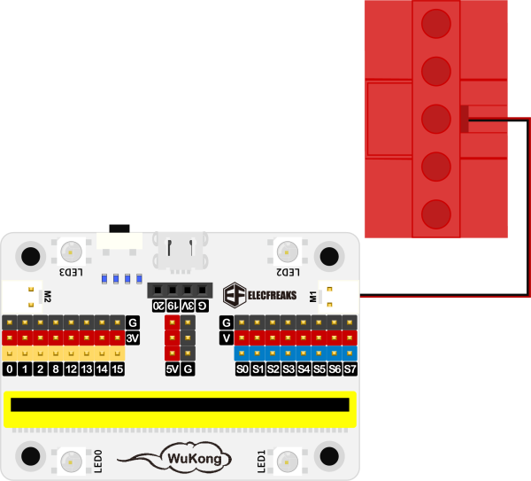

# Case 11: The Tiny Sky Wheel

## Purpose
---
To make a tiny sky wheel.
 

## Link: 
---
[micro:bit Wonder Building Kit](https://www.elecfreaks.com/micro-bit-wonder-building-kit-without-micro-bit-board.html)

## Materials Required
---

Video link:
[https://youtu.be/dbboivj1E64](https://youtu.be/dbboivj1E64)

## Bricks build-up
---

## Hardware Connection

Connect a [motor](https://www.elecfreaks.com/geekservo-motor-2kg-compatible-with-lego.html) to M1 port on [Wukong breakout board](https://www.elecfreaks.com/wukong-board-with-lego-holder-for-micro-bit.html).

## Software Platform
---
[MakeCode](https://makecode.microbit.org/)

## Coding
---
### Add extensions
Click "Advanced" in the MakeCode to see more choices.
 

Search with Wukong in the dialogue box to download it. 

### Program
 

Link:[https://makecode.microbit.org/_VuRXgH1y30yp](https://makecode.microbit.org/_VuRXgH1y30yp)

### Result

When button A is pressed the tiny sky wheel starts to rotate and when button B is pressed it stops rotating.
