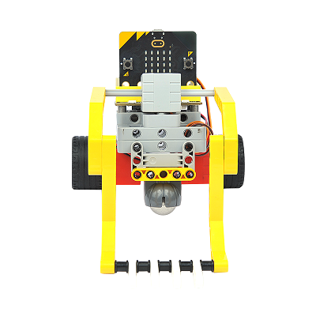
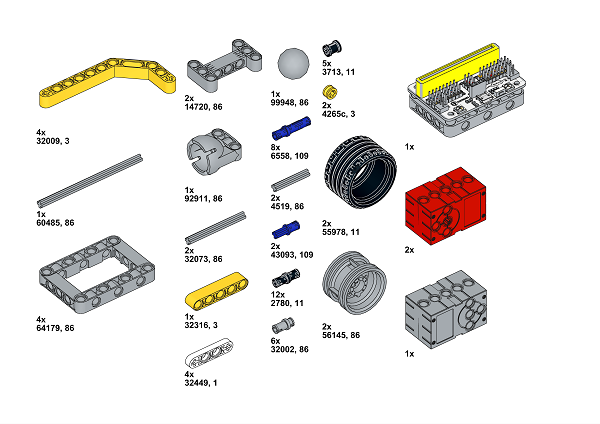
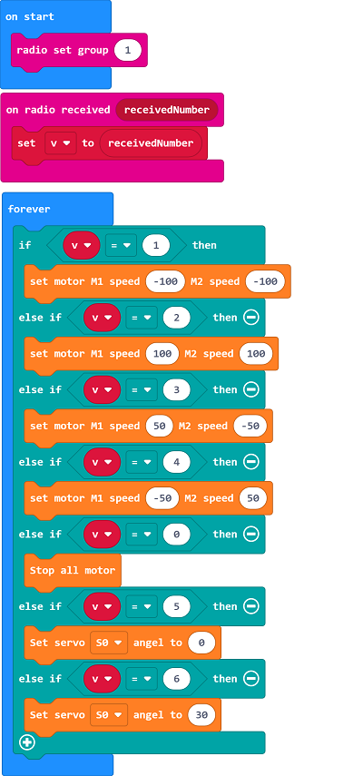

# Case 12: The Forklift
## Purpose
To make a forklift. 
 

## Link: 

[micro:bit Wonder Building Kit](https://www.elecfreaks.com/micro-bit-wonder-building-kit-without-micro-bit-board.html)
[Joystick bit](https://www.elecfreaks.com/joystick-bit-2-for-micro-bit.html)

## Materials Required

Video link:
[https://youtu.be/PIhMVJYBMhM](https://youtu.be/PIhMVJYBMhM)

## Software Platform

[MakeCode](https://makecode.microbit.org/)

## Coding
### Add extensions
Click "Advanced" in the MakeCode to see more choices.
 

Search with Wukong in the dialogue box to download it. 

 Search with https://github.com/elecfreaks/pxt-sonarbit in the dialogue box to add the sonar:bit extension. 

### Program
For Joystick:bit:  

Link:[https://makecode.microbit.org/_f5DVqMKrtgYA](https://makecode.microbit.org/_f5DVqMKrtgYA)
For the forklift:

Link:[https://makecode.microbit.org/_1vCDgiCWbYgt](https://makecode.microbit.org/_1vCDgiCWbYgt)

