# Case 13: The Seesaw

## Purpose
---
To make a seesaw.
 

## Link: 
---
[micro:bit Wonder Building Kit](https://www.elecfreaks.com/micro-bit-wonder-building-kit-without-micro-bit-board.html)

## Materials Required
---

Video link:
[https://youtu.be/2qZLmY6tJRs](https://youtu.be/2qZLmY6tJRs)

## Bricks build-up
---

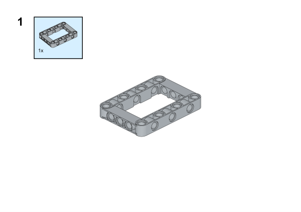

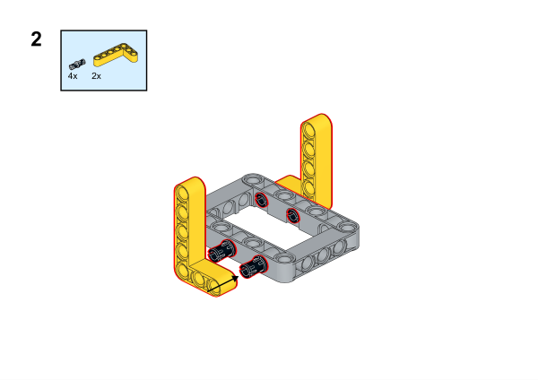

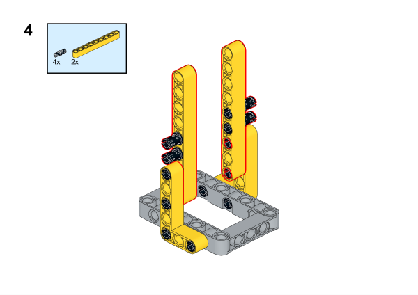

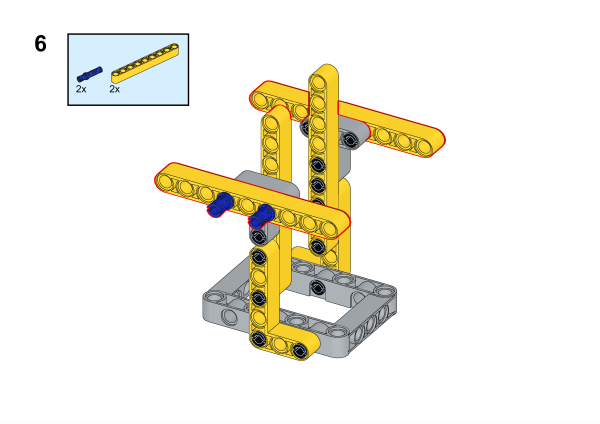

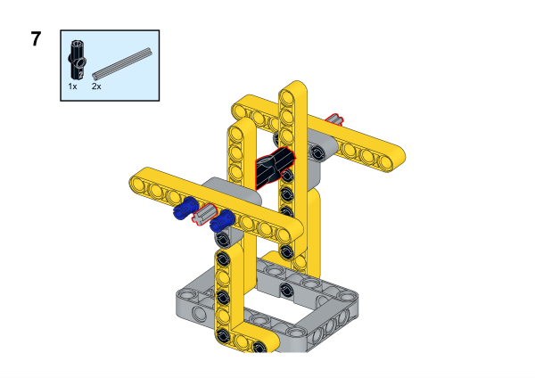

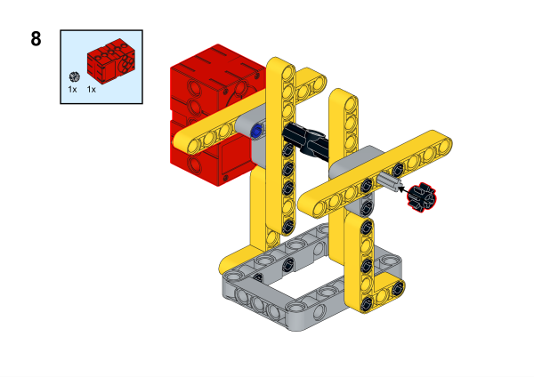

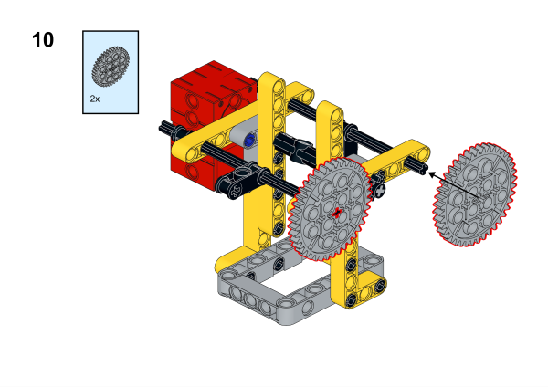

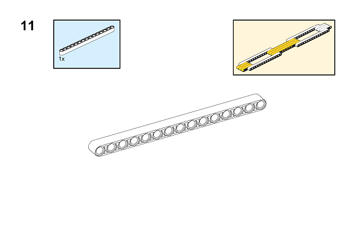

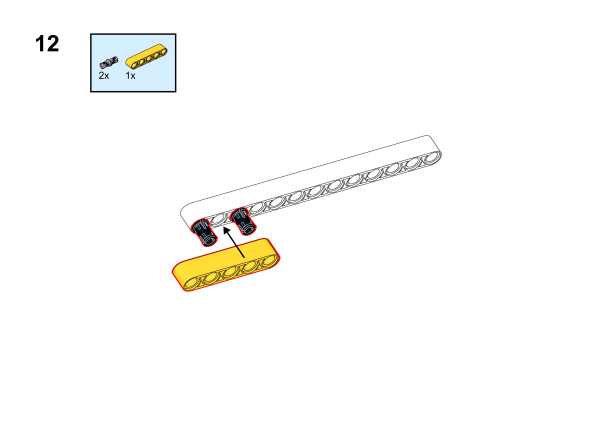

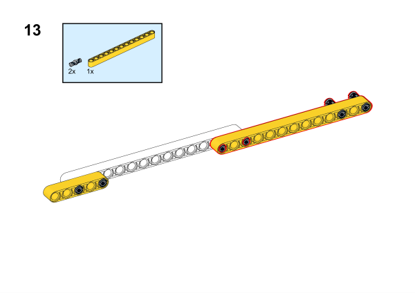

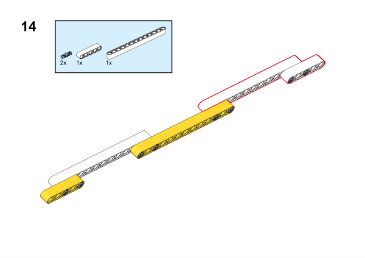

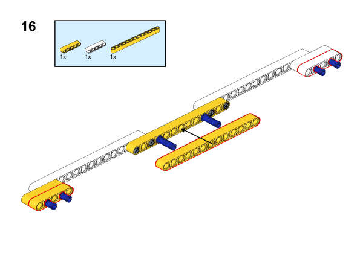

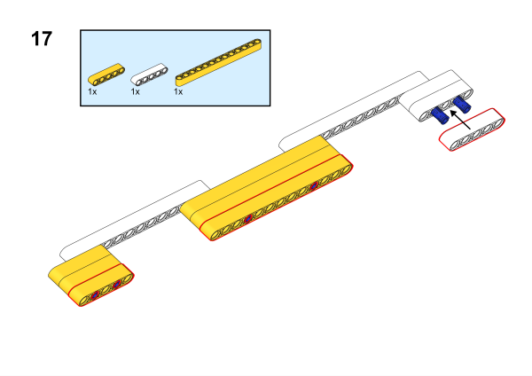

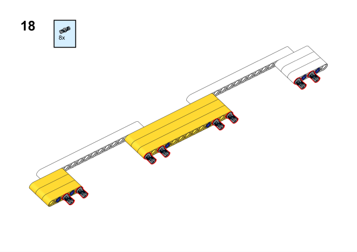

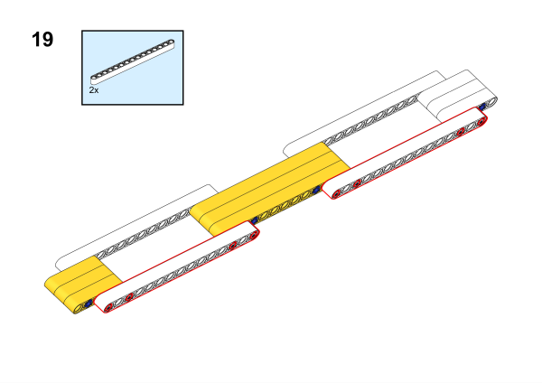

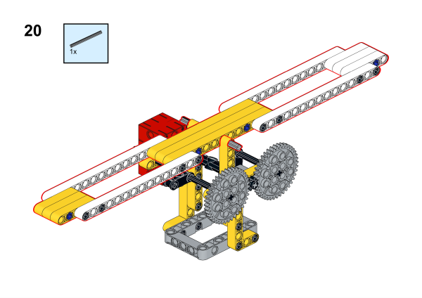

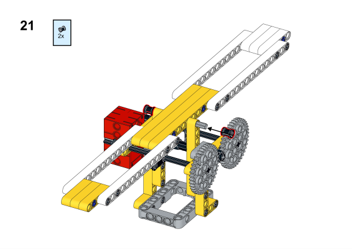

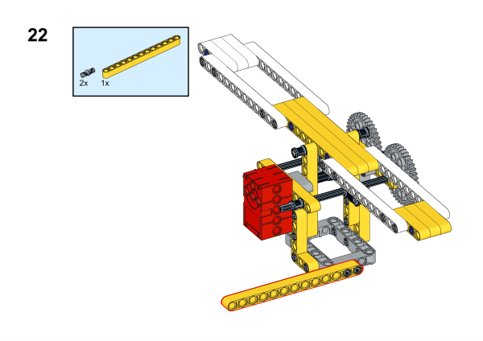

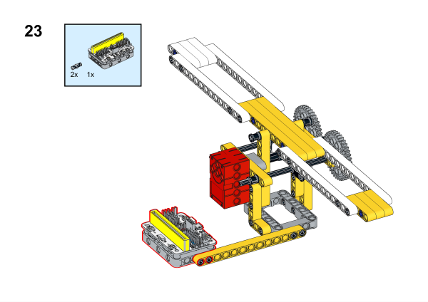

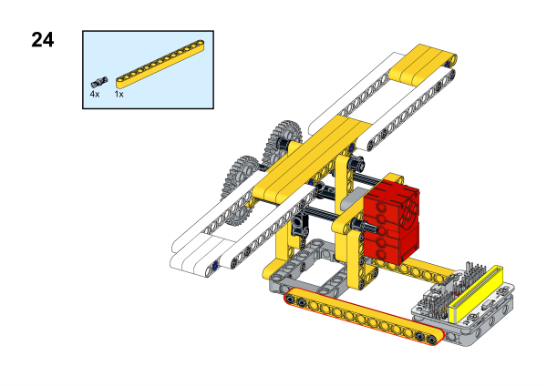

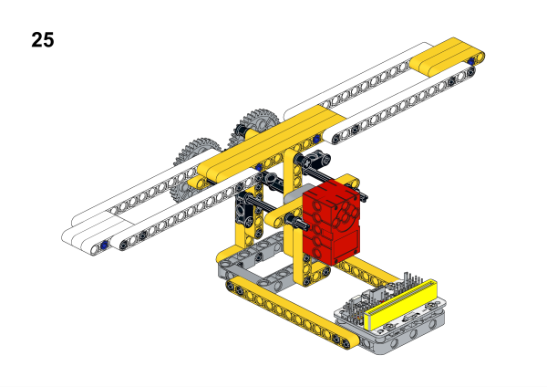

## Software Platform
---
[MakeCode](https://makecode.microbit.org/)

## Coding
---
### Add extensions
Click "Advanced" in the MakeCode to see more choices.
 

Search with Wukong in the dialogue box to download it. 

### Program
 

Link:[https://makecode.microbit.org/_VuRXgH1y30yp](https://makecode.microbit.org/_VuRXgH1y30yp)

