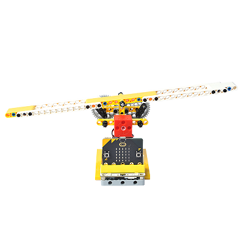
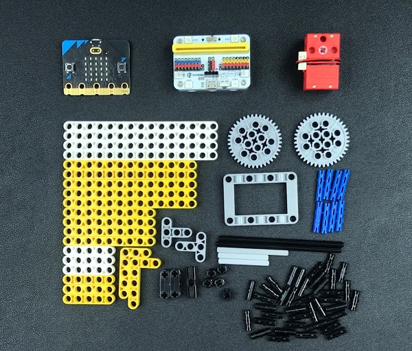

# Case 13: The Seesaw
## Purpose
To make a seesaw.
 

## Link: 

[micro:bit Wonder Building Kit](https://www.elecfreaks.com/micro-bit-wonder-building-kit-without-micro-bit-board.html)

## Materials Required

Video link:
[https://player.bilibili.com/player.html?bvid=BV1V64y117zM&p=13&page=13](https://player.bilibili.com/player.html?bvid=BV1V64y117zM&p=13&page=13)

## Software Platform

[MakeCode](https://makecode.microbit.org/)

## Coding
### Add extensions
Click "Advanced" in the MakeCode to see more choices.
 

Search with Wukong in the dialogue box to download it. 

### Program
 

Link:[https://makecode.microbit.org/_iFDPfDex5CqA](hhttps://makecode.microbit.org/_iFDPfDex5CqA)

