# Case 15: The Walking Robot 

## Purpose
---
To make a walking robot.
 
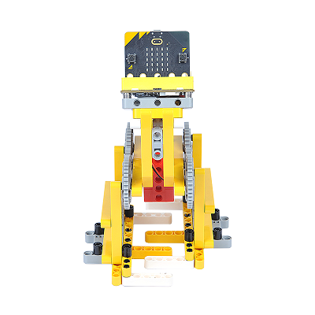

## Link: 
---
[micro:bit Wonder Building Kit](https://www.elecfreaks.com/micro-bit-wonder-building-kit-without-micro-bit-board.html)

## Materials Required
---
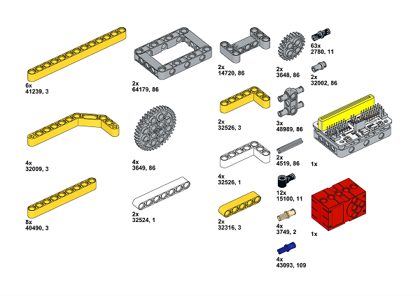

Video link:
[https://youtu.be/ohn8NMhKybw](https://youtu.be/ohn8NMhKybw)

## Bricks build-up
---

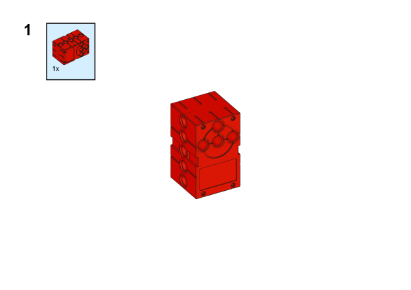

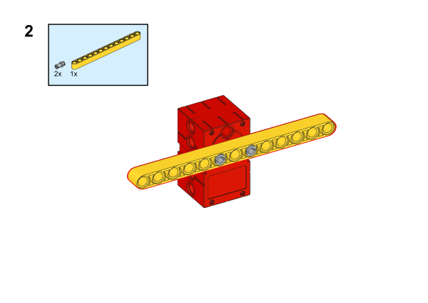

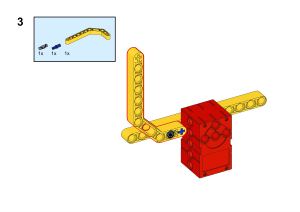

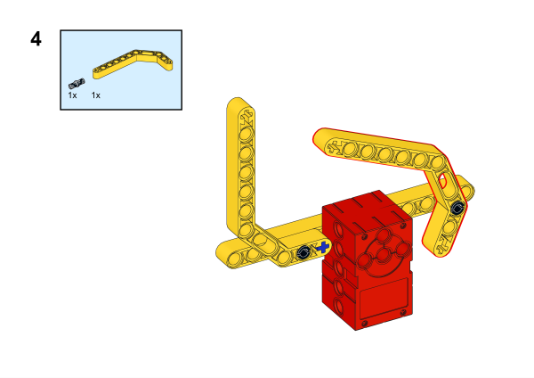

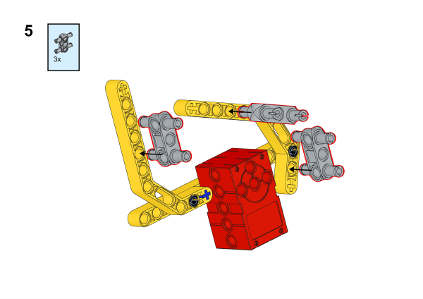

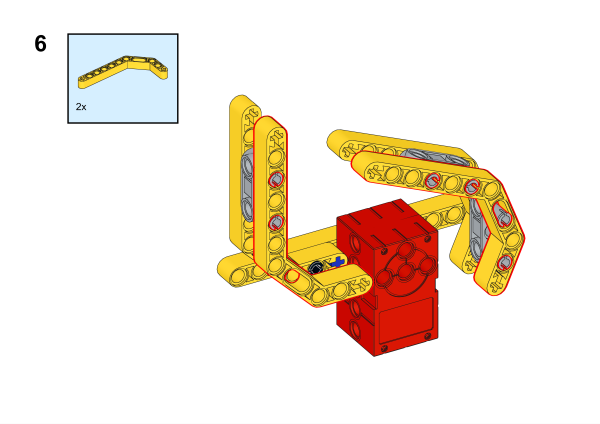

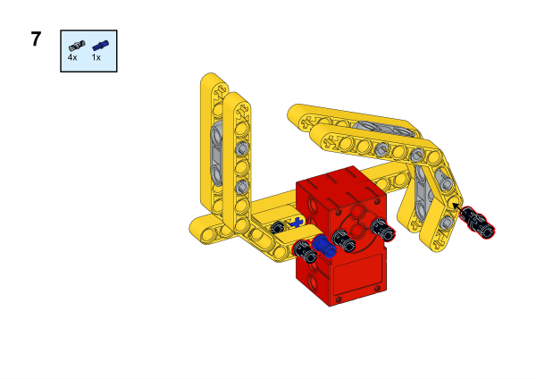

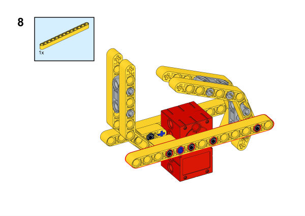

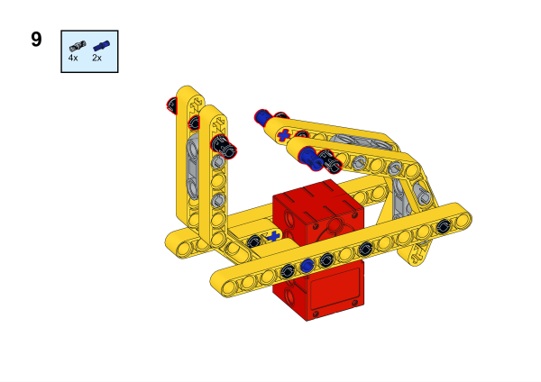

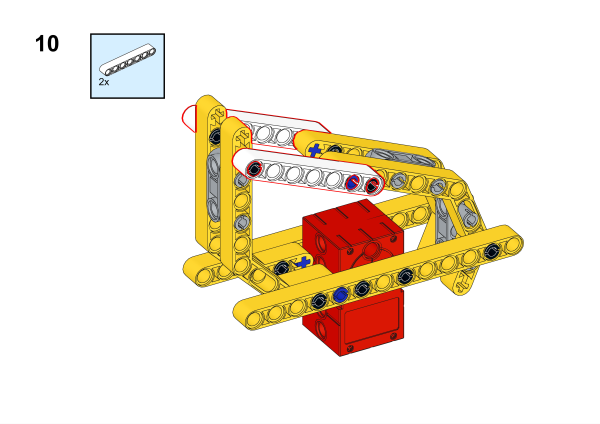

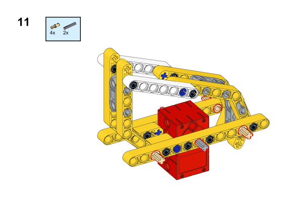

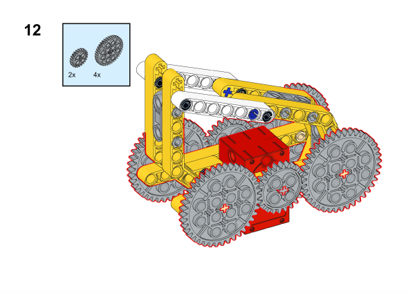

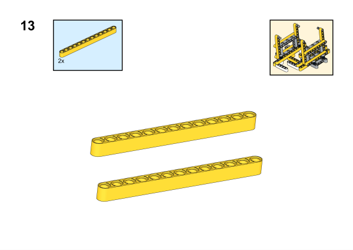

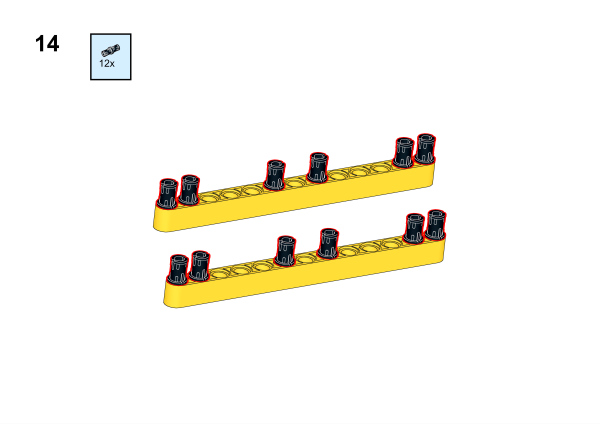

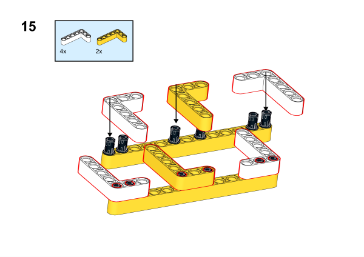

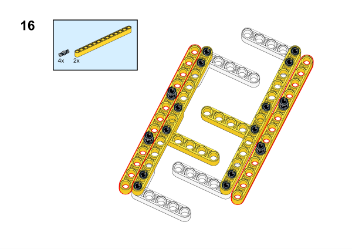

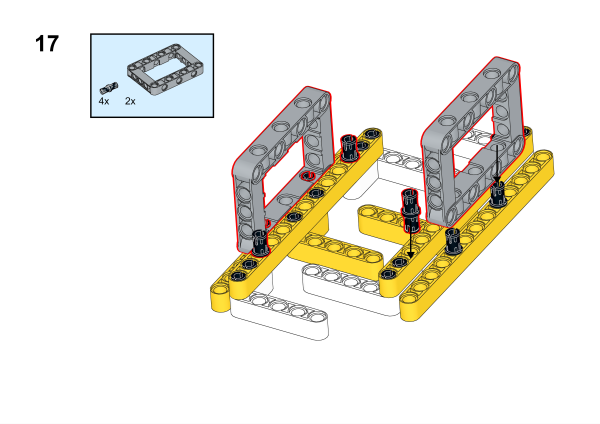

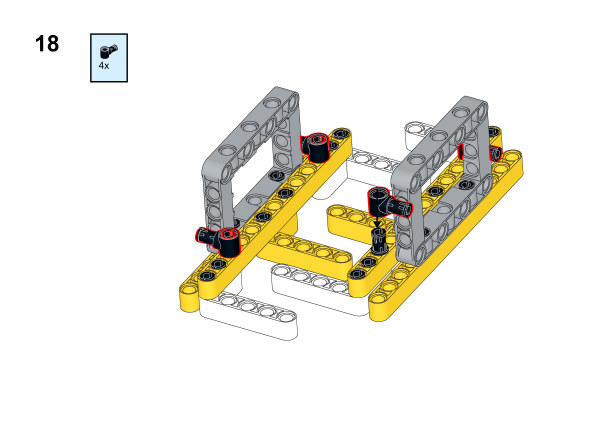

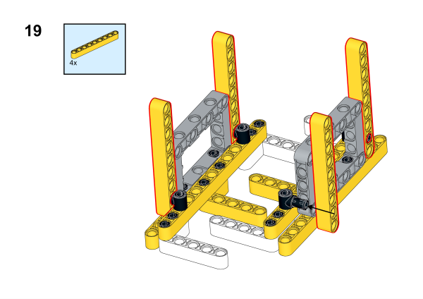

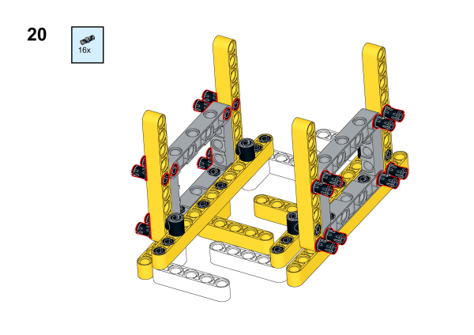

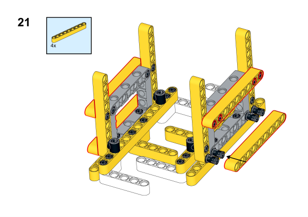

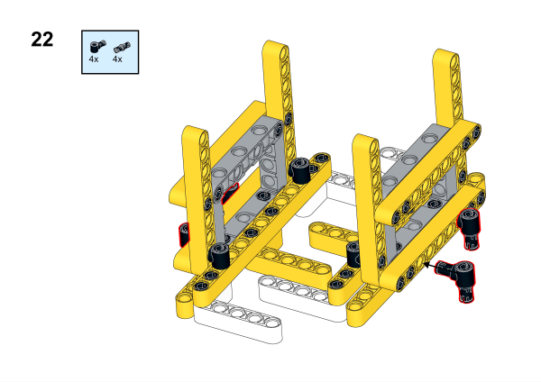

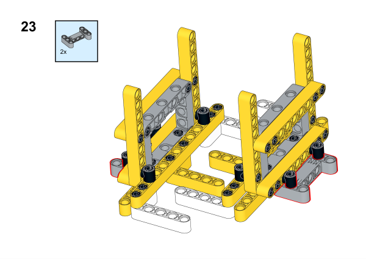

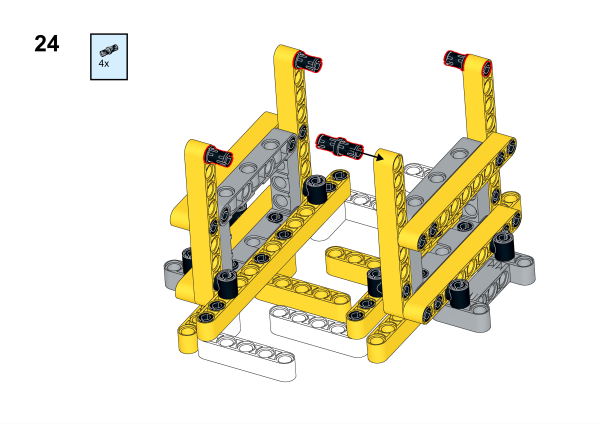

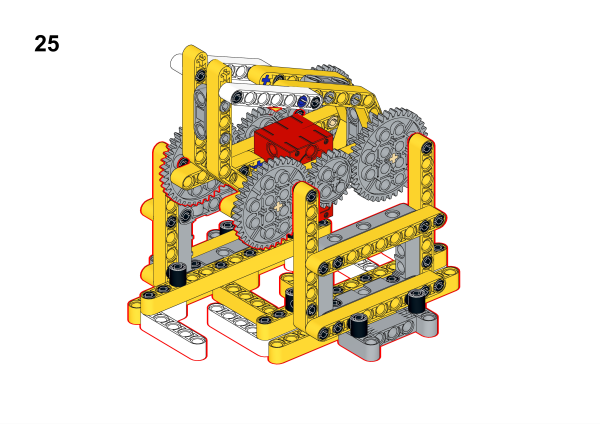

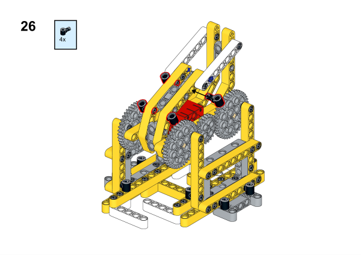

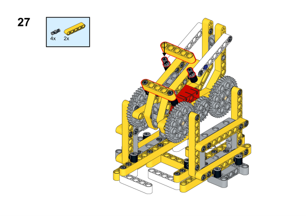

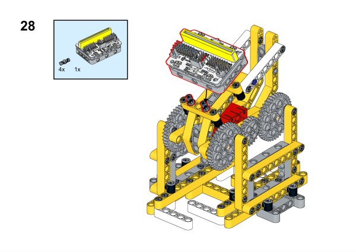

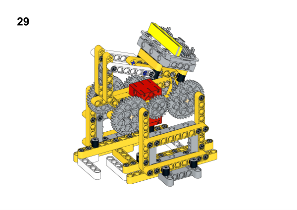

## Software Platform
---
[MakeCode](https://makecode.microbit.org/)

## Coding
---
### Add extensions
Click "Advanced" in the MakeCode to see more choices.
 

Search with Wukong in the dialogue box to download it. 

### Program
 

Link:[https://makecode.microbit.org/_b5D9689YX8R3](https://makecode.microbit.org/_b5D9689YX8R3)

