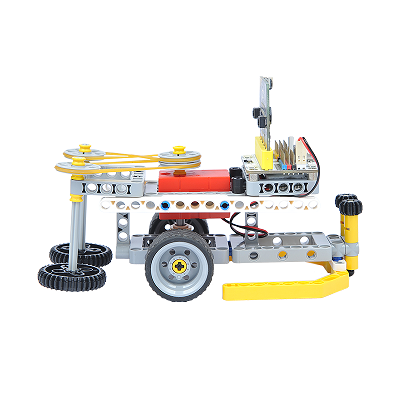
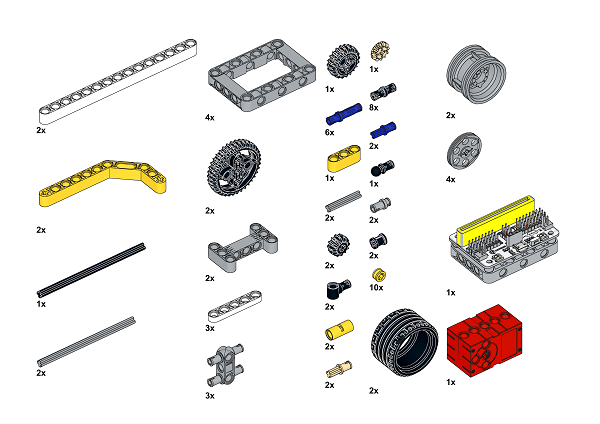
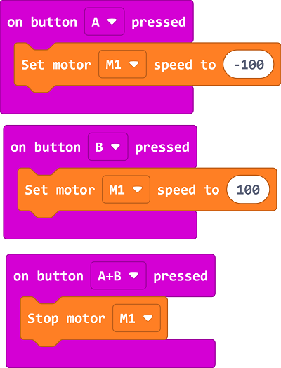

# Case 16: The Road Sweeper
## Purpose
To make a road sweeper.
 

## Link: 

[micro:bit Wonder Building Kit](https://www.elecfreaks.com/micro-bit-wonder-building-kit-without-micro-bit-board.html)

## Materials Required

Video link:
[https://youtu.be/kdY41mPGvRI](https://youtu.be/kdY41mPGvRI)

## Software Platform

[MakeCode](https://makecode.microbit.org/)

## Coding
### Add extensions
Click "Advanced" in the MakeCode to see more choices.
 

Search with Wukong in the dialogue box to download it. 

### Program
 

Link:[https://makecode.microbit.org/_boH9rbLs0JrV](https://makecode.microbit.org/_boH9rbLs0JrV)

