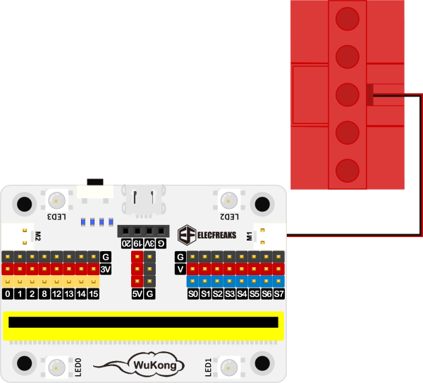

# Case 17: The Rickshaw

## Purpose
---
To make a rickshaw.
 

## Link: 
---
[micro:bit Wonder Building Kit](https://shop.elecfreaks.com/products/elecfreaks-micro-bit-32-in-1-wonder-building-kit-without-micro-bit-board?_pos=5&_sid=2094afd2f&_ss=r)

## Materials Required
---

Video link:
[https://youtu.be/qHvM-sRProA](https://youtu.be/qHvM-sRProA)

## Bricks build-up
---

## Hardware Connection

Connect a [motor](https://www.elecfreaks.com/geekservo-motor-2kg-compatible-with-lego.html) to M1 port on [Wukong breakout board](https://www.elecfreaks.com/wukong-board-with-lego-holder-for-micro-bit.html).

## Software Platform
---
[MakeCode](https://makecode.microbit.org/)

## Coding
---
### Add extensions
Click "Advanced" in the MakeCode to see more choices.
 

Search with Wukong in the dialogue box to download it. 

### Program
 

Link:[https://makecode.microbit.org/_448W1dKFLEXt](https://makecode.microbit.org/_448W1dKFLEXt)

### Result

When button A is pressed the rickshaw moves forward, when button B is pressed the rickshaw moves backward, when button A+B is pressed the it stops moving.
