# Case 17: The Rickshaw
## Purpose
To make a rickshaw.
 

## Link: 

[micro:bit Wonder Building Kit](https://www.elecfreaks.com/micro-bit-wonder-building-kit-without-micro-bit-board.html)

## Materials Required

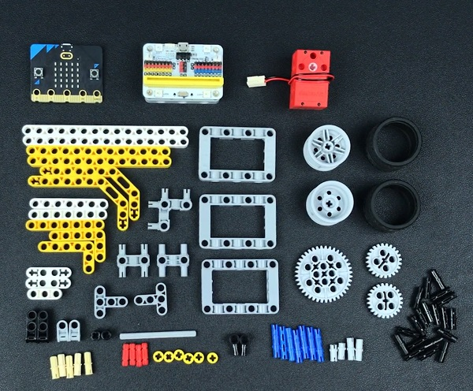

Video link:
[https://youtu.be/qHvM-sRProA](https://youtu.be/qHvM-sRProA)

## Bricks build-up
---

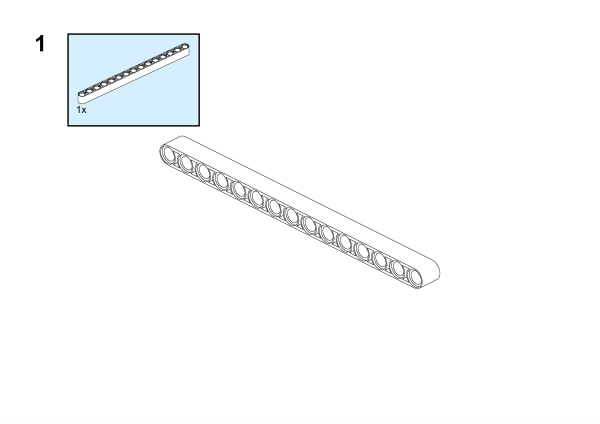

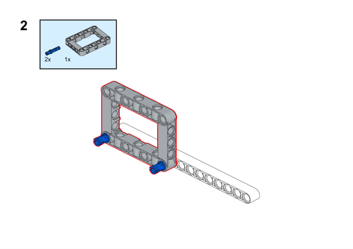

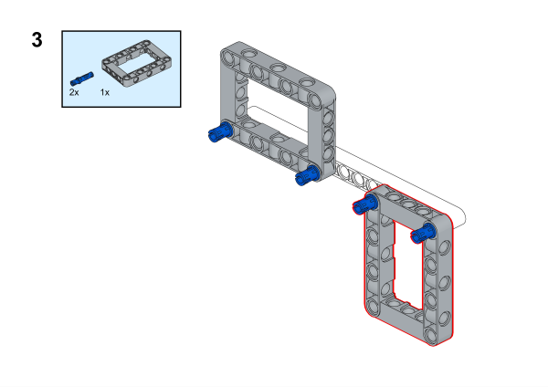

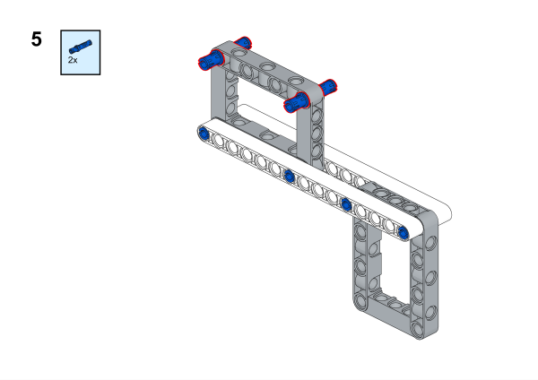

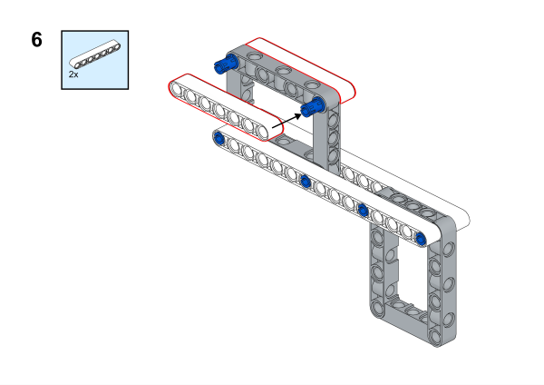

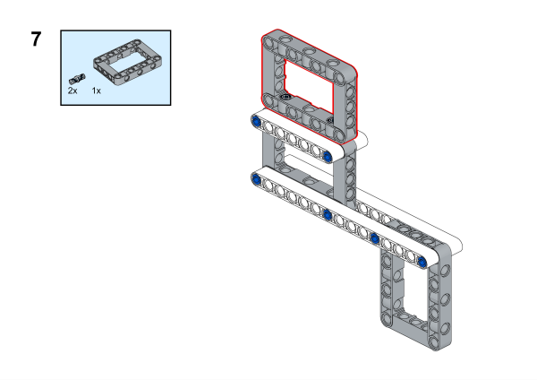

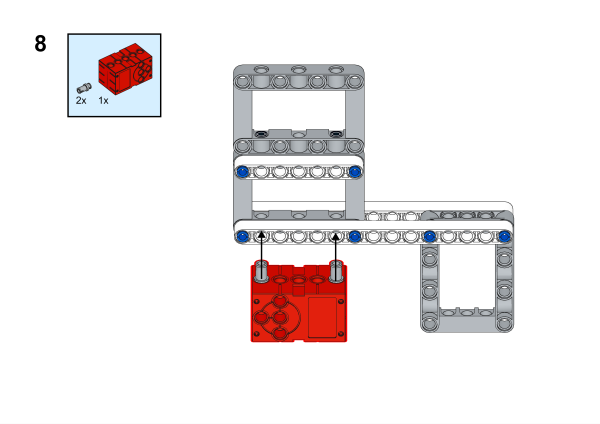

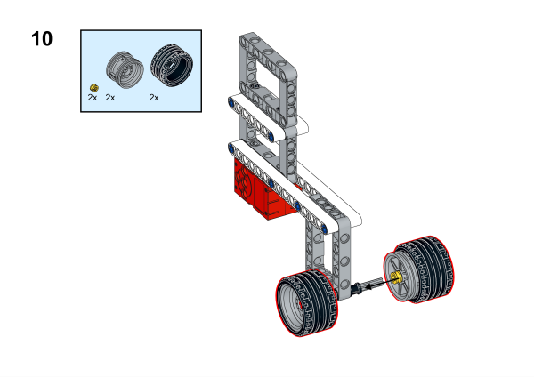

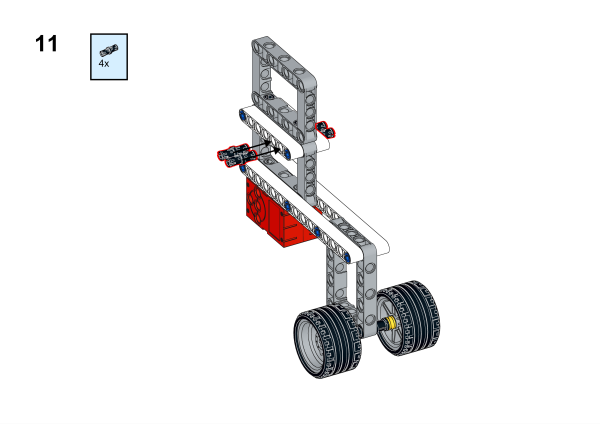

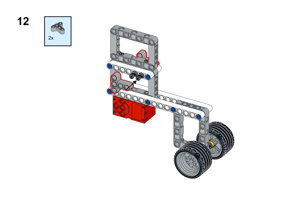

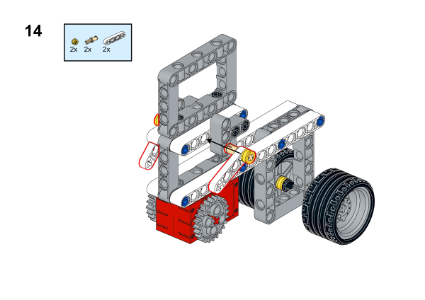

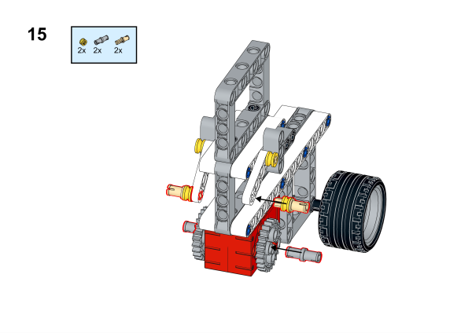

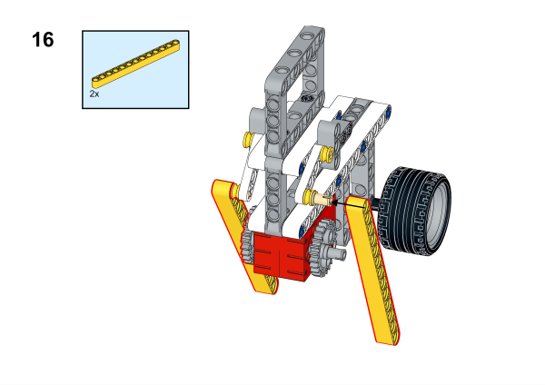

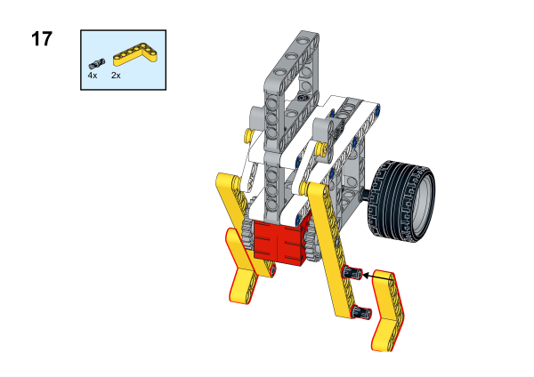

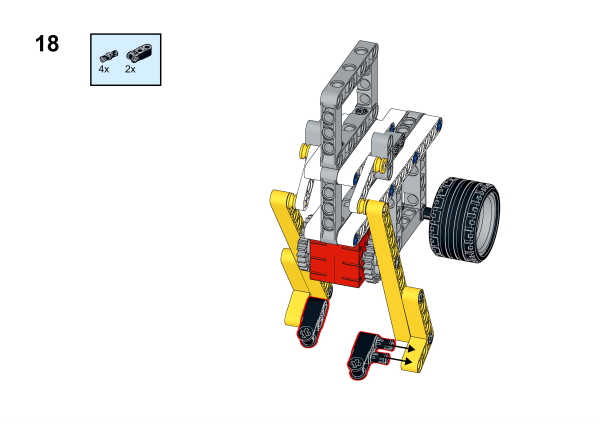

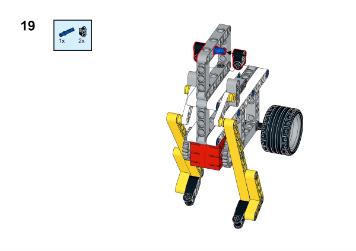

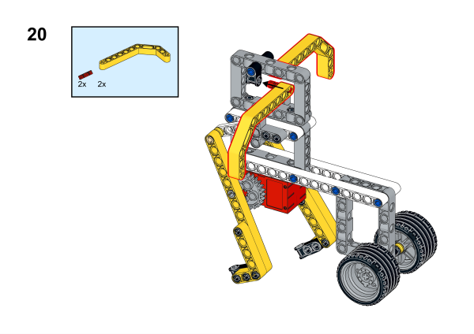

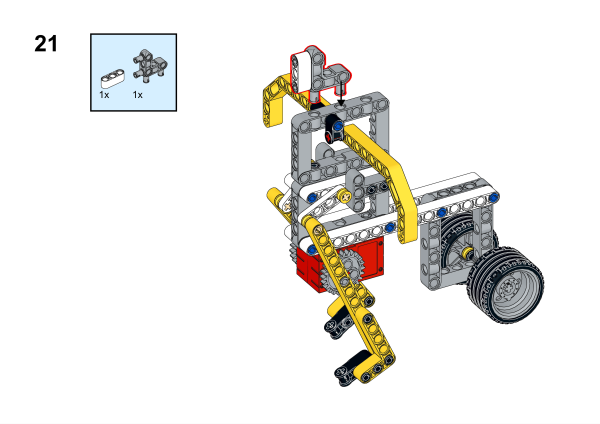

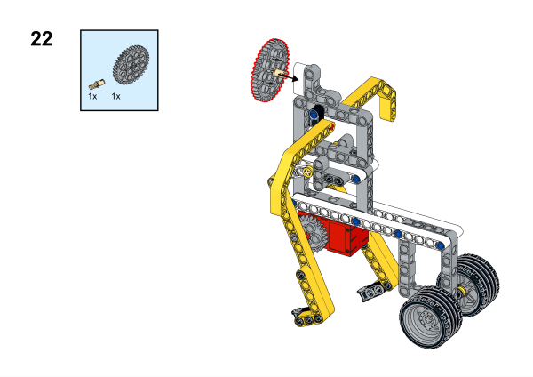

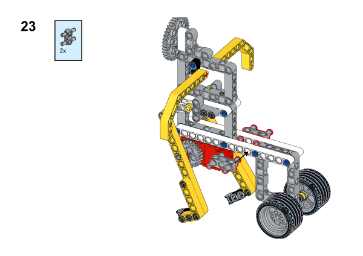

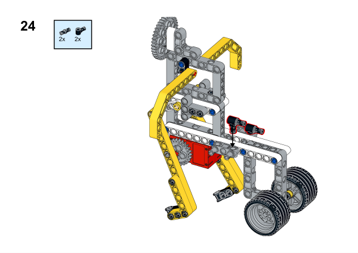

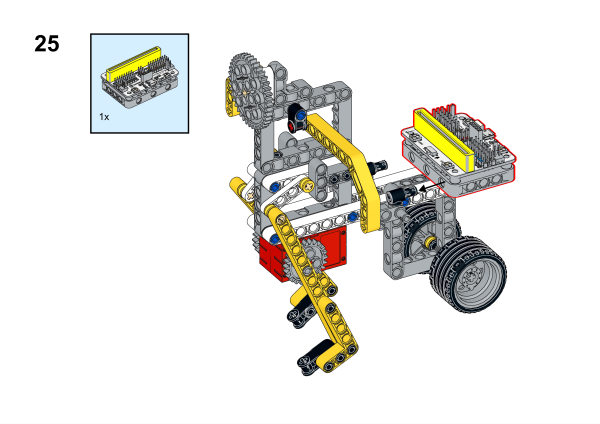

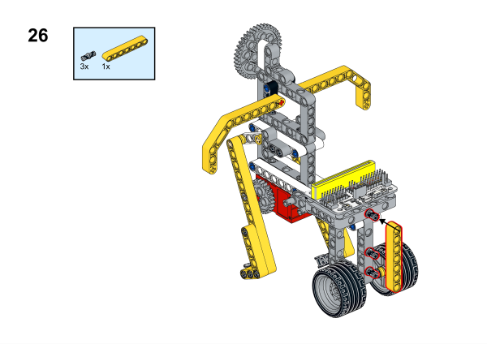

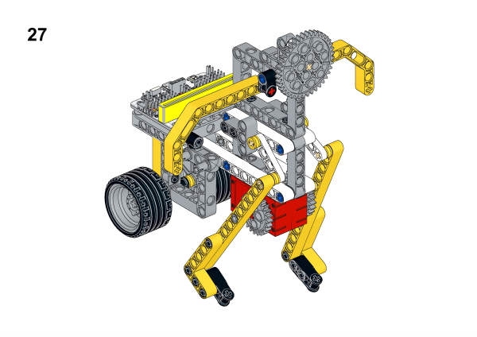

## Software Platform

[MakeCode](https://makecode.microbit.org/)

## Coding
### Add extensions
Click "Advanced" in the MakeCode to see more choices.
 

Search with Wukong in the dialogue box to download it. 

### Program
 
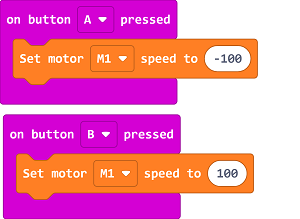

Link:[https://makecode.microbit.org/_fTwXKM2Tae9r](https://makecode.microbit.org/_fTwXKM2Tae9r)

