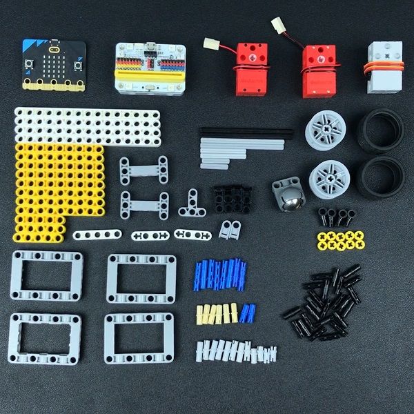
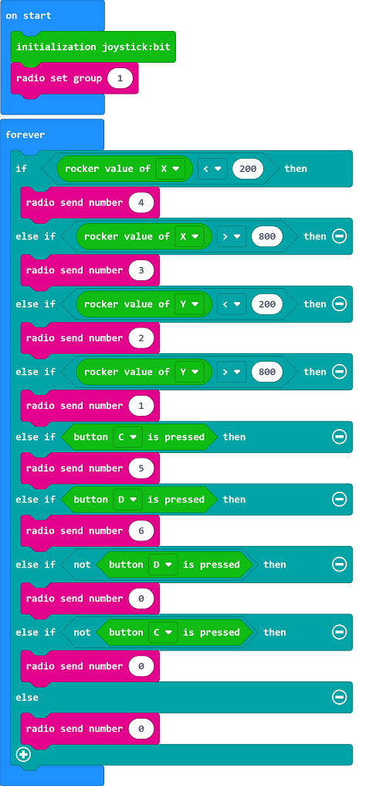
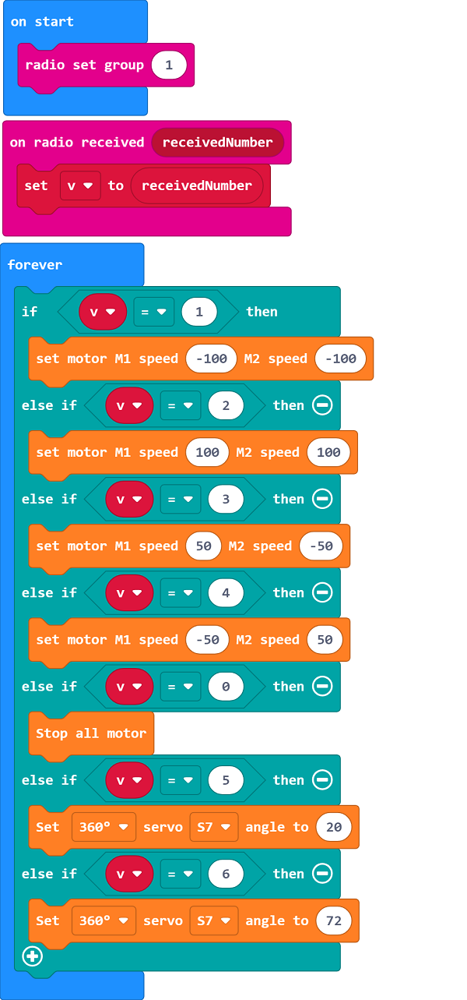

# Case 18: The Aerial Ladder Truck 
## Purpose
To make an aerial ladder truck.
 

## Link: 

[micro:bit Wonder Building Kit](https://www.elecfreaks.com/micro-bit-wonder-building-kit-without-micro-bit-board.html)
[Joystick bit](https://www.elecfreaks.com/joystick-bit-2-for-micro-bit.html)

## Materials Required

Video link:
[https://player.bilibili.com/player.html?bvid=BV1V64y117zM&p=18&page=18](https://player.bilibili.com/player.html?bvid=BV1V64y117zM&p=18&page=18)

## Software Platform

[MakeCode](https://makecode.microbit.org/)

## Coding
### Add extensions
Click "Advanced" in the MakeCode to see more choices.
 

Search with Wukong in the dialogue box to download it. 

Search with joystickbit in the dialogue box to download it.

### Program
For Joystick:bit:  

Link:[https://makecode.microbit.org/_f5DVqMKrtgYA](https://makecode.microbit.org/_f5DVqMKrtgYA)
For the aerial ladder truck: 

Link:[https://makecode.microbit.org/_V004ujT5wJ9j](https://makecode.microbit.org/_V004ujT5wJ9j)

