# Case 23: The Locomotive

## Purpose
---
Make a locomotive.
 
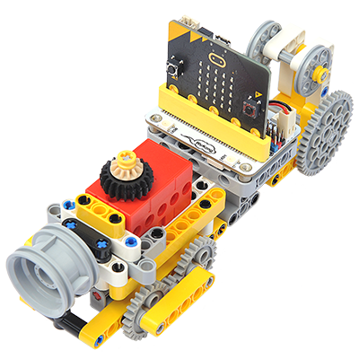

## Link: 
---
[micro:bit Wonder Building Kit](https://www.elecfreaks.com/micro-bit-wonder-building-kit-without-micro-bit-board.html)

## Materials Required
---
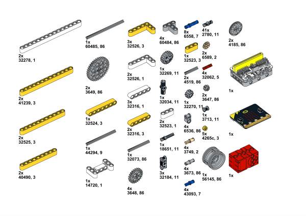

## Bricks build-up
---
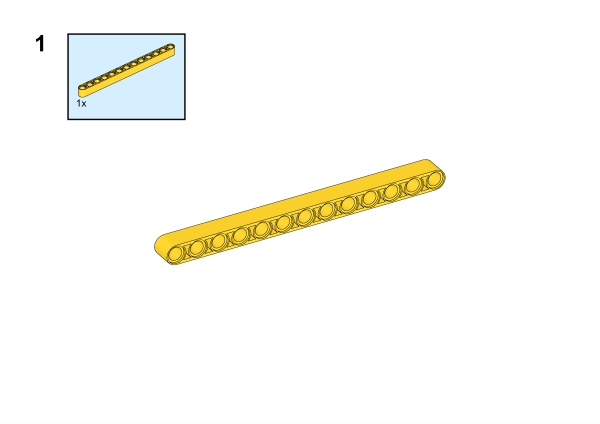

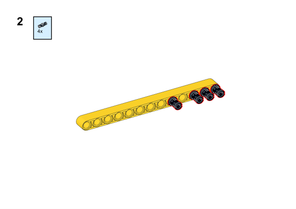

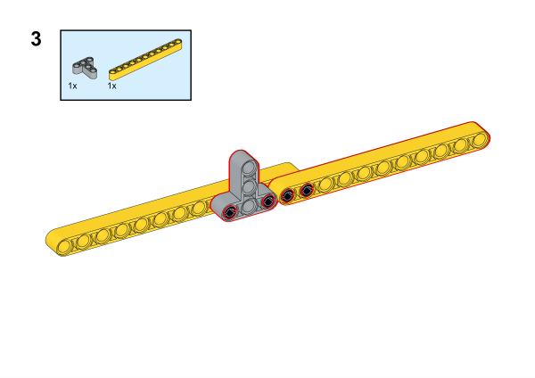

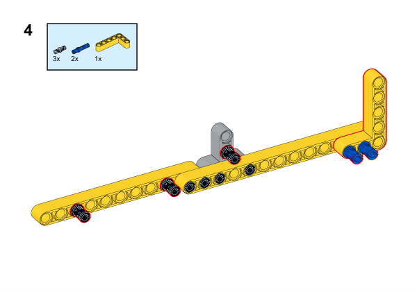

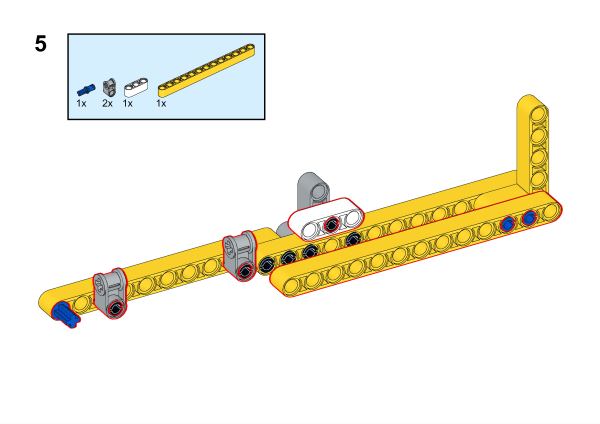

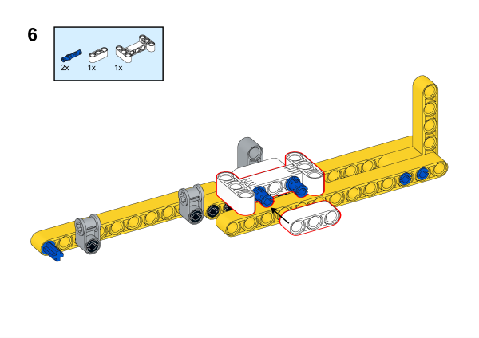

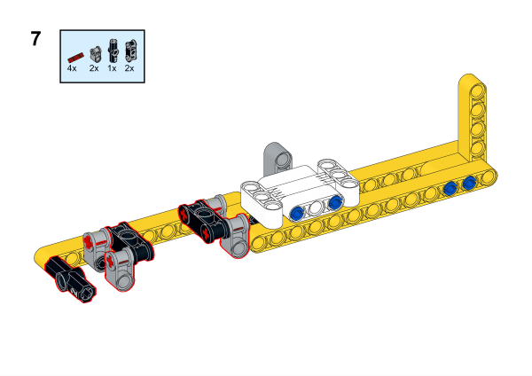

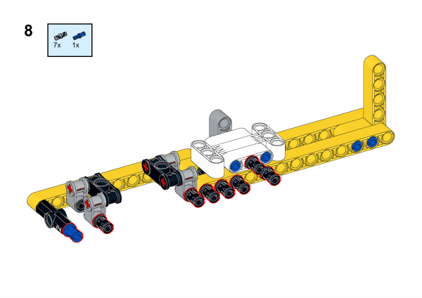

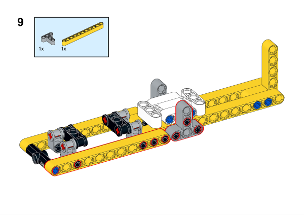

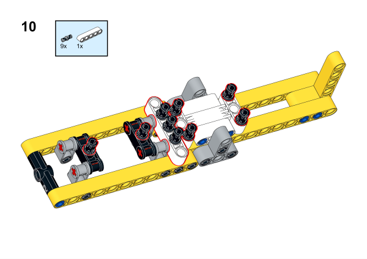

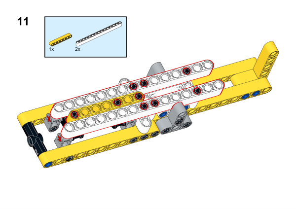

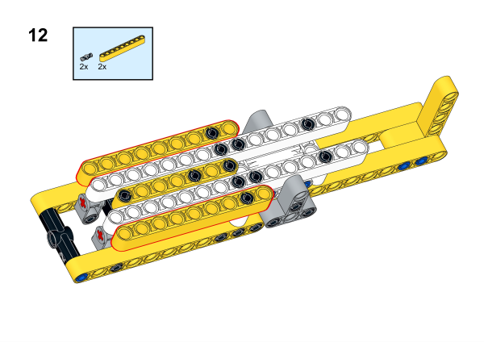

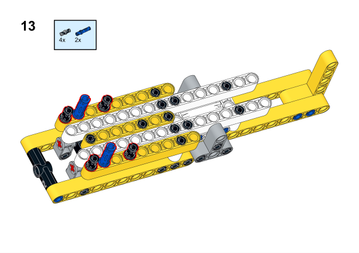

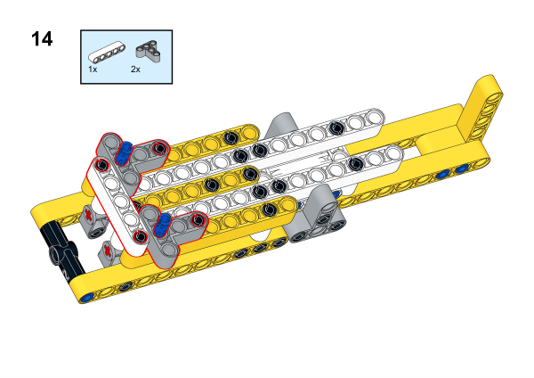

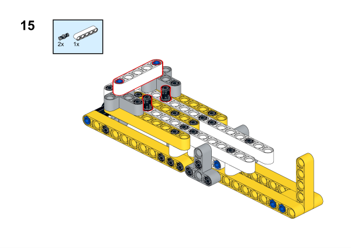

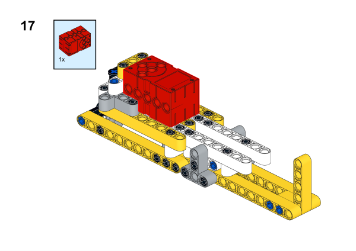

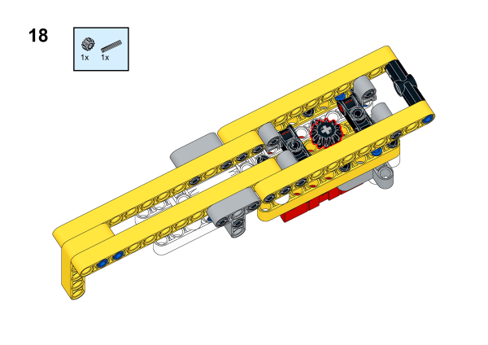

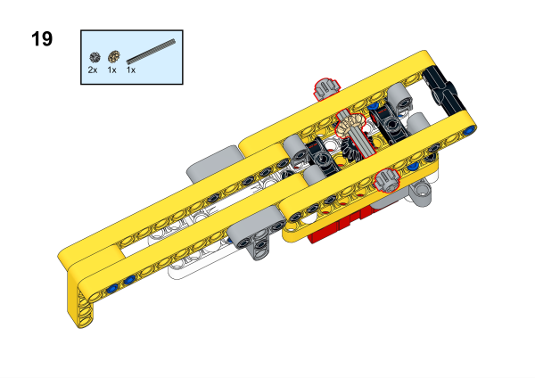

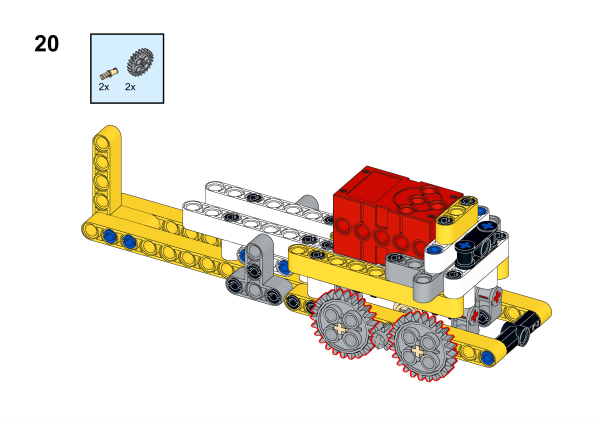

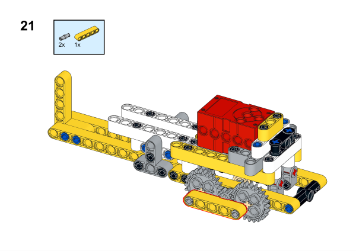

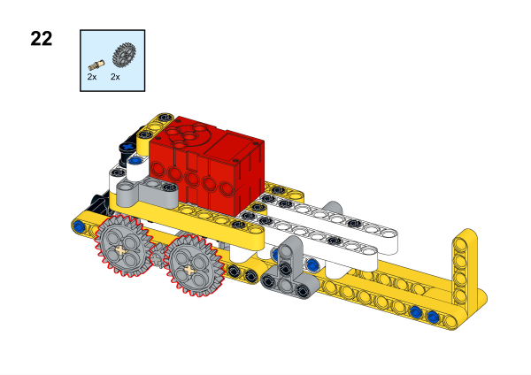

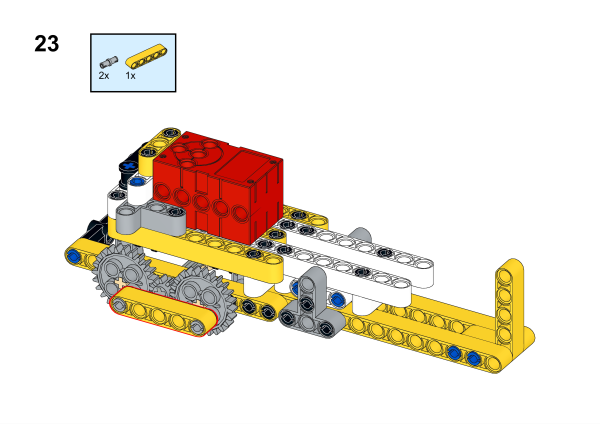

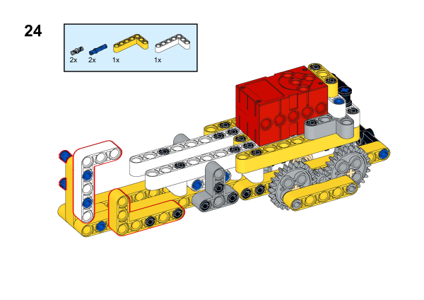

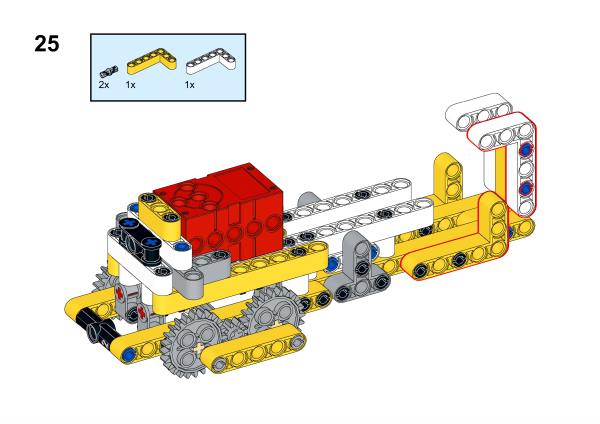

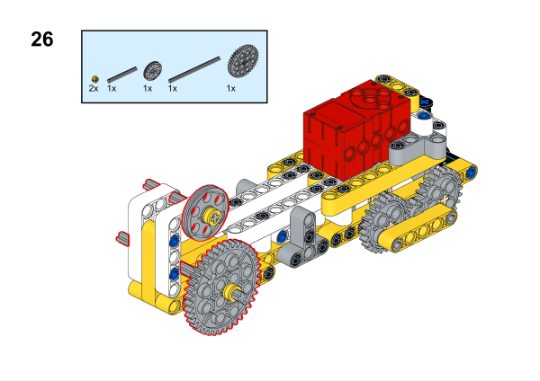

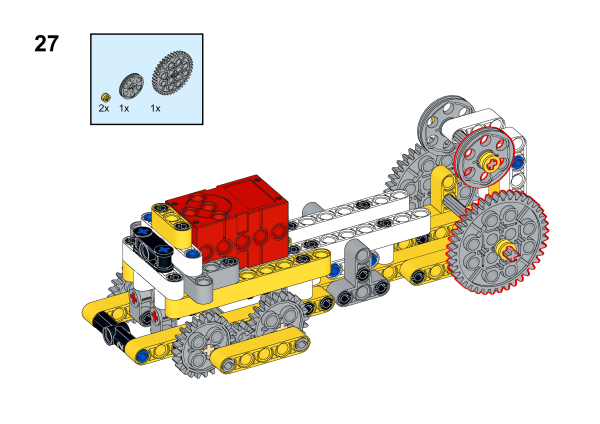

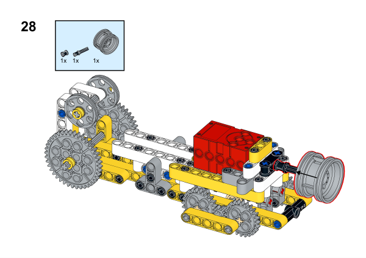

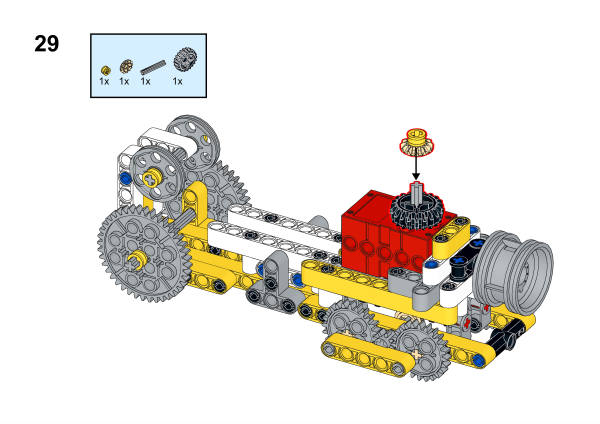

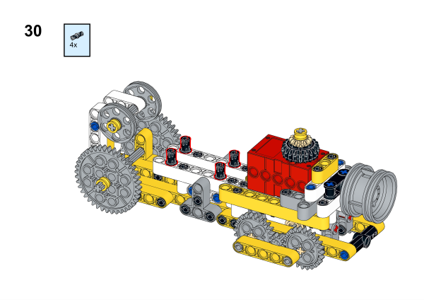

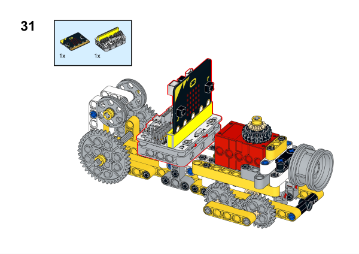

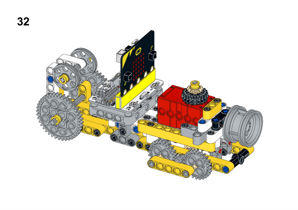

## Software Platform
---
[MakeCode](https://makecode.microbit.org/)

## Coding
---
### Add extensions
Click "Advanced" in the MakeCode to see more choices.
 

Search with Wukong in the dialogue box to download it. 

### Program
 
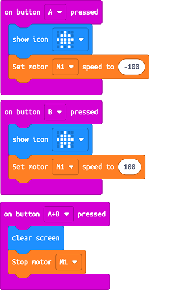

Link:[https://makecode.microbit.org/_5WjDde1jAF6R](https://makecode.microbit.org/_5WjDde1jAF6R)

