# Case 24: The Top Emitter

## Purpose
---
Make a top emitter.
 
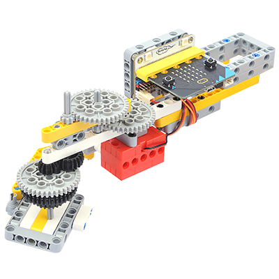

## Link: 
---
[micro:bit Wonder Building Kit](https://shop.elecfreaks.com/products/elecfreaks-micro-bit-32-in-1-wonder-building-kit-without-micro-bit-board?_pos=5&_sid=2094afd2f&_ss=r)

## Materials Required
---
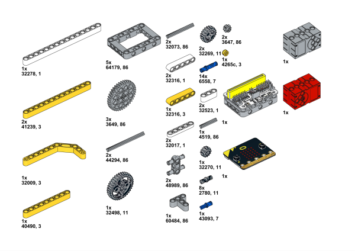

## Bricks build-up
---

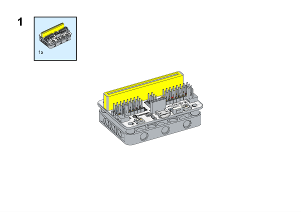

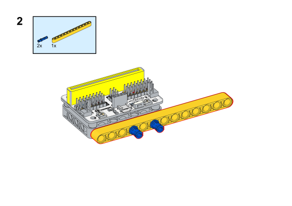

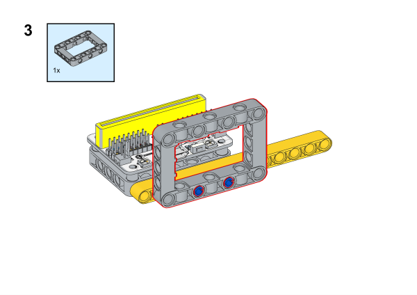

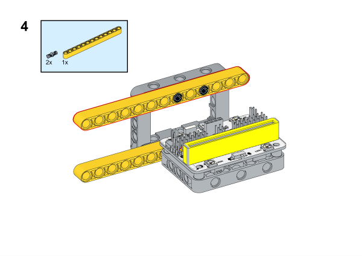

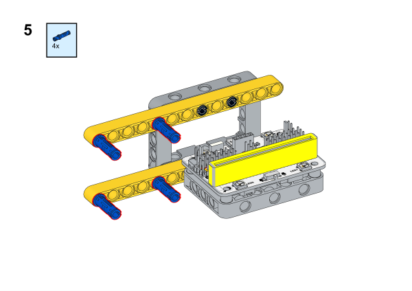

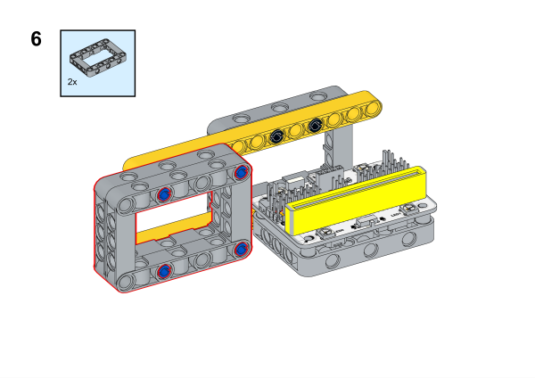

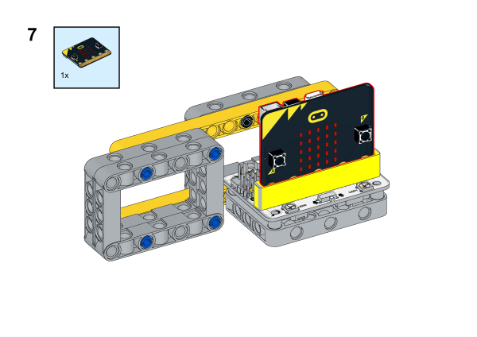

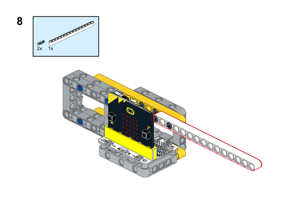

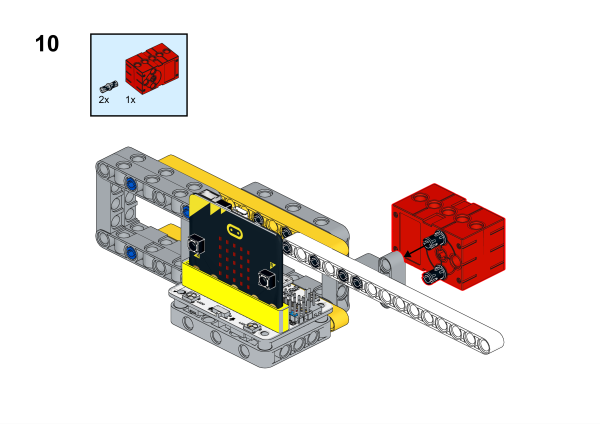

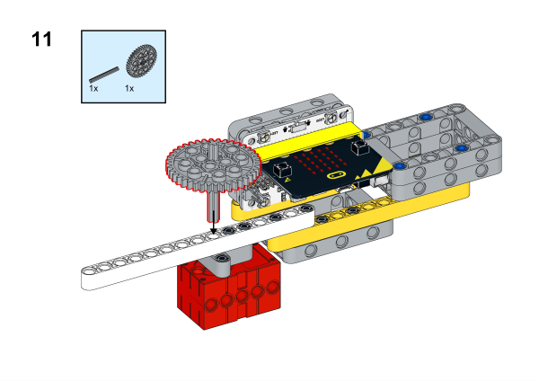

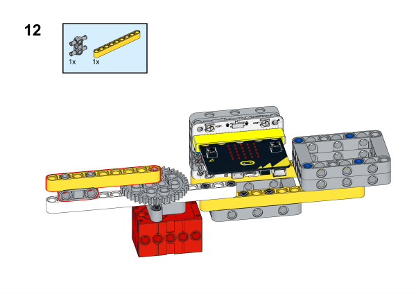

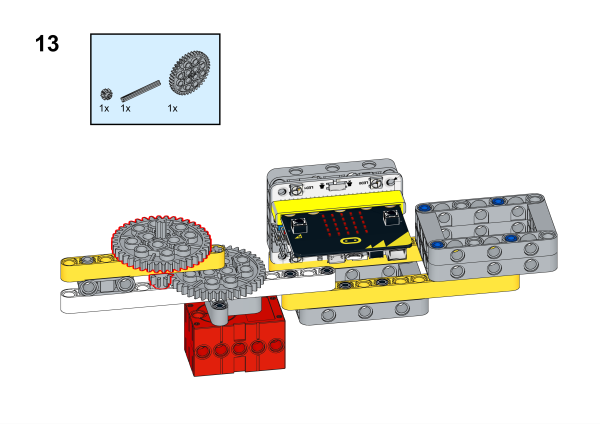

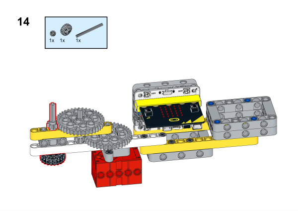

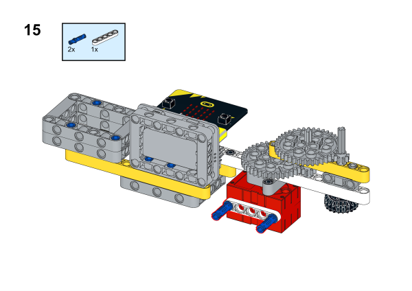

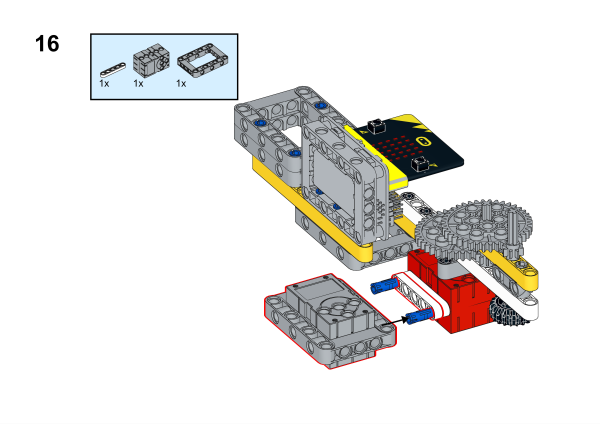

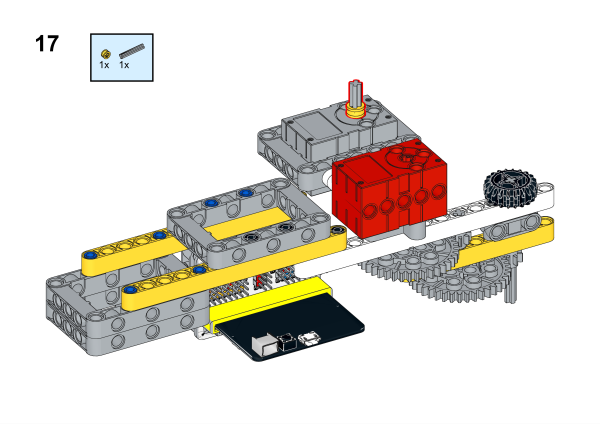

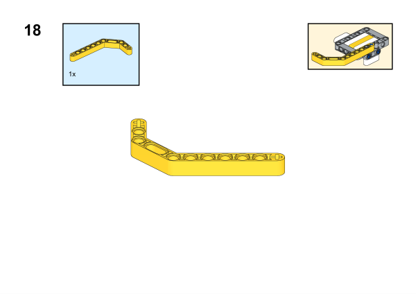

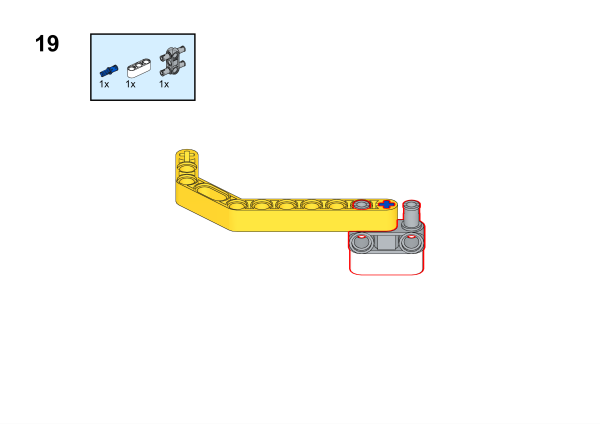

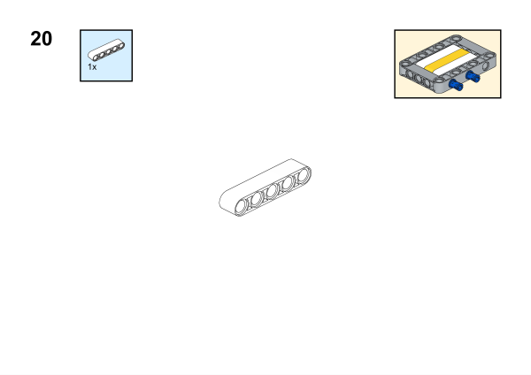

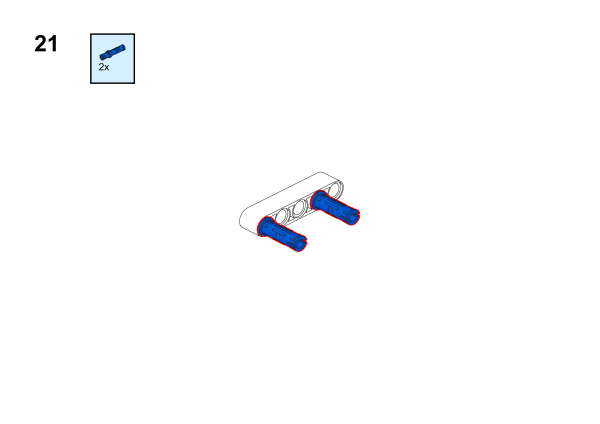

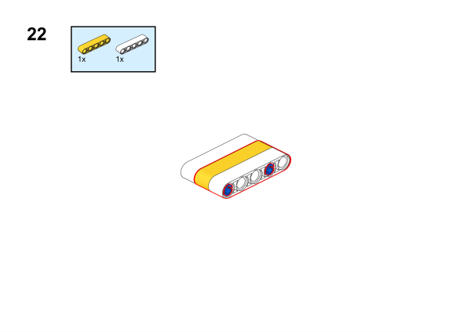

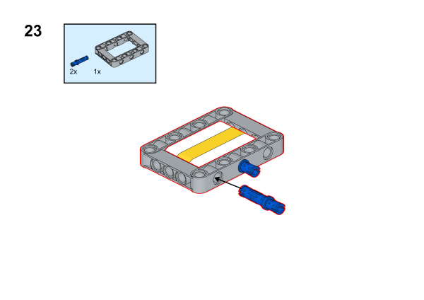

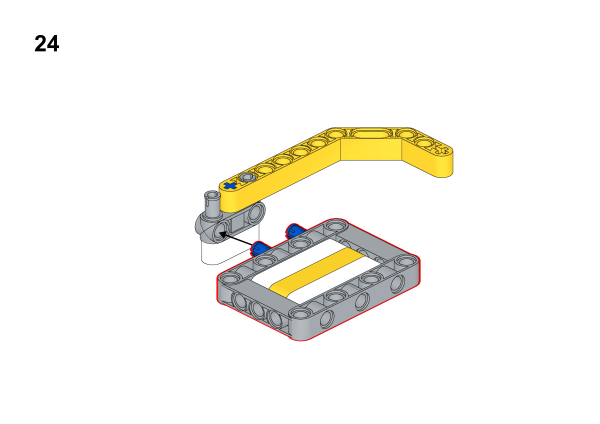

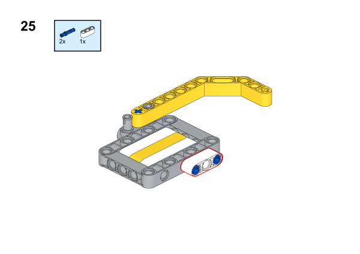

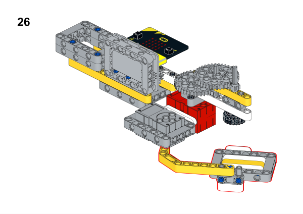

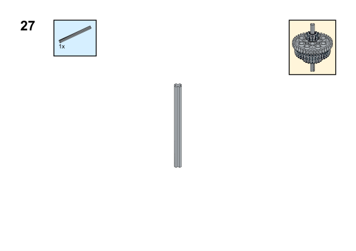

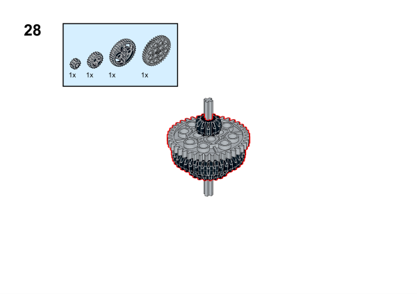

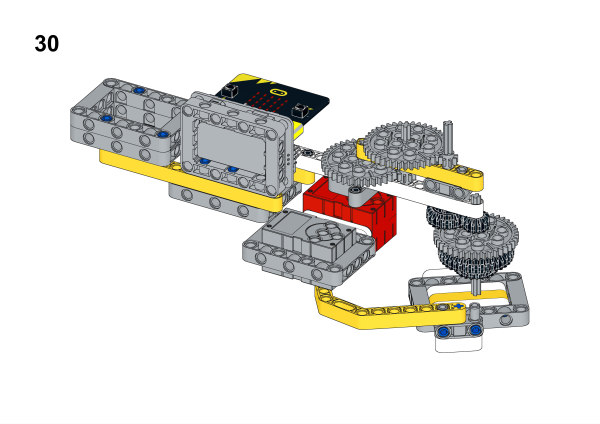

## Hardware Connection

Connect a [motor](https://www.elecfreaks.com/geekservo-motor-2kg-compatible-with-lego.html) to M1, and the [servo](https://www.elecfreaks.com/geekservo-2kg-360-degrees-compatible-with-lego.html) to S1 ports on [Wukong breakout board](https://www.elecfreaks.com/wukong-board-with-lego-holder-for-micro-bit.html). 

## Software Platform
---
[MakeCode](https://makecode.microbit.org/)

## Coding
---
### Add extensions
Click "Advanced" in the MakeCode to see more choices.
 

Search with Wukong in the dialogue box to download it. 

### Program
 
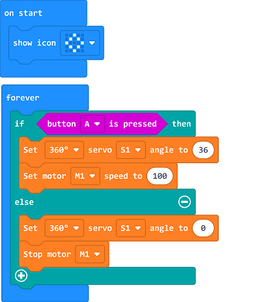

Link:[https://makecode.microbit.org/_Vw1agAfMAccF](https://makecode.microbit.org/_Vw1agAfMAccF)

### Result

Place the gyro in the acceleration position, when the button A is pressed (long press) , the bottom baffle will support the small gyro on the baffle to accelerate the rotation; release the A button, the bottom baffle will move to the right, and the gyro falls off, then the motor will stop rotating.
