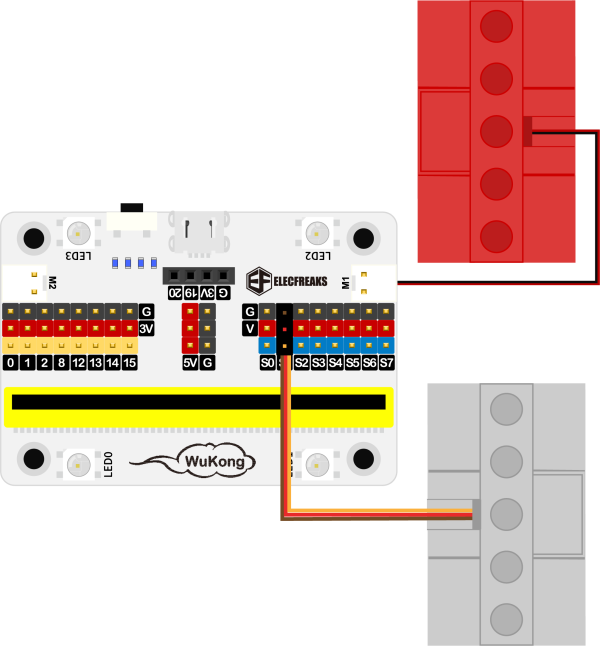

# Case 24: The Top Emitter

## Purpose
---
Make a top emitter.
 

## Link: 
---
[micro:bit Wonder Building Kit](https://www.elecfreaks.com/micro-bit-wonder-building-kit-without-micro-bit-board.html)

## Materials Required
---

## Bricks build-up
---

## Hardware Connection

将一个[电机](https://www.elecfreaks.com/geekservo-motor-2kg-compatible-with-lego.html)连接到[悟空扩展板](https://www.elecfreaks.com/wukong-board-with-lego-holder-for-micro-bit.html)的M1接口，将一个[舵机](https://www.elecfreaks.com/geekservo-2kg-360-degrees-compatible-with-lego.html)连接到[悟空扩展板](https://www.elecfreaks.com/wukong-board-with-lego-holder-for-micro-bit.html)的S1接口.

## Software Platform
---
[MakeCode](https://makecode.microbit.org/)

## Coding
---
### Add extensions
Click "Advanced" in the MakeCode to see more choices.
 

Search with Wukong in the dialogue box to download it. 

### Program
 

Link:[https://makecode.microbit.org/_Vw1agAfMAccF](https://makecode.microbit.org/_Vw1agAfMAccF)

