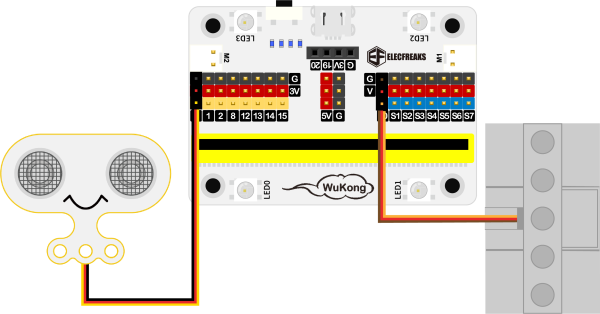

# Case 27: The Smart Garbage Can

## Purpose
---
Make a smart garbage can.
 

## Link: 
---
[micro:bit Wonder Building Kit](https://www.elecfreaks.com/micro-bit-wonder-building-kit-without-micro-bit-board.html)

## Materials Required
---

## Bricks build-up
---

## Installation Mthods of Hardwares

Install the sonar:bit with the bricks. 

## Hardware Connection

Connect a [servo](https://www.elecfreaks.com/geekservo-2kg-360-degrees-compatible-with-lego.html) to S0 and a [sonar:bit](https://www.elecfreaks.com/sonar-bit-for-micro-bit-ultrasonic-sensor-distance-measuring-3v-5v.html) to P0 port on [Wukong breakout board](https://www.elecfreaks.com/wukong-board-with-lego-holder-for-micro-bit.html). 

## Software Platform
---
[MakeCode](https://makecode.microbit.org/)

## Coding
---
### Add extensions
Click "Advanced" in the MakeCode to see more choices.
 

Search with Wukong in the dialogue box to download it. 

Search with IOT:bit in the dialogue box to download it. 

### Program
 

Link:[https://makecode.microbit.org/_XeMXzj7z3JFx](https://makecode.microbit.org/_XeMXzj7z3JFx)

### Result

When the micro:bit is powering on, it displays a heart icon, then the lid will automatically open when the ultrasonic sensor detects someone approaching, and it will automatically close after three seconds.
