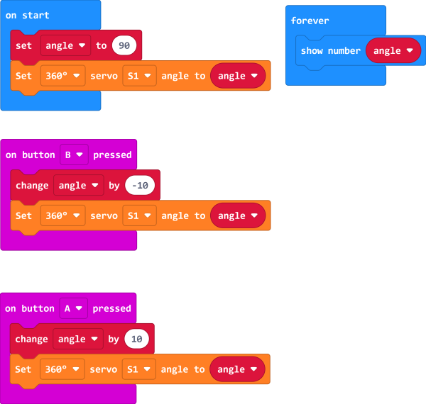

#  Safety instructions
 Wonder Building Kit is an electronic product and we need to pay attention to the following issues in daily use, please read carefully and know the relevant precautions.

1. Do not use the Wukong expansion board while it is being charged. Using the Wukong expansion board while charging will not only shorten the life of the Wukong expansion board, but may also cause damage to the product.
2. Do not use detergent or water to clean the Wonder Building Kit. We recommend that you use a cotton cloth moistened with alcohol to scrub, or a hair dryer if you still need to clean the joints.
4. Do not disassemble or alter in any way the structure of the Wukong expansion board and other electronic devices by yourself.
5. Do not place the Wukong expansion board and other electronic components near or in fire as this may cause damage to the product or cause a fire.
6. When not using the Wonder Building Kit for an extended period of time, place it in a clean box and wrap it in a bag to prevent dust from falling into the interface and interfering with your use. Store the wrapped Wonder Building Kit in a clean, dry environment.
# 360° Degrees Building Blocks Servo Usage Precautions
When 360° Servo is used for the first time, the angle should be adjusted first, and then the structure should be built to avoid blocking of the servo due to the space structure, which will lead to damage of the product. The reference commissioning procedure is as follows:
 
