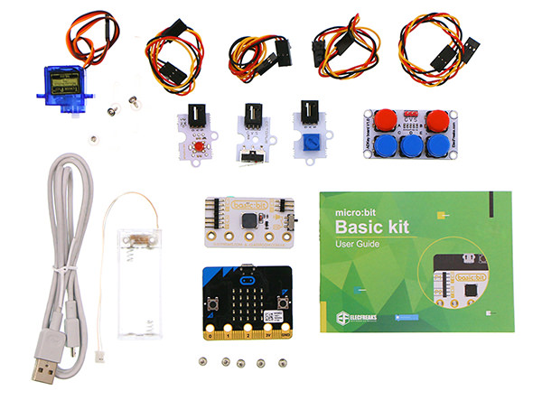

# Introduction
---
ELECFREAKS micro:bit basic kit is an entry-level kit. We carefully select 5 most common electric bricks, which can be easily connected to micro:bit via basic:bit. This kit can help students learn how to build their micro:bit projects quickly. And these electric bricks can be driven by Makecode defaulted blocks directly. You don't have to add any extra package. It is helpful for students to understand the usage of electric bricks from its principle.

## Components
---
Module | Quantity
:-: | :-: 
micro:bit |1
basic:bit|1
LED Module|1
Crash Sensor|1
Potentiometer| 1
Servo|1
ADKey|1
USB Cable|1
Crystal Battery Box|1
Basic:kit Manual Book|1

## FAQ
---
