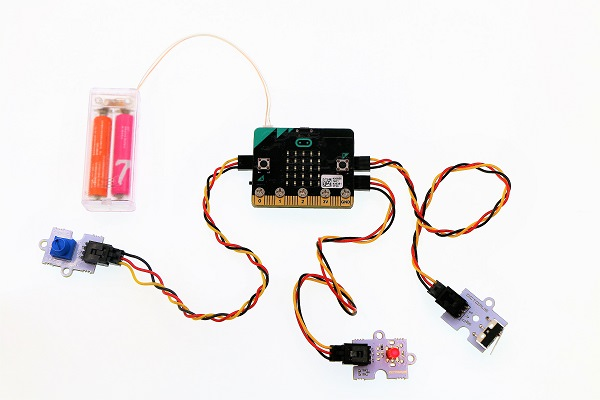
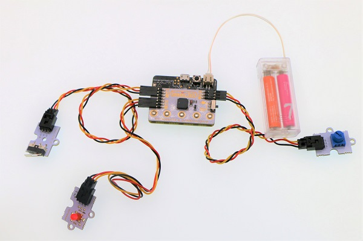
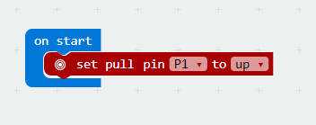
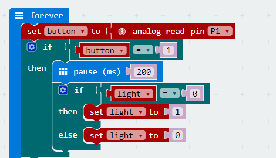
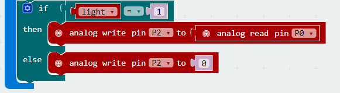

# case 01 Light Controller 

## Our Goal

Use basic kit to control light. 

## Material

1 x [basic kit](https://shop.elecfreaks.com/products/elecfreaks-micro-bit-beginner-basic-kit-without-micro-bit-board?_pos=1&_sid=b2a4954fa&_ss=r)

## Background Knowledge

## Hardware Connection

Connect the crash sensor to P1 port on basic:bit, connect an LED module to P2 and connect a potentiometer module to P0, just like the picture showed below. 

***Note：*** The switch on basic:bit must be shifted to P0 end, or the buzzer onboard will be connected to P0 port.

## Software

[Microsoft Makecode](https://makecode.microbit.org/#)

## Programming

### Step 1

When start, set a pull-up to P1 port to initialize the crash sensor. 

### Step 2

Read the return value of P1 port in digital way, and assign it to variable `button` to obtain the status of crash sensor.
Judge if `button` equals to 1. If `button` is equal to 1, it means the crash sensor is pressed down and we have to delay time and debounce. 
Judge the variable `light`. If the value of `light` is 0, it means the light is turned off, and we set `light` to 1. Or else, we set it to 0. 

### Step 3

Judge the variable `light`. If `light` is equal to 1, it means the light is turned on. Then read the value of P0 port(i.e. the return value of the potentiometer) in analog way, while writing it to P2 port with the same method. Now, this value becomes the parameter of LED module. 
If `light` isn't equal to 1, it means the light is turned off. Then analog write P2 to 0 and turn off LED. 

### Program

The link of the whole program: [https://makecode.microbit.org/_DL87DfRpaL7z](https://makecode.microbit.org/_DL87DfRpaL7z)

You can also check the program from the page below.

<iframe style="position:absolute;top:0;left:0;width:100%;height:100%;" src="https://makecode.microbit.org/#pub:_DL87DfRpaL7z" frameborder="0" sandbox="allow-popups allow-forms allow-scripts allow-same-origin"></iframe>
  

## Result

Press the crash sensor for once, the LED module is turned on; press again, then it is turned off. When the LED is turned on, we can adjust the brightness of LED by rotating the knob on the potentiometer.

## Think

Why we need to delay time and debounce ? 

## FAQ

## Relative Readings
---

