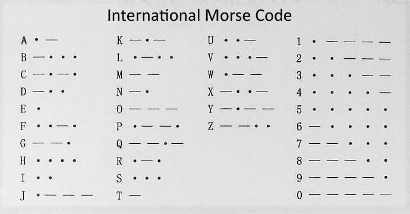
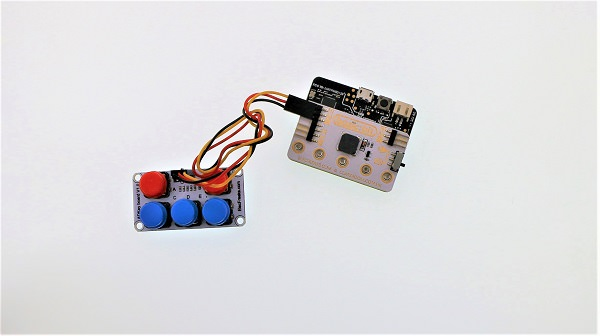
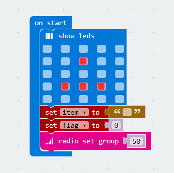
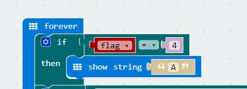
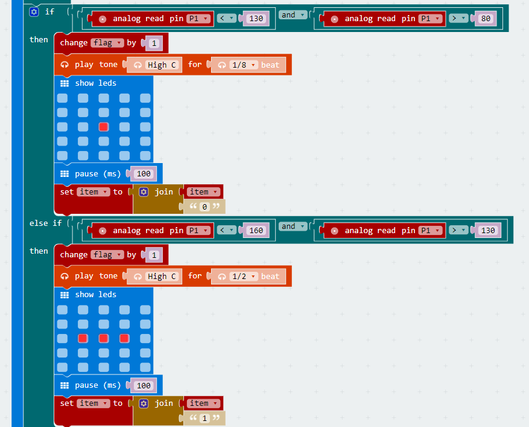
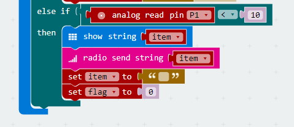

# case 02 Morse Code 

## Our Goal
---
- Use basic kit to complete morse code. 

## Material
---
- 1 x basic kit

## Background Knowledge
---

### Morse Code

- [Morse Code](https://en.wikipedia.org/wiki/Morse_code) is a method of transmitting text information as a series of on-off tones, lights, or clicks that can be directly understood by a skilled listener or observer without special equipment. It is named for Samuel F. B. Morse, an inventor of the telegraph. The International Morse Code encodes the ISO basic Latin alphabet, some extra Latin letters, the Arabic numerals and a small set of punctuation and procedural signals (prosigns) as standardized sequences of short and long signals called "dots" and "dashes", or "dits" and "dahs", as in amateur radio practice. 

### Table of Morse Code

## Hardware Connection
---
- Connect the crash sensor to P1 port on basic:bit. See picture below.

## Software
---
- [Microsoft Makecode](https://makecode.microbit.org/#)

- ADKeypad analog read the return value of I/O port. Here's the values:

1. Button A <10
2. Button B: 10-80
3. Button C: 80-130
4. Button D: 130-160
5. Button E: 160-600

## Programming
---
### Step 1

- When start, display an image, set variable `item` to the data that ready to be sent, and set variable `flag` to the length of string.
- Set a radio group to 50. 

### Step 2

- Judge if the variable `flag`(string length) is 4. (in this case, we use English letters in Morse Code only, so the maximum length is 4.) If it is 4, then show string "A" to the user. 

### Step 3

- Analog read the value of P1 port. Judge which button is pressed. If the return value is among 80-130, then it is button C that was pressed. 

- When button C is pressed, increase the string length variable(`flag`) by 1, and play a tone for 1/8 beat, then display a pixel point on micro:bit screen, which stands for a dot in morse code. In the final, delay time to de-shock, and write character "0" to the end of the string. 

- The event of button D is similar to button C, but it will display a dash (in morse code) on micro:bit screen, and write character "1" to the end of the string.

### Step 4

- When button A is pressed, display the string and then send it. At the same time, set variable `item` and `flag` to 0 and initialize the program. 

### Program

The link of the whole program: [https://makecode.microbit.org/_3JrVPeeDVY2r](https://makecode.microbit.org/_3JrVPeeDVY2r)

You can also check the program from the page below.

<iframe style="position:absolute;top:0;left:0;width:100%;height:100%;" src="https://makecode.microbit.org/#pub:_3JrVPeeDVY2r" frameborder="0" sandbox="allow-popups allow-forms allow-scripts allow-same-origin"></iframe>
  

## Result
---

- Press down button C, micro:bit screen will display a dot; press down button D, then it will display a dash. When the total press amount for button C or D is 4, then micro:bit will display the character A. At this time, we need to press button A to restart the program. 

## Think
---
- Why we need to delay time and debounce ?

## FAQ
---

## Relative Readings
---

