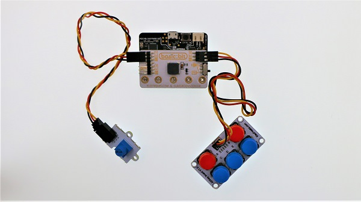
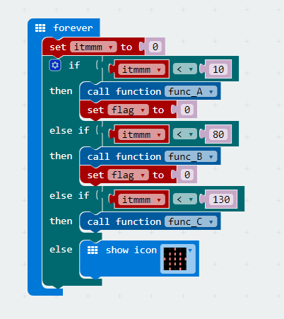
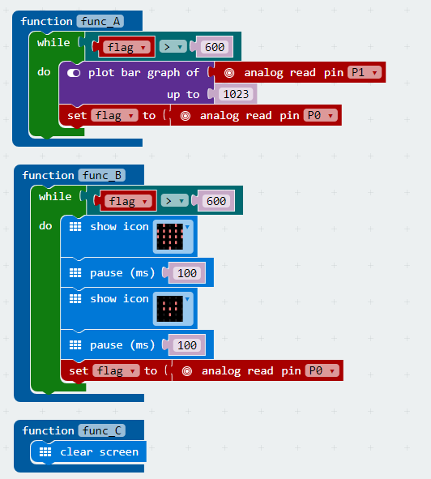

# case 03 Function Selector

## Our Goal

 Use basic kit to create a function selector.

## Material

1 x [basic kit](https://shop.elecfreaks.com/products/elecfreaks-micro-bit-beginner-basic-kit-without-micro-bit-board?_pos=1&_sid=b2a4954fa&_ss=r)

## Hardware Connection

 Connect the crash sensor to P0 port on basic:bit and connect the potentiometer to P1. See picture below. 

## Software

 [Microsoft Makecode](https://makecode.microbit.org/#)

 The crash sensor analog read the return value of I/O port. Here's the values:

1. Button A <10
2. Button B: 1080
3. Button C: 80130
4. Button D: 130160
5. Button E: 160600

## Programming

### Step 1

 Create a forever loop, read the value of P0 port in analog way, and then assign the return value to variable `itmmm` so as to judge which button is pressed. 
 If `itmmm` is under 10, it means button A is pressed. When button A is pressed, call function `func_A` and set variable `flag`(Variable for judging the internal loop in the function) to 0 after call. 
 If `itmmm` is under 80, it means button B is pressed. When button B is pressed, call function `func_B`and set variable `flag` to 0 after call. 
 If `itmmm` is under 130, it means button C is pressed. When button B is pressed, call function`func_C`.

### Step 2

 Function `func_A`: When `flag` is beyond 600(i.e. no buttons pressed), read the value of P1 port and plot it on micro:bit screen. Read the button status of P0 port. When button E is pressed, the loop is terminated and the function call is finished. 
 Function `func_B`: When `flag` is beyond 600(i.e. no buttons pressed), display a flashing heart. Read the button status of P0 port after each flash. When button E is pressed, the loop is terminated and the function call is finished. 
 Function `func_C`: Clear the screen and finish the call of function. 

### Program

The link of the whole program: [https://makecode.microbit.org/_cuufKuP6FARo](https://makecode.microbit.org/_cuufKuP6FARo)

You can also check the program from the page below.

<iframe style="position:absolute;top:0;left:0;width:100%;height:100%;" src="https://makecode.microbit.org/#pub:_cuufKuP6FARo" frameborder="0" sandbox="allowpopups allowforms allowscripts allowsameorigin"></iframe>
  

## Result

 When startup, micro:bit will display an image of house.
 Press button A to call function `func_A`. We can use potentiometer to control the brightness of the LED screen . And we can press any button to finish the call of function. 
 Press button B to call function `func_B`, and micro:bit will display a flashing heart. And we can press any button to finish the call of function. 
 Press button C to call function `func_C` and clear the screen. 
 For other situations, micro:bit will display a house image. 

## Think

## FAQ

Q: why there is nothing happened when a button is pressed down?      
A: The button status judgement is not always happen. When other section of code is running, the button program will stop judge.      

## Relative Readings

Interrupt: [When something unexpected occured during the operation of a computer, it will stop the current program and transfer to a new program. Once the new program is processed, it will return to and continue its original suspended program.](https://en.wikipedia.org/wiki/Interrupt)

