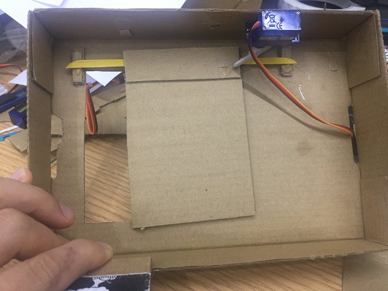
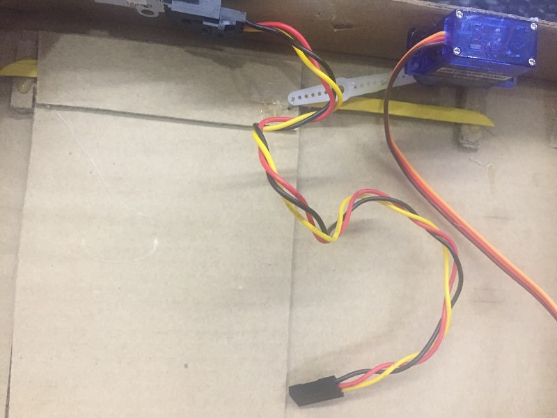
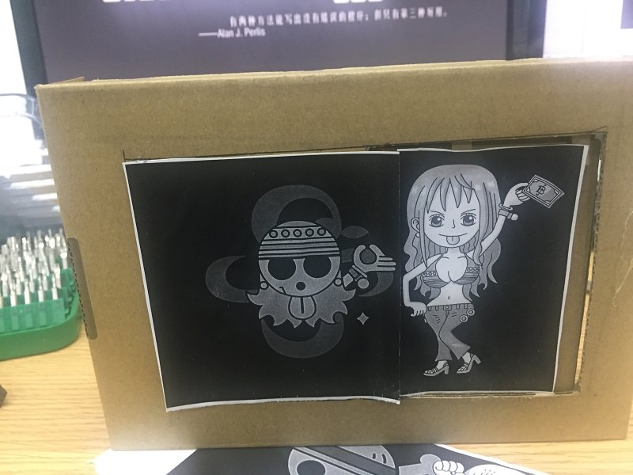
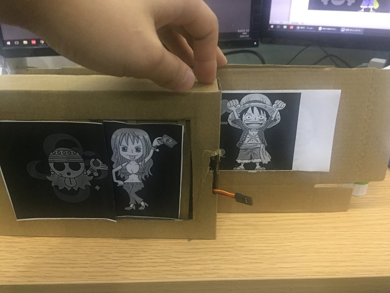
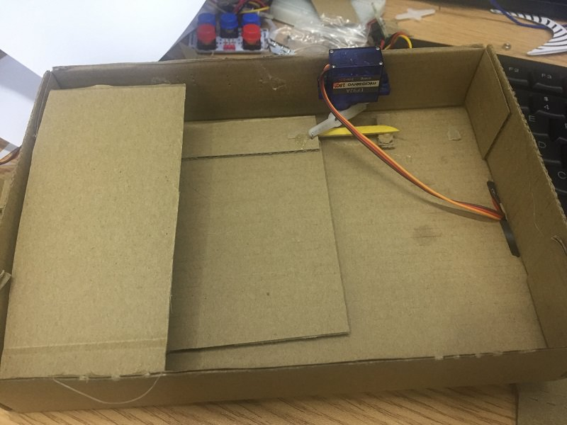
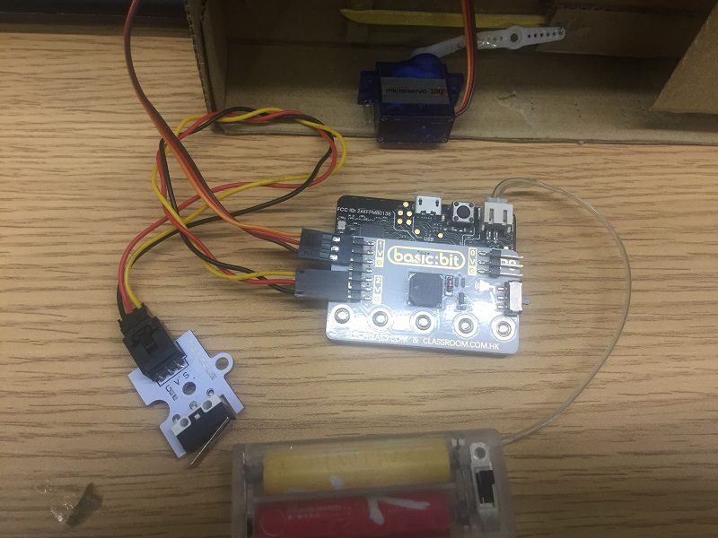
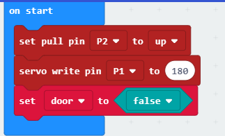
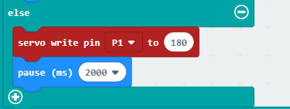

# case 04 Show Box for Stickers 

## Goal
---

- Make a show box for stickers you like.

## Materials
---

- 1 x Servo
- 1 x Cardboard
- 1 x Hot melt glue gun
- 1 x Scissors
- 1 x Handmade knife
- 1 x Crash sensor
- 1 x Batteries pack
- 1 x basic kit board

## Background 
---
### What is a show box for your stickers?

- Do you want to show your lovely stickers to others ? Let's make a show box for stickers.

### How does it work?

- When micro:bit is received signal detected by crash sensor by basic:kit board, the servo turns and the door of show box opens.

## Practical operation
---
Prepare a handmade knife, a hot melt glue gun, a scissors and a piece of cardboard.

Set up as below：

Front side：

Back side：

Set and stick components as below.

Prepare your lovely stickers and stcik them as below.

Thread wires through the hole of front side.

## Hardware connect
---
-  Connect servo to P1, crash sensor to P2 and battaries pack to micro:bit. (as below) 

## Software

---
[makecode](https://makecode.microbit.org/#)

## Programming
---
### Step 1

Under "on start"，set pull pin P2 to up to keep signal stable. Set servo write pin P1 to 180, then the sticker board is at rest.

Set door as a variable, and its initial value is false for saving status of sticker board.

### Step 2

Under forever, snap if statement to judge if the P2 port is equal to 0, it means if the sensor switch is pressed.

When the value P2 port is equal to 2, the sensor switch is pressed, set variable door to not door.

Then, snap another if statement to control the value of varible door, which means to judge the status of the door. If variable door is equal to true, then the sticker board will move(P1=0).

### Step 3

When the value of P2 is not equal to 0, the sensor switch is not be pressed. 

Then, the sticker board is at rest(set P1 to 180).

### Program

Please refer to detail programming：[https://makecode.microbit.org/_0JmTbLKuXA8s](https://makecode.microbit.org/_0JmTbLKuXA8s)

You also could directly download program visit website as below:

<iframe style="position:absolute;top:0;left:0;width:100%;height:100%;" src="https://makecode.microbit.org/#pub:_0JmTbLKuXA8s" frameborder="0" sandbox="allow-popups allow-forms allow-scripts allow-same-origin"></iframe>
  
---

## Result
---
Press the crash module, your stickers begins to moving.

## Think
---
How to show more stickers to your friends？

## Questions
---

## More Information  
---

