# case 05 Shock Box 

## Goal
---

- Make a shock box.

## Materials
---

- 1 x Servo
- 1 x Cardboard
- 1 x Hot melt glue gun
- 1 x Scissors
- 1 x Handmade knife
- 1 x Crash sensor
- 1 x Batteries pack
- 1 x basic kit board (Basic:bit)

## Background
---
### What is a shock box ?

- Want to be special? Let's make a shock box and you will find more when you turn off the light.

### How does it work?

- When micro:bit is received signal detected by crash sensor by basic:kit board, the servo turns and the shock box turns and shows different faces.

## Practical operation
---
Prepare a handmade knife, a hot melt glue gun, a scissors and a piece of cardboard.

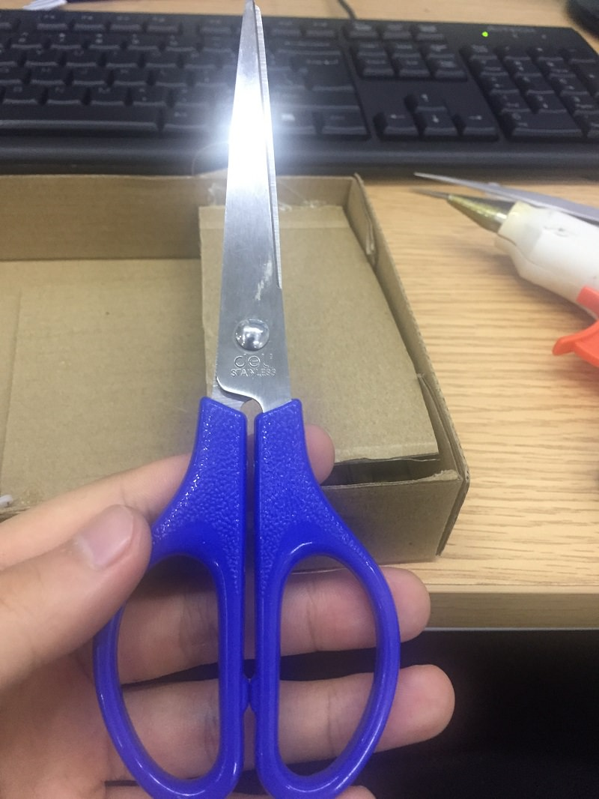

Set up as below：

Make a little square box which has four special faces(You also could draw it by yourself). Make a little paper cover on the box and set the box on servo.

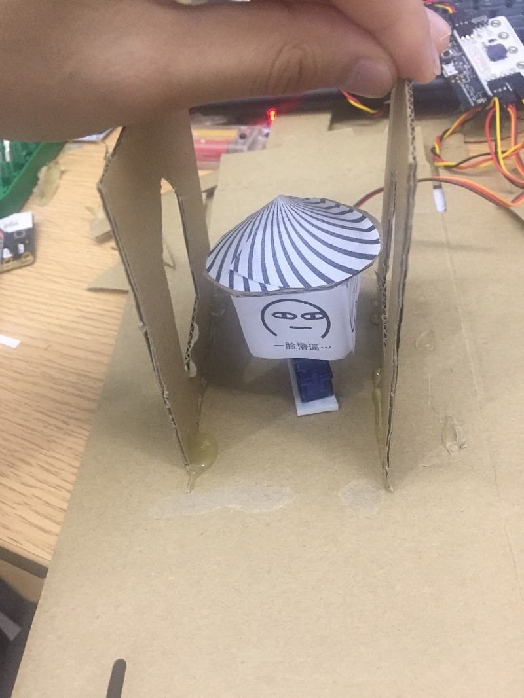

Clip four pieces of the cardboard and cut the centre part of the four pieces, then place the four cardboard around the box. You could place them closely to the box and you could clearly see the faces.

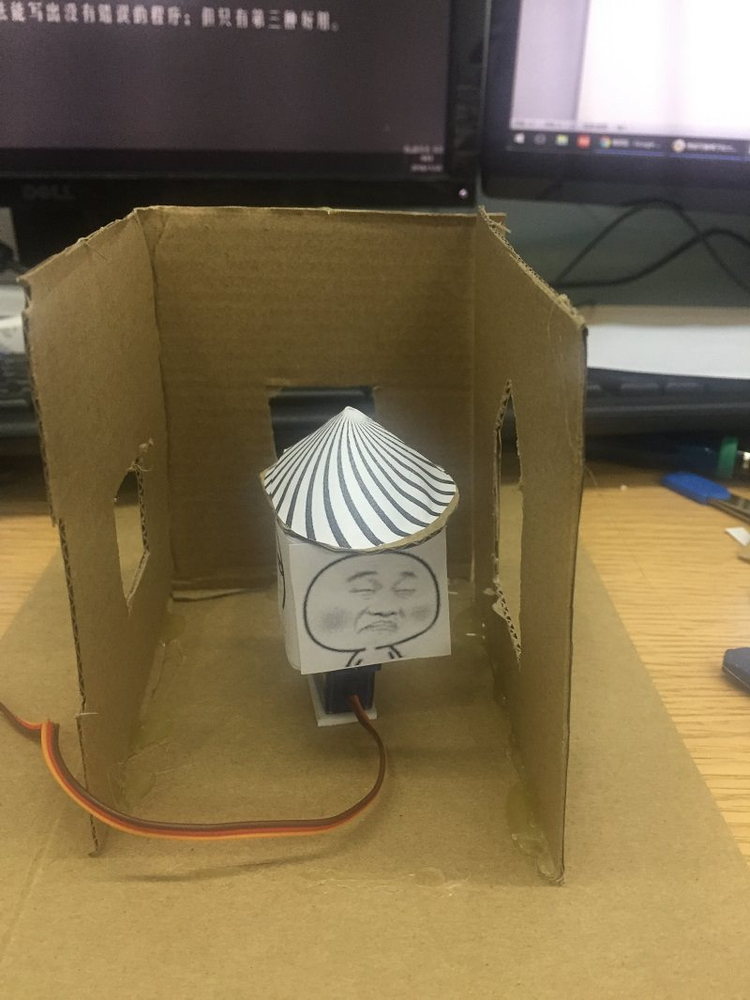

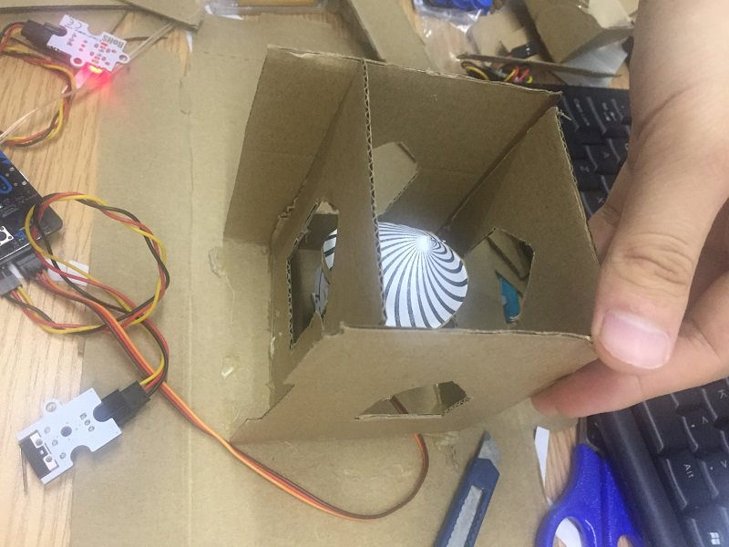

Make a roof by cutting your cardborad and drill a small hole of the roof. Then thread light wire through the hole.

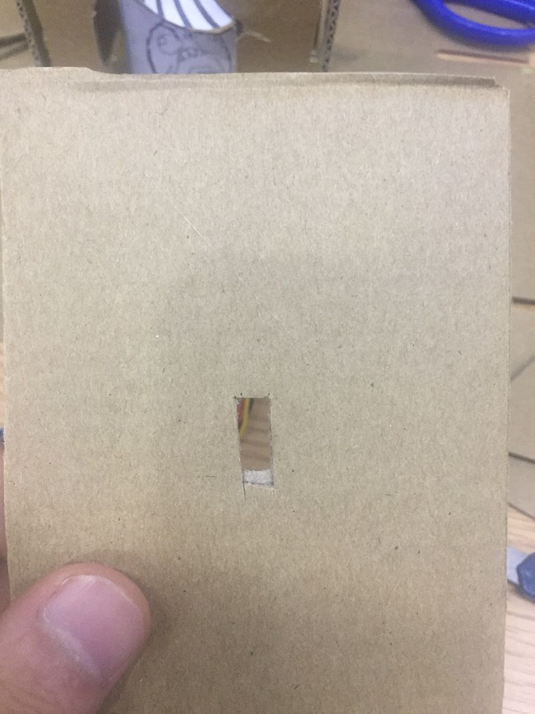

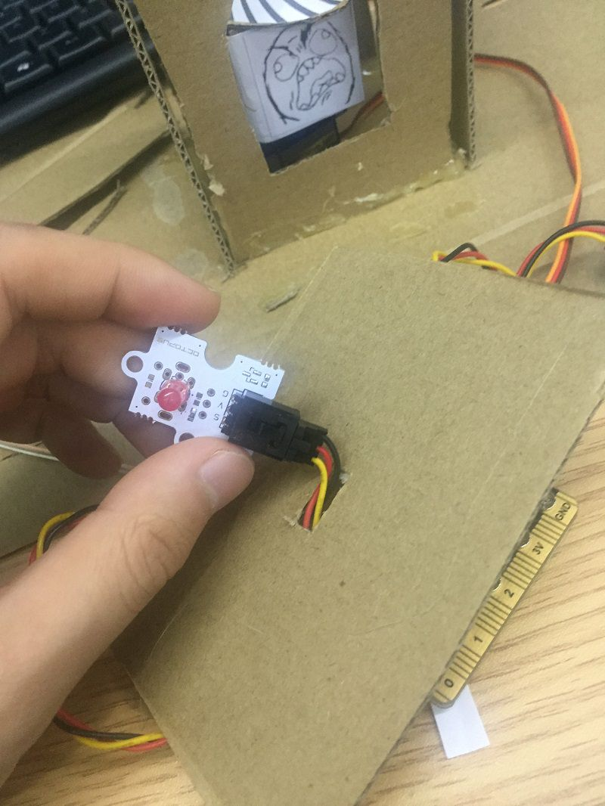

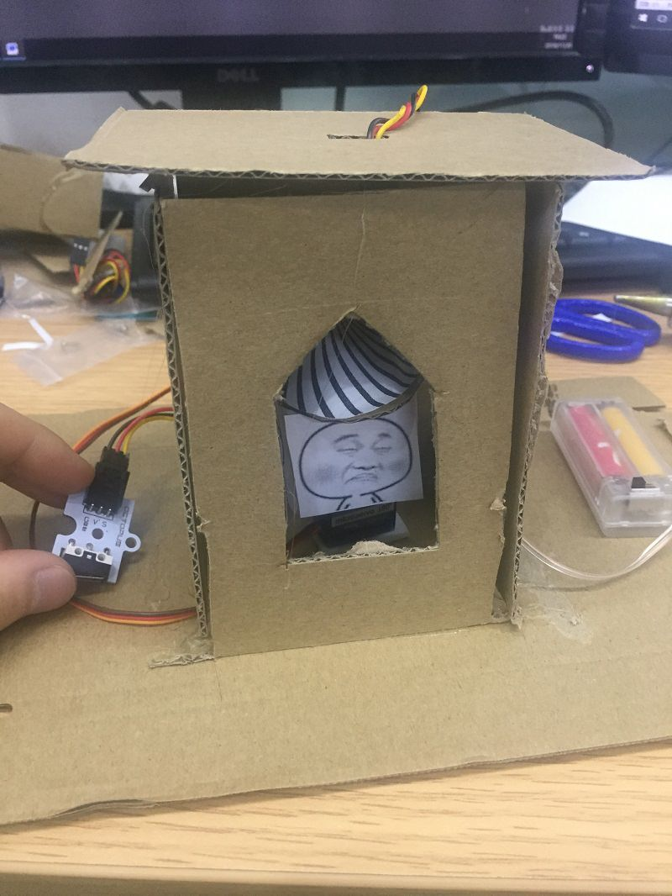

Set and stick components as below.

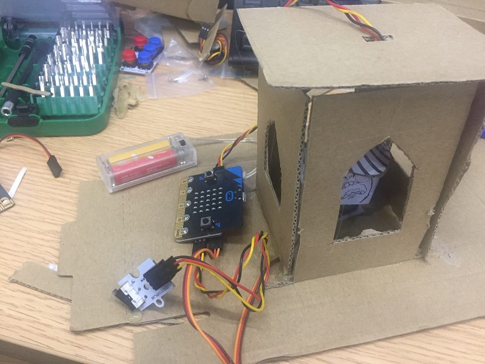

## Hardware connect
---

Connect small LED to P0, servo ro P1, crash sensor to P2 and battaries pack to micro:bit. (as below) 
  
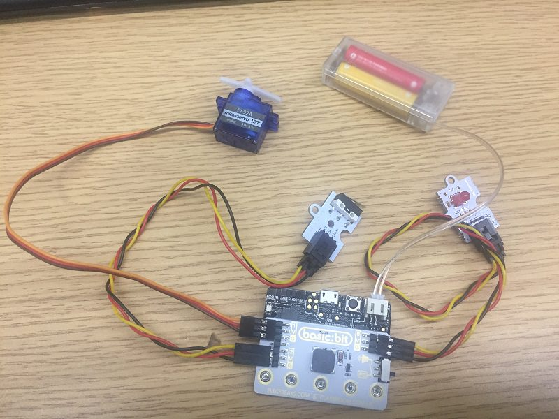

###Please note the swith of basic:bit should at P0.

## Software
---
[makecode](https://makecode.microbit.org/#)

## Programming
---
### Step 1

Under "on start"，set pull pin P2 to up to keep signal stable. Set servo write pin P1 to 180, then the sticker board is at rest.

Set door as a variable, and its initial value is false for controlling turn of faces box.

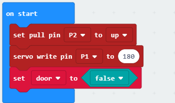

### Step 2

Under forever, snap if statement to judge if the P2 port is equal to 0, it means if the sensor switch is pressed.

When the value P2 port is equal to 2, the sensor switch is pressed, set variable door to not door.

Then, snap another if statement to control the value of varible door, which means to judge the status of the door. If variable door is equal to true, then the show will turn and the light will up(P1=0).

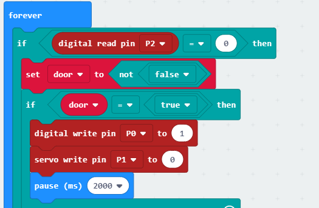

### Step 3

When the value of P2 is not equal to 0, the sensor switch is not be pressed. 

Then, the box at rest(set P1 to 180) and light will off.

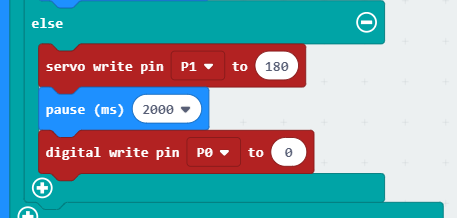

### Program

Please refer to detail programming：[https://makecode.microbit.org/_M9M33fRYo9KY](https://makecode.microbit.org/_M9M33fRYo9KY)

You also could directly download program visit website as below:

<iframe style="position:absolute;top:0;left:0;width:100%;height:100%;" src="https://makecode.microbit.org/#pub:_M9M33fRYo9KY" frameborder="0" sandbox="allow-popups allow-forms allow-scripts allow-same-origin"></iframe>
  
---

## Result
---
Press the crash module, the box turns and shows different faces

## Think
---
How to make the faces box turns face by face ?

## Questions
---

## More Information   
---

