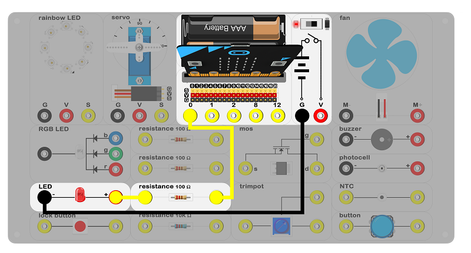
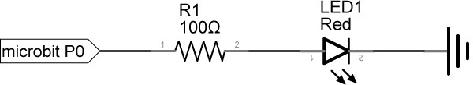
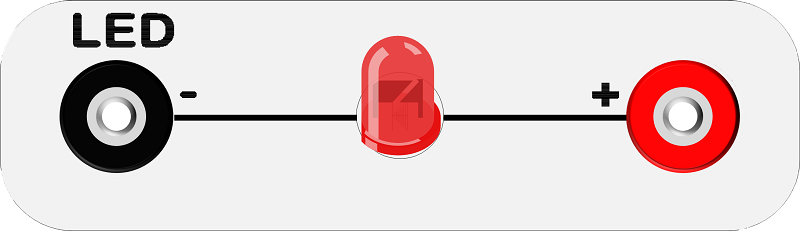
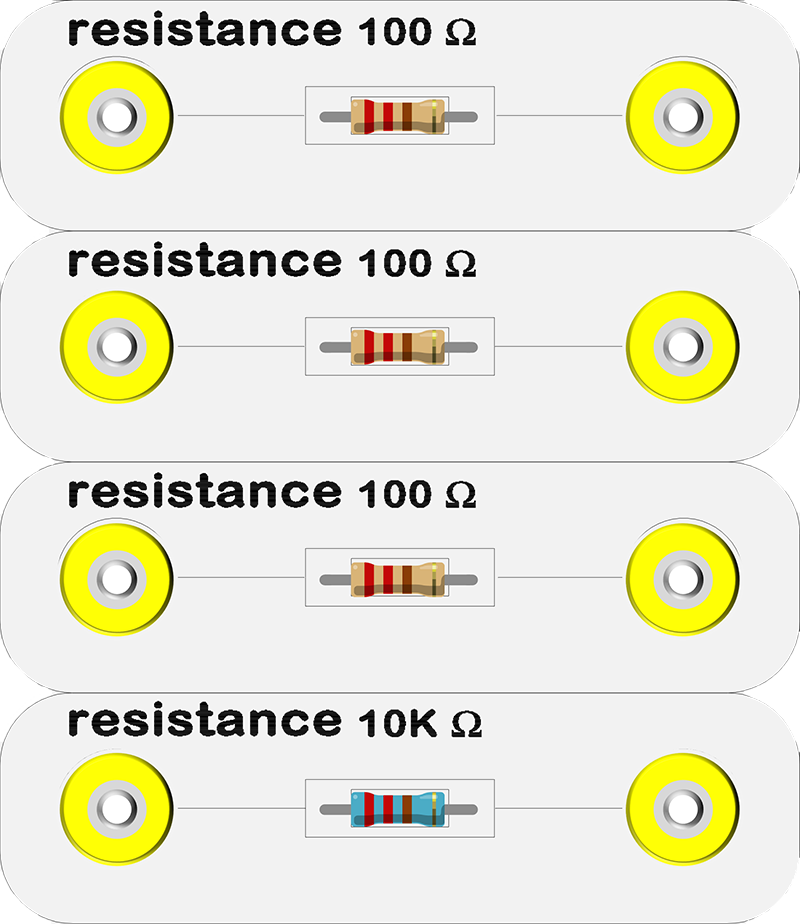
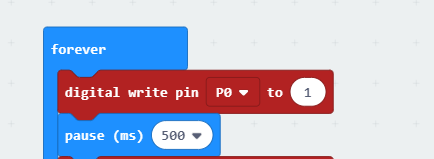
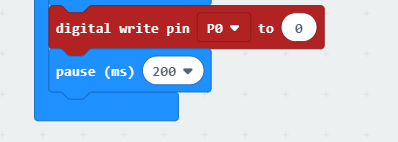
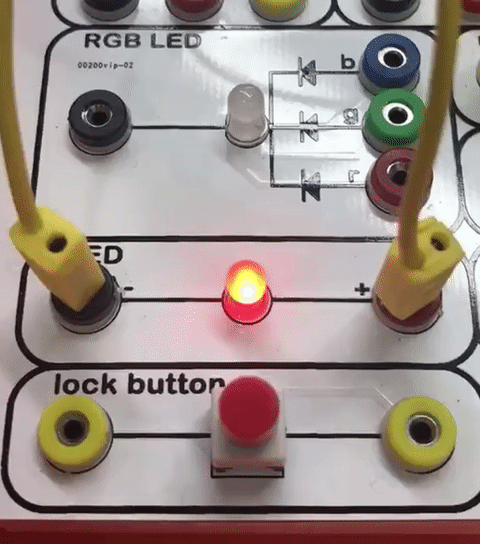

# case 01 led 

## Introduction ##
---
LED is a common use in our life. Most of signal light employs LED as main illuminant. In this case, we will use the micro:bit to control one LED flashing.

## Hardware Connect ##
---
、

- Connect the circuit as above picture and put 2 AAA batteries into the batteries pack.

## Principles of Circuits ##
---

- The GND of slot on the micro:bit is into innards of batteries' GND to generate the current loop.
- Set low voltage(digital 1) to P0, the circuit on and the LED on.
- Set high voltage(digital 0) to P0, the circuit off and the LED off.

## Introduction of Components ##
---
### LED ###
- LED, light-emitting diode, is a solid state semiconductor devices, which can be directly converted into electricity for lighting up.
- The experiment box included a red LED. The black port on the left is negative pole and the red port on the right is positive pole.

*- Note: Please note the positive and the negative when you are connecting.*

### Resistor ###
- The resistor is a kind of component to control the current. It can limit the current of connecting circuit. By the way, there is no positive or negative for the resistor.
- The experiment box included 3 100Ω resistors and 1 10KΩ resistor.

- Install a 100Ω resistor in LED circuit to limit the circuit. It may cause breakdown of LED if the current is not be limited.

## Software
---
### Step 1

- Click [makecode https://makecode.microbit.org/#](https://makecode.microbit.org/#).

- Click on "New Project" and set a new Project.

### Step 2

- First, snap the digital write pin into the forever block, write 1 to the P0 port for lighting up the LED, then pause 500ms;

- Next, snap the digital write pin under the pause (ms) block, write 0 to the P0 port for turning off the LED, then pause 500ms;

### Program

- Program link：[https://makecode.microbit.org/_Fa1Jpj38Di1Y](https://makecode.microbit.org/_Fa1Jpj38Di1Y)

- You also could directly download program by visiting website as below:

<iframe style="position:absolute;top:0;left:0;width:100%;height:100%;" src="https://makecode.microbit.org/#pub:_Fa1Jpj38Di1Y" frameborder="0" sandbox="allow-popups allow-forms allow-scripts allow-same-origin"></iframe>
  
---

## Result
---
- Turn on the switch, LED starts to flashing.

## Think
---
- Why we add a 500ms pause ? 

## Questions
---

## More Information  
---

