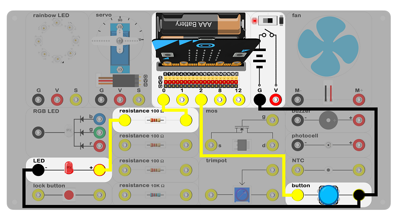
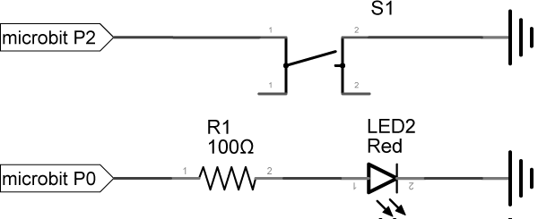
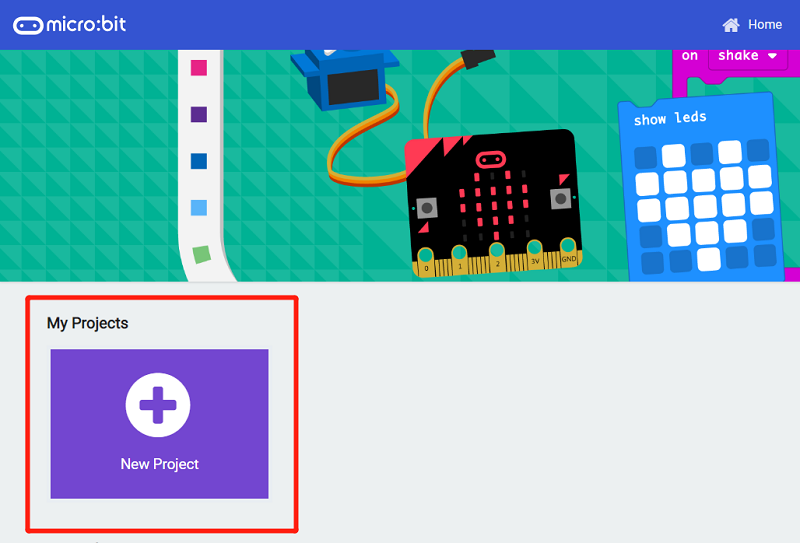
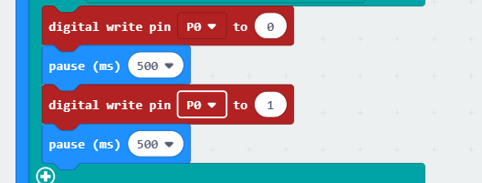

# case 02 button 

## Introduction ##

We learned about how to use micro:bit to let LED flashing in the previous case.

In this case, we are going to use a button to control the flashing LED. 

## Products Link

[ELECFREAKS Experiment Box Kit](https://shop.elecfreaks.com/products/elecfreaks-experiment-box-kit-without-micro-bit-board?_pos=1&_sid=ac099db2f&_ss=r)

## Hardware Connect ##

 Connect circuit as above picture and put 2 AAA batteries to the batteries pack.

## Principles of Circuits ##

 The GND of slot on micro:bit is into innards of batteries' GND to generate current loop.
 When the button pressed, the circuit connects, P2 port of the micro:bit connects GND and level of P2 be pulled down.

## Introduction of Components ##

### Button ###
 This is a common component used to control electronic devices. It is used to connect or cut electrical circuits.  
 This momentary push button switch is usually open. When it's pressed down, it completes the circuit and turns the device on. When it's released, it bounces back to the original state of disconnect. 
 There is a button with blue hat on the experiment box.

## Software

### Step 1

 Click [makecode https://makecode.microbit.org/#](https://makecode.microbit.org/#)。

 Click on "New Project" and set a new Project.

### Step 2

 Snap the set pull pin in to the on start and set pull pin P2 to up to let its default be 1. That's say,  default high level.

### Step 3 

 If P2 is in low voltage, which means the button is pressed, the program will start to run in block
then.

### Step 4

 If the value of P2 is equal to 0, write 0 to P0 port and pause 500ms. Then, write 1 and pause 500ms, LED starts to flashing.

### Program

 Program link：[https://makecode.microbit.org/_5UriK0fC7LWr](https://makecode.microbit.org/_5UriK0fC7LWr)

 You also could directly download program by visiting website as below:

<iframe style="position:absolute;top:0;left:0;width:100%;height:100%;" src="https://makecode.microbit.org/#pub:_5UriK0fC7LWr" frameborder="0" sandbox="allowpopups allowforms allowscripts allowsameorigin"></iframe>
  

## Result

 Press the button, LED starts to flashing. 
 Release the button, LED keeps lighting.

## Think

 Why we add a 500ms pause ?

## Questions

## Questions 

