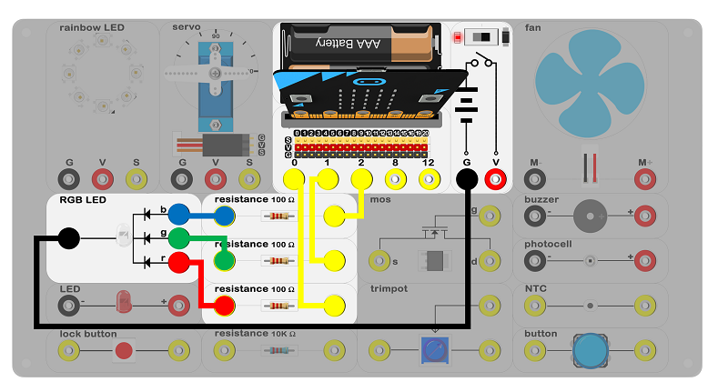
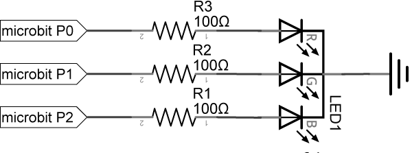
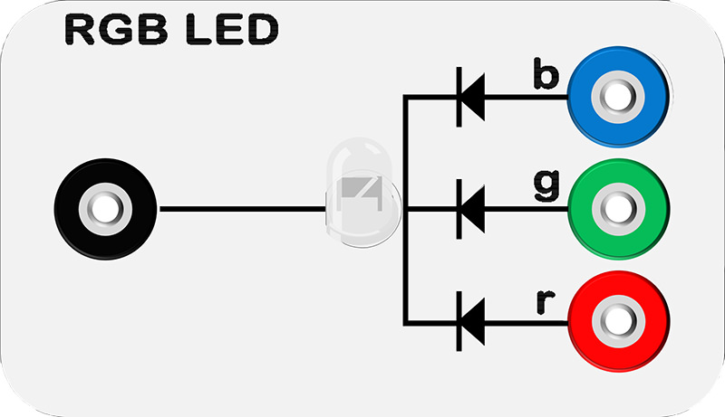
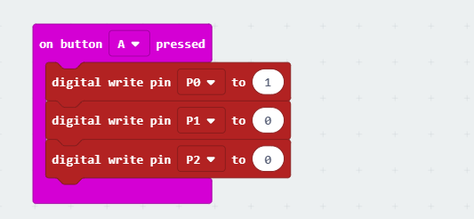
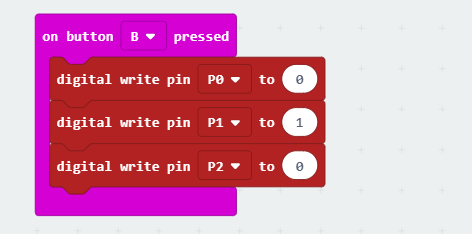
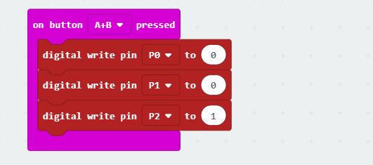

# case 03 RGB led 

## Introduction ##
---
The RGB LED is a kind of LED which creates light of red, green and blue. In this case, we will let RGB LED flash in red, green and blue.

## Hardware Connect ##
---

- Connect circuit as above picture and put 2 AAA batteries to batteries pack.

## Principles of Circuits ##
---

The GND of slot on micro:bit is into innards of batteries' GND to generate current loop.

## Introduction of Components ##
---
### RGB LED ###
- The RGB LED is an LED that has 3 integrated LEDs - red, green and blue in a single component which is divided into R, G and B channel. It is a well-known fact that red, green and blue are three primary colors of light. It can mix all color for everything. RGB LED can generate limitless types of color as well.
- There are 2 types of RGB LEDs, common anode and common cathode. In common-cathode RGB LEDs, the
common port connects to GND. While in common-anode RGB LEDs, the common port connects to VCC. 
-  Our Experiment Box uses a common-cathode RGB LED.

***Note:*** Please note the positive and the negative when you are connecting.

## Software
---
### Step 1

- Click [makecode https://makecode.microbit.org/#](https://makecode.microbit.org/#)。

- Click on "New Project" and set a new Project.

### Step 2

- Snap digital write pin into on button A pressed as below picture. Write 1 to the P0 port, 0 to the P1 port and 0 to the P2 port.
- It means write 1 to R channel of the RGB and write 0 to G & b channel of the RGB.
- RGB LED is the red light.

- Write code for the green light and the blue light in the same way.

### Program

- Program link：[https://makecode.microbit.org/_bm1g8RaVuPkb](https://makecode.microbit.org/_bm1g8RaVuPkb)

- You also could directly download program by visiting website as below:

<iframe style="position:absolute;top:0;left:0;width:100%;height:100%;" src="https://makecode.microbit.org/#pub:_bm1g8RaVuPkb" frameborder="0" sandbox="allow-popups allow-forms allow-scripts allow-same-origin"></iframe>
  

## Result
---
- When the button A be pressed, RGB LED emits red light.
- When the button B be pressed, RGB LED emits green light.
- When the button C be pressed, RGB LED emits blue light.

## Think
---
- What is the color be after mix of red and blue? Show it!

## Questions
---

## More Information  
---

