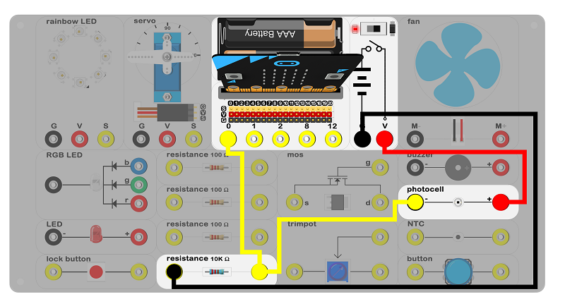
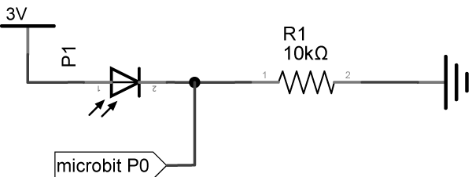
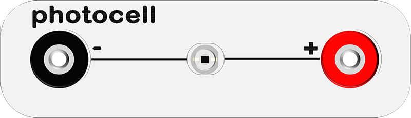
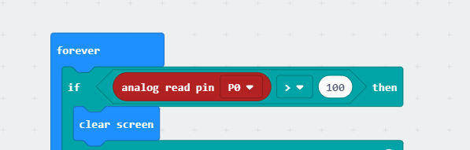
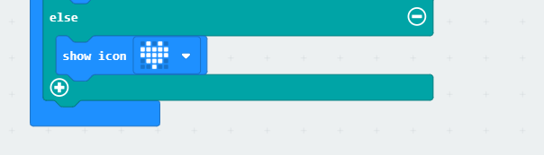
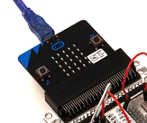

# case 05 photocell 

## Introduction ##

 Photocells change their resistive value based on how much light shines on their face. In this case, we are going to use a photocell to control screen brightness of the micro:bit 5x5LED.

## Products Link

[ELECFREAKS Experiment Box Kit](https://shop.elecfreaks.com/products/elecfreaks-experiment-box-kit-without-micro-bit-board?_pos=1&_sid=ac099db2f&_ss=r)

## Hardware Connect ##

 Connect circuit as above picture and put 2 AAA batteries to batteries pack.

## Principles of Circuits ##

 The GND of slot on micro:bit is into innards of batteries' GND to generate current loop.

## Introduction of Components ##

### Photocell ###
 Photocells or photodiodes. They change their resistive value based on how much light shines on its face. The more light shines on it, the lower its resistance. The photocell is very sensitive to light, so we can use illumination intensity to change circuit of electricity.
 The experiment box included a phtocell. The black port on the left is negative pole and the red port on the right is positive pole.

***Note:*** Please note the positive and the negative when you are connecting.

## Software

### Step 1

 Click [makecode https://makecode.microbit.org/#](https://makecode.microbit.org/#)。

 Click on "New Project" and set a new Project.

### Step 2

 Snap an if statement into the forever to judge if analog read pin P0 is more than 100.
 The value is more than 100(The light is very bright）.
 Clear screen.

### Step 3

 The value is less than or equal to 100(The light is dark).
 A heart icon will show on micro:bit 5X5 allay.

### Program

 Program link：[https://makecode.microbit.org/_1f0Kjdgk7dVc](https://makecode.microbit.org/_1f0Kjdgk7dVc)

 You also could directly download program by visiting website as below:

<iframe style="position:absolute;top:0;left:0;width:100%;height:100%;" src="https://makecode.microbit.org/#pub:_1f0Kjdgk7dVc" frameborder="0" sandbox="allowpopups allowforms allowscripts allowsameorigin"></iframe>
  

## Result

 When the light becomes dark, a heart icon shows.

## Think

## Questions

## More Infromation  

