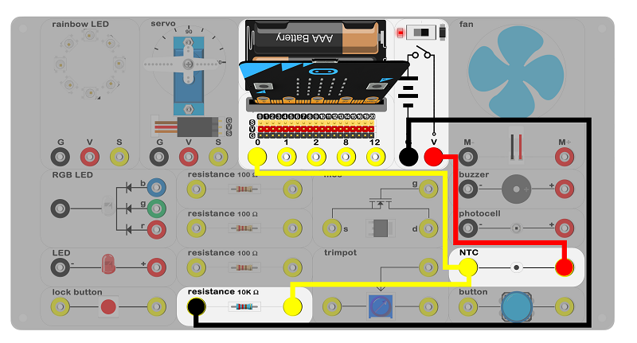
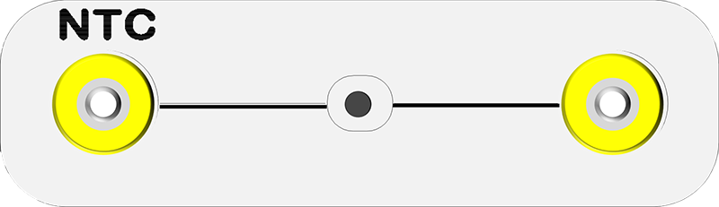
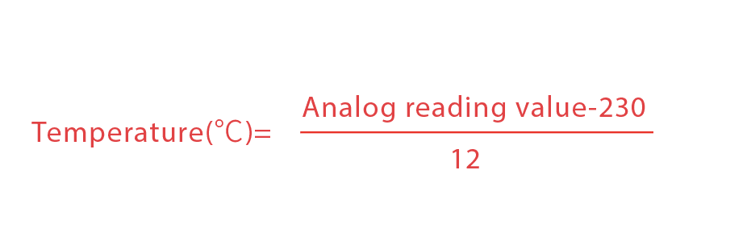
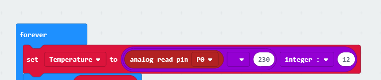

# case 06 NTC 

## Introduction ##
---
- The temperature sensor is a sensor that can sense the temperature and convert the temperature to output signal. The temperature sensor is core of temperature measurement instrument.

## Hardware Connect ##
---

- Connect circuit as above picture and put 2 AAA batteries into batteries pack.

## Principles of Circuits ##
---

- The GND of slot on micro:bit is into innards of batteries' GND to generate current loop.

## Introduction of Components ##
---
### NTC ###
- The NTC is an analog temperature sensor where the output voltage and temperature form a liner relationship. The higher the temperature, the larger the output voltage.
- The experiment box included a NTC.

***Note:*** Please note the positive and the negative when you are connecting.

## Software
---
### Step 1

- Click [makecode https://makecode.microbit.org/#](https://makecode.microbit.org/#)。

- Click on "New Project" and set a new Project.

### Step 2

- Reduction Formula：

- The reading is an analog value of the IO port, we need a formula as above to convert the values into Celsius.

### Step 3

- Set "Temperature" as a variable to store the Celsius.
- As above formula, convert the values of P0 into Celsius.

- Show the temperature value and pauce a second.

### Program

- Program link：[https://makecode.microbit.org/_h8hUjXYFM0yH](https://makecode.microbit.org/_h8hUjXYFM0yH)

- You also could directly download program by visiting website as below:

<iframe style="position:absolute;top:0;left:0;width:100%;height:100%;" src="https://makecode.microbit.org/#pub:_h8hUjXYFM0yH" frameborder="0" sandbox="allow-popups allow-forms allow-scripts allow-same-origin"></iframe>
  

## Result
---
- Show the current temperature on the micro:bit allay.

## Think
---
- 

## Questions
---

## More Information  
---

