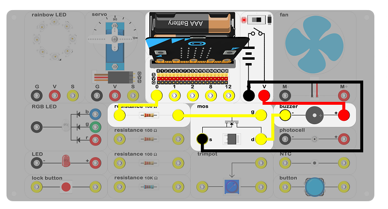
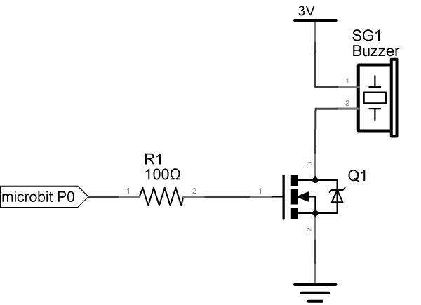
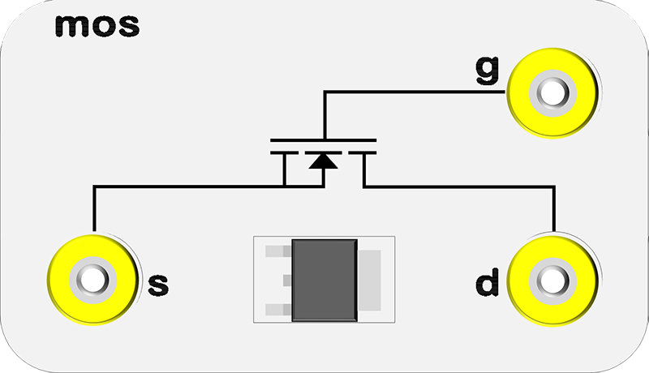
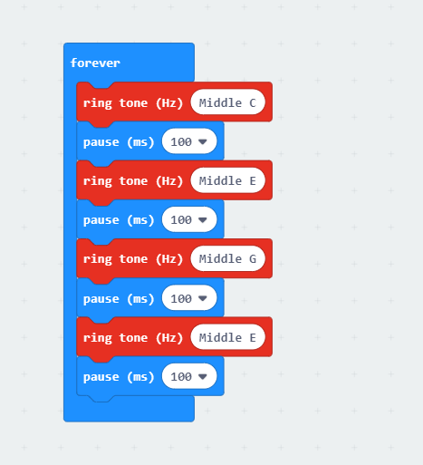

# case 07 buzzer 

## Introduction ##
---
- The buzzer is a kind of integrated electroic sounder which be widely used in computers, printers, photocopiers, announciators, electronic toys, automotive electronics, telephones and timers. In this case, we are going to use the micro:bit driving the buzzer to make it voice in different frequency, just like an alarm song.

## Hardware Connect ##
---

- Connect circuit as above picture and put 2 AAA batteries into batteries pack.

## Principles of Circuits ##
---

- The GND of slot on micro:bit is into innards of batteries' GND to generate current loop.
- P0 port of the micro:bit outputs a square wave, and it be amplified when it through the audion to drive the buzzer.

## Introduction of Components ##
---
### Buzzer ###
- The buzzer a kind of voice device which consists of vibration device and resonance device. Sorting it by control method, the buzzer contains active and passive.
- Principle of active：The buzzer has integrated vibration system and sampling amplifier circuit. It generates voice when DC electrical source is getting through it. You can refer the picture as below:

- Principle of passive：Turn the square signal to voice.You can refer the picture as below:

- The experiment box included a passive buzzer.

### Mos Tube###

- Audion is a semiconductor device to control the current. It is used to amplify the feeble signal to electronic signal with large amplitudes. The buzzer will in a feeble voice when it directly received PWM signal by micro:bit. This is because the currents of I/O port is usually weak which can’t directly drive buzzer. Now we need a transistor to amplify the currents of PMW signal for buzzer can alarm properly.
- The experiment box included a mos tube.

*- Note: Please note the positive and the negative when you are connecting.*

## Software
---
### Step 1

- Click [makecode https://makecode.microbit.org/#](https://makecode.microbit.org/#)。

- Click on "New Project" and set a new Project.

### Step 2

- Snap the ring tone block and pause block into the forever in order to play the GRE sound.

### Program

- Program link：[https://makecode.microbit.org/_VdrFjUVzHgA1](https://makecode.microbit.org/_VdrFjUVzHgA1)

- You also could directly download program by visiting website as below:

<iframe style="position:absolute;top:0;left:0;width:100%;height:100%;" src="https://makecode.microbit.org/#pub:_VdrFjUVzHgA1" frameborder="0" sandbox="allow-popups allow-forms allow-scripts allow-same-origin"></iframe>
  
---

## Result
---
- The buzzer emits diffrent voices just like a alarm sound. 

## Think
---

## Questions
---

## More Informations 
---

