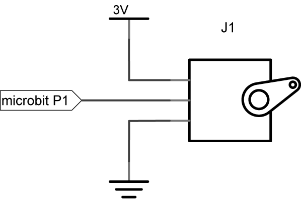
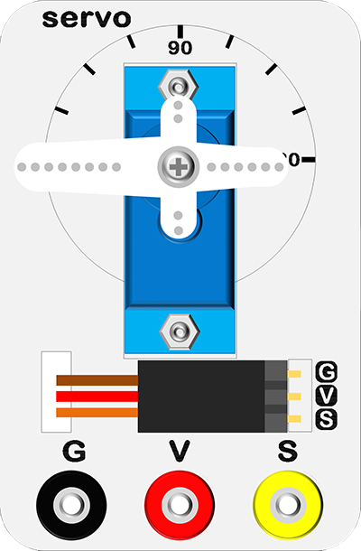

# case 08 servo

## Introduction ##
---
- The servo is a kind of angle servo driver. It is adapted to varying control system. In this case, we are going to use the micro:bit to control rotating of the servo.

## Hardware Connect ##
---

- Connect circuit as above picture and put 2 AAA batteries into batteries pack.

## Principles of Circuits ##
---

- The GND of slot on micro:bit is into innards of batteries' GND to generate the current loop.

## Introduction of Components ##
---
### Servo ###
- A servo is an automatic control system that consists of a DC motor, a reduction gear unit, a potentiometer and a control circuit. Generally, the servo has its the largest rotation angle (For example:180 deg).
- Our reference point at a 90deg middle position is defined by a signal frequency of 20ms and a pulse width of 1.5ms.
- The experiment box included a 180° servo.

Note：You don't need to think out some complex questions like pulse width because micro:bit Foundation has converted the servo code to block.

*- Note: Please note the positive and the negative when you are connecting.*

## Software
---
### Step 1

- Click [makecode https://makecode.microbit.org/#](https://makecode.microbit.org/#)。

- Click on "New Project" and set a new Project.

### Step 2

- Snap the servo write pin and pause block into the forever and set P1 to 0.
- Pause 2000ms.

- Snap the servo write pin again after the first pause block and set P1 to 180.
- Pause 2000ms.

### Program

- Program link：[https://makecode.microbit.org/_fudJaMCRhE1r](https://makecode.microbit.org/_fudJaMCRhE1r)

- You also could directly download program by visiting website as below:

<iframe style="position:absolute;top:0;left:0;width:100%;height:100%;" src="https://makecode.microbit.org/#pub:_fudJaMCRhE1r" frameborder="0" sandbox="allow-popups allow-forms allow-scripts allow-same-origin"></iframe>
  
---

## Result
---
- The servo will rotate between 0 deg to 180 deg.

## Think
---
- If we want to make a thermometer dial by using the NTC and the servo, how do we design the circuit and the programming? 

## Questions
---

## More Information
---

