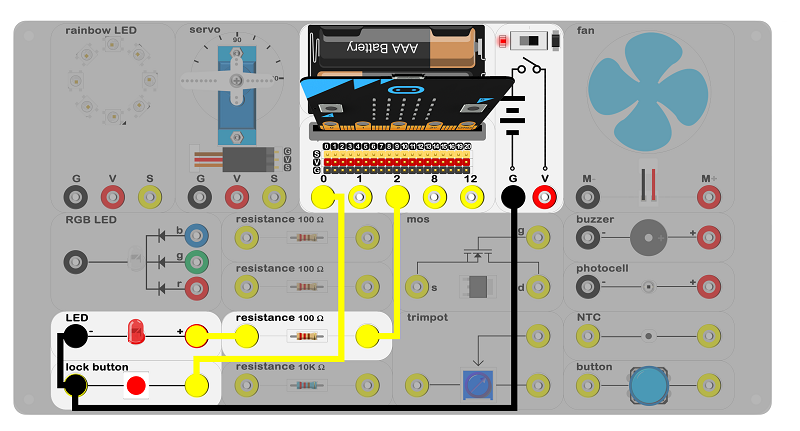
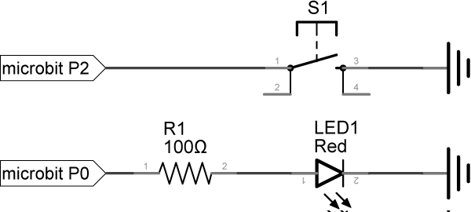
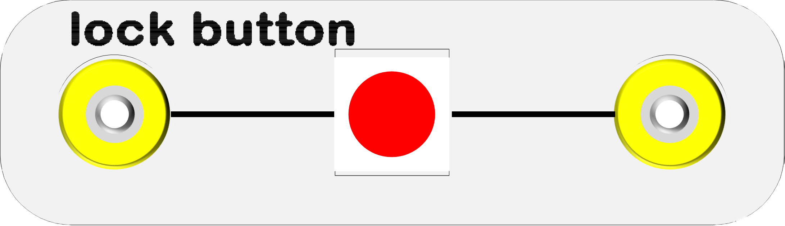

# case 09 selflocking button 

## Introduction ##

 The selflocking switch is a common use button switch. When we fisrt press the button and the circuit of switch will be connection, it means selflock. And when we press the button again, the circuit of switch will be disconnection. In this case, we are going to use the selflocking switch to control on and off of the LED.

## Products Link

[ELECFREAKS Experiment Box Kit](https://www.elecfreaks.com/experimentboxformicrobit.html)

## Hardware Connect ##

  Connect circuit as above picture and put 2 AAA batteries into batteries pack.

## Principles of Circuits ##

 The GND of slot on micro:bit is into innards of batteries' GND to generate the current loop.

## Introduction of Components ##

### Selflocking switch ###
 The selflocking switch is usually a normal switch with a mechanical lock built in. When pressed down and released, it doesn't bounce back automatically. Only after a second press will it unlock and fully release. 
 The experiment box included a selflocking button with a red hat.

***Note:*** Please note the positive and the negative when you are connecting.

## Software

### Step 1

 Click [makecode https://makecode.microbit.org/#](https://makecode.microbit.org/#)。

 Click on "New Project" and set a new Project.

### Step 2

 Snap the set pin block into the on start to emit the edge events. Then, set pull pin P0 to up to set a default high level and to detect the edge of the level fluctuation.

 Every time you press the button, the voltage of P0 port P0 changes. From 0V to 3.3 V, we call this RISE. From3.3V to 0V, we call this FALL.

### Step 3

 Set a event to monitor rise and fall of P0 voltage. When the RISE comes, write 1 to P2 port to light up the LED.

### Step 4

 When the FALL comes, write 0 to P2 port to turn off the LED.

### Program

 Program link：[https://makecode.microbit.org/_33tJqiCC8DL0](https://makecode.microbit.org/_33tJqiCC8DL0)

 You also could directly download program by visiting website as below:

<iframe style="position:absolute;top:0;left:0;width:100%;height:100%;" src="https://makecode.microbit.org/#pub:_33tJqiCC8DL0" frameborder="0" sandbox="allowpopups allowforms allowscripts allowsameorigin"></iframe>
  

## Result

  Press down selflocking switch, LED turns on; press again, LED turns off.

## Think

 How can we control the micro:bit screen with the selflocking switch ?

## Questions

## More Information  

