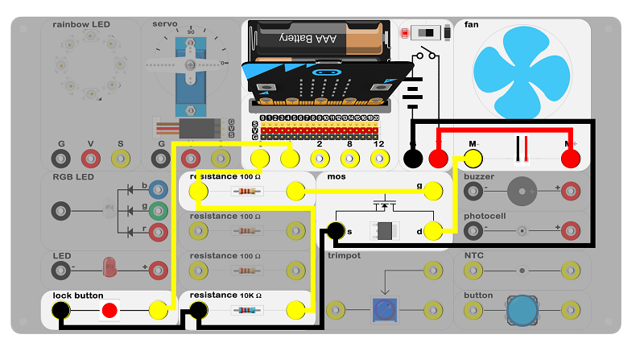
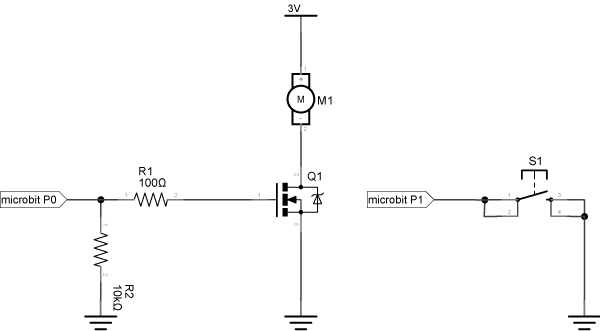
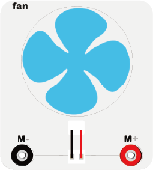
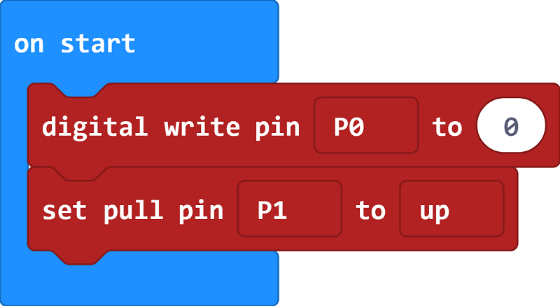
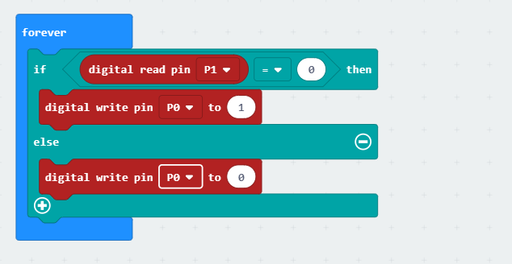

# case 11 DC motor 

## Introduction ##
---
- The servo is a device that can transfer electric energy to kinetic energy based on a law of electromagnetic induction. In this case, we will use a switch to turn the motor on and off.

## Hardware Connect ##
---

- Connect circuit as above picture and put 2 AAA batteries into batteries pack.

## Principles of Circuits ##
---

- The GND of slot on micro:bit is into innards of batteries' GND to generate the current loop.

## Introduction of Components ##
---
### DC Motor
- There are many categories of motors, but a motor basically transforms electric energy into kinetic energy according to the rule of electromagnetic induction. When the direct voltage was added on the two sides of the motor, the motor turns. The higher the voltage, the faster the rotation. 
- The experiment box included a DC motor, and it connects a fan to show rotation.

*- Note: Please note the positive and the negative when you are connecting.*

## Software
---
### Step 1

- Click [makecode https://makecode.microbit.org/#](https://makecode.microbit.org/#)。

- Click on "New Project" and set a new Project.

### Step 2

- Under the on start block, Wirte 0 to the P0 port to prevent motor from mis operated. Set pull pin P1 to up for waiting button signal.

### Step 3

- Judge the value of P1 if it is equal to 0. If it is, write 1 to the P0 port for starting the servo; If it is not, write 0 to the P0 port to stopping the servo.

### Program

- Program link：[https://makecode.microbit.org/_Y94cmyMePXsh](https://makecode.microbit.org/_Y94cmyMePXsh)

- You also could directly download program by visiting website as below:

<iframe style="position:absolute;top:0;left:0;width:100%;height:100%;" src="https://makecode.microbit.org/#pub:_Y94cmyMePXsh" frameborder="0" sandbox="allow-popups allow-forms allow-scripts allow-same-origin"></iframe>
  
---

## Result
---
-  Press switch, the motor runs; press it again, the motor stops. 

## Think
---
- How can we use the trimpot to control the speed of the motor? 

## Questions
---

## More Information 
---

