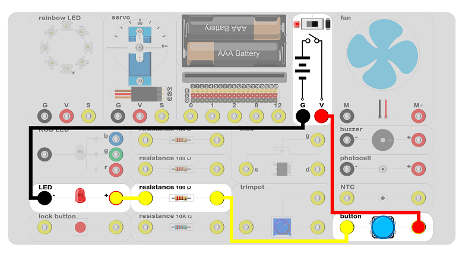
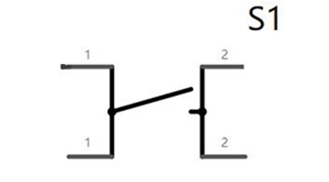
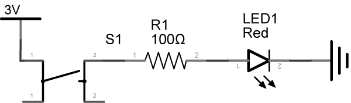

# circuit design 01 

## Introduction ##

We are going to use the experiment box to finish a pure circuit design and to control the LED without the micro:bit code.

## Products Link

[ELECFREAKS Experiment Box Kit](https://shop.elecfreaks.com/products/elecfreaks-experiment-box-kit-without-micro-bit-board?_pos=1&_sid=ac099db2f&_ss=r)

## Hardware Connect ##

 Connect the circuit as above picture and put 2 AAA batteries into the batteries pack.

## Introduction of Components ##

### Button Switch ###
 The button switch means touch switch. It is a kind of electronic switch and it be classified into electronic components.When it is used, it needs to meet the operating force, the pressure switch function is closed and the switch function is closed. When the pressure is released, the switch is disconnected. Its internal construction switching is by metal shrapnel forces.
 The button switch is shown in the schemetics as below picture.

### LED ###

 LED, lightemitting diode, is a kind of LED semiconductor diode which can transfer electric energy to luminous energy. The luminous diode is same as diode which is consistuded by one PN and with unilateral conductivity. Please note that when using the diode, the positive and negative poles should be strictly distinguished, and the positive pole should be grounded to the negative pole of the power supply. Otherwise, the diode will be reversely broken and the component will be damaged.
 The LED is shown in the schemetics as below picture.

### Resistor ###

 The resistor is a current limiting element which always be calld resistance. When it installed into the circuit, it can limit the value of the current. The ideal resistor is the linear resistor. That is, the instantaneous current through the resistor is proportional to the applied instantaneous voltage. It is the ohm's law (The current through a conductor between two points is directly proportional to the voltage across the two points. )
 The ohm law is shown in the schemetics as below picture.

## Circuit Analysis ##

 The voltage of two AAA batteries is 3v, so the nominal voltage is 3v. The nominal operating current of the LED is 30mA. According to the ohm law, the resistance value is 100Ω. Therefore, it is need to install a 100Ω resistance to limit the current. Otherwise, excessive current will cause a burnout of the LED. 
 When the button pressed, the circuit connects and the LED lights up. 

## Result

 When the button pressed and the LED lights up.

## Think 

 How do we use the trimpot to control the luminance of the LED? How can we design the circuit?

## Questions

## More Information  

