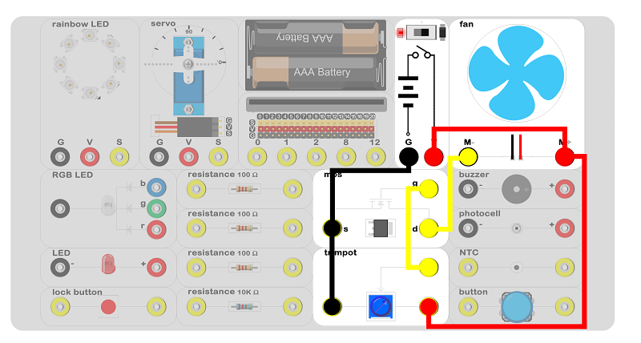
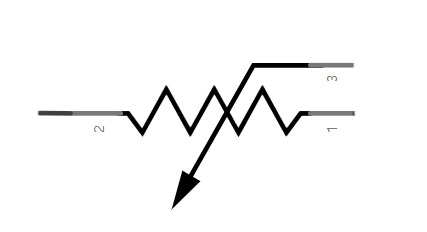
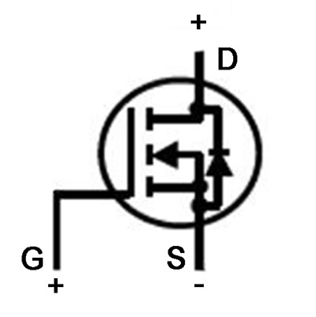
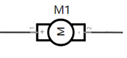
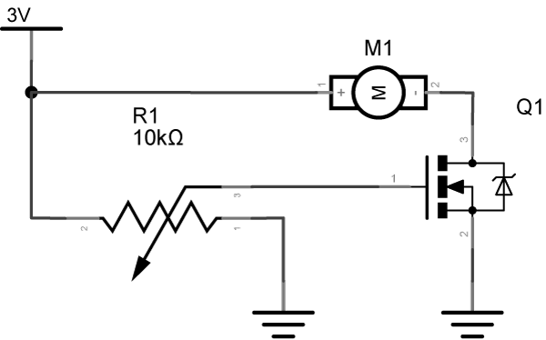

# circuit design 02 

## Introduction ##

We are going to use the experiment box to finish a pure circuit design and to control the rotate speed of the motor by trimpot without the micro:bit code. 

## Products Link

[ELECFREAKS Experiment Box Kit](https://www.elecfreaks.com/experiment-box-for-micro-bit.html)

## Hardware Connect ##

 Connect circuit as above picture and put 2 AAA batteries into the batteries pack.

## Introduction of Components ##

### Trimpot ###

 The trimpot can be a threeterminal device or a twoterminal element. The twoterminal element can be a variable resistor. 
 The variable resistor，its value could be adjusted and it can be used to adjust the situation for circuital current and resistance value change. The variable resistor can change the feature of the signal generator, dim the light and drive the motor to control its rotation. 
 The trimpot is shown in the schemetics as below picture.

### NMOS Tube ###

 When the NMOS is used as a switching element, when the grid G is higher than a certain voltage, the drain D and the source S are turned on. The drain D is equal to the potential of the source S. And the circuit is connected.

 The NMOS tube is shown in the schemetics as below picture. 

### DC Motor ###

 A DC motor is an electric motor that converts direct current electrical energy into mechanical energy. Due to its good speed regulation performance, it is widely used in power drag. The DC motor is divided into three types according to the excitation mode: permanent magnet, other excitation and selfexcitation. The experiment box included a 3V permanent magnet DC motor, and the its speed is proportional to the voltage value. Starting voltage is 2V, rated voltage is 3V. 
 The DC motor is shown in the schemetics as below picture.

## Circuit Analysis ##

 When the resistance value increases, it can be divider resistance for motor and  it outputs the signal to mos tube(G). 
 When the trimpot rotates to a certain angle, the mos tube conducts, the circuit of motor connects and the motor rotates. 
 When the trimpot continues to rotate, its effect of partial pressure gradually decreases and its motor voltage gradually increases. Finally, the rotate speed of the motor reaches the highest. 

## Result

 When the trimpot rotates to a certain angle, the motor drives and the rotate speed of the motor reaches the highest.

## Think

 How do we use the trimpot to control the luminance of the LED? How can we design the circuit?

## Questions

## More Information  

