# circuit knowledge 

## Electric Current
---
An electric current is a flow of electric charge.[1]:2 In electric circuits this charge is often carried by moving electrons in a wire. It can also be carried by ions in an electrolyte, or by both ions and electrons such as in an ionised gas

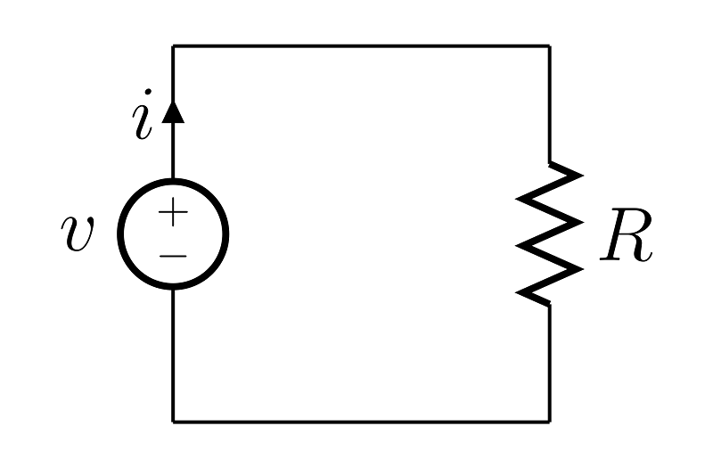

### Ampere
The SI unit for measuring an electric current is the ampere, which is the flow of electric charge across a surface at the rate of one coulomb per second. Electric current is measured using a device called an ammeter.[

### Current Measurements
Oriented movement of charge to form a current. Direction of current depends on regulation of positive charge orientation. The electric current is a physical quantity to signify strong and weak of the current. We should use an ampere meter to measure the current and it need to be connection in series with measured electrical appliance. Then, let the current flow into the positive terminal and out from the negative terminal. Please note that the measured current should not be over the maximum measurement value(range) of the ampere meter. 

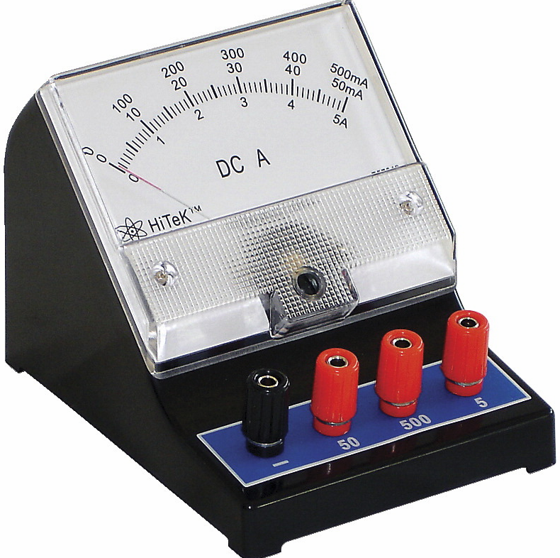

### LED
- LED Summary LED (Light Emitting Diode), light-emitting diode, is a solid state semiconductor devices, which can be directly converted into electricity to light. Heart of LED is a chip of a semiconductor，the side of chip is attach to a bracket and the other side of chip is connect to positive pole of the supply. It is seem that the whole chip is sealed by epoxy coating.
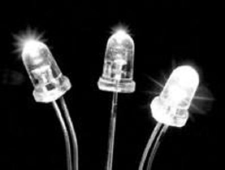

## Electric Circuit
---
In physics, batteries and other appliances to supply the power are called power supply. And appliances for power consumptionbulbs, electromotors and buzzers are called electrical appliances. Hence, the power supply, the electrical appliances, the wire and the switch to form an electric circuit.**Note：There will be current flow into the circuit only when the circuit is closing.**

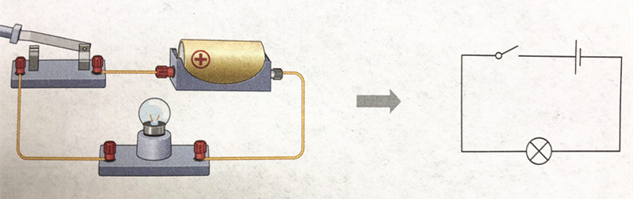

###  Circuit Diagram
The circuit diagram means a diagram is drawed by symbol.

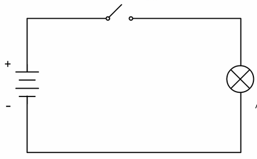

### Access & Open circuit & Short circuit

- Access：Normally connected circuit, it is called access.
- Open circuit： Current will not flow into the circuit if circuit be cut, it is called open circuit.
- Short Circuit：Use wire to connect positive and negative of power directly, it is called short circuit.

### In series & In parallel 

- In series：As below picture，make two bulbs in turn and connect to the circuit, the 2 bulbs are series connection.

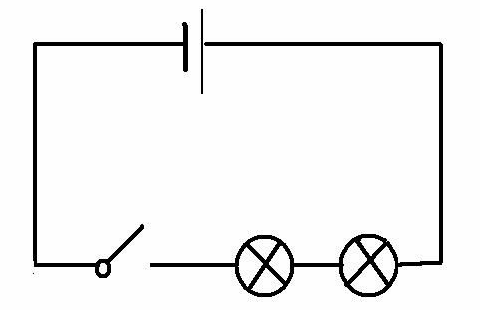

- In parallel：As below picture，connect two sides of two bulbs in circuit, the 2 bulbs are parallel connection.

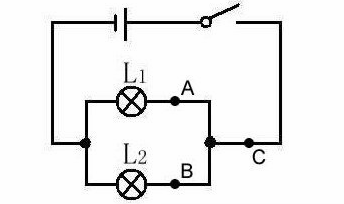

- Rules of series connection: Electric current are all same in the series connection.

- Rules of parallel connection: Current of parallel connection is sum of branch circuit.

## Voltage ##
---
- Voltage, which is also called electric potential difference. The difference in electric potential between two points (i.e., voltage) in a static electric field is defined as the work needed per unit of charge to move a test charge between the two points. n the International System of Units, the derived unit for voltage is named volt. mV, μV and kV is commonly used unit. This definition is similar to "water pressure". It is need to point that "voltage" is commonly use in circuit, "electric potential difference" is can be used at all electrical phenomena.

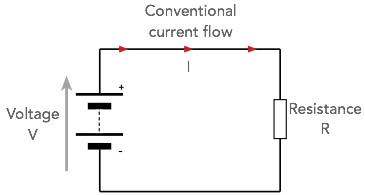

### Law of voltage in series and parallel

- The voltage in two sides of the power supply in the series circuit is equal to the sum of the voltages in two sides of the consumers. 

  U=U1+U2

- The voltage in two sides of the power supply in the parallel circuit is equal to the voltage in two sides of the power supply of each branch.

  U=U1-U2

## Resistance ##
---
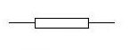

- The electrical resistance of an object is a measure of its opposition to the flow of electric current. The inverse quantity is electrical conductance, and is the ease with which an electric current passes. Electrical resistance shares some conceptual parallels with the notion of mechanical friction. The SI unit of electrical resistance is the ohm (Ω), while electrical conductance is measured in siemens (S).
1KΩ=1000Ω
1MΩ-1000000Ω

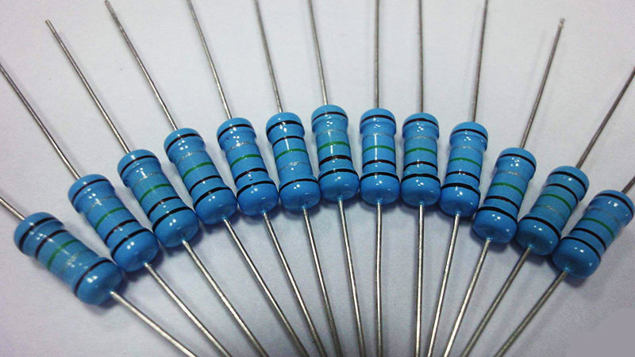

## Ohm's law ##
---
Current of conductor is in direct proportion to sides of the conductor and  be inversely proportional to resistance of the conductor. If we use "U" for voltage, "R" for resistance and "I" for electric current and the formula is:

    U=IR

Unit of U:（V），Unit of R:（Ω），Unit of I（A）

## Color Ring Resistance Reference ##
- The color ring resistance identification method refers to the use of four color rings or five color rings or six color rings on the resistance to represent the resistance value. We could read color signal of resistance value from any angle.
The color ring resistance is the most using resistance type for different electronic equipments. It is easy for the maintainer to read the value whatever it be installed and convenient for detecting and relacing.

### Reference ###
- 4 Band Resistor Color Code Reference :The first band is tens digit , the second is units digit，the third is multiplier and the forth is tolerance.
- Example:
- Brown Red Red Gold
- The final resistance value is 12×10^2=1.2kΩ and its tolerance is ±5%.
- The tolerance indicates the value of the resistance. Fluctuating above the standard value of 1200 (5% × 1200) indicates that the resistance is acceptable, that is, the good resistance is between 1140-1260.The first and second rings with four color rings represent the first two digits of the resistance; the third ring represents the magnification; the fourth ring represents the tolerance. The key to rapid identification is to determine the resistance value within a certain order of magnitude according to the color of the third ring. For example, a few K or a few tens of K, and then enter the reading of the first two rings. This will allow you to read the numbers very quickly.

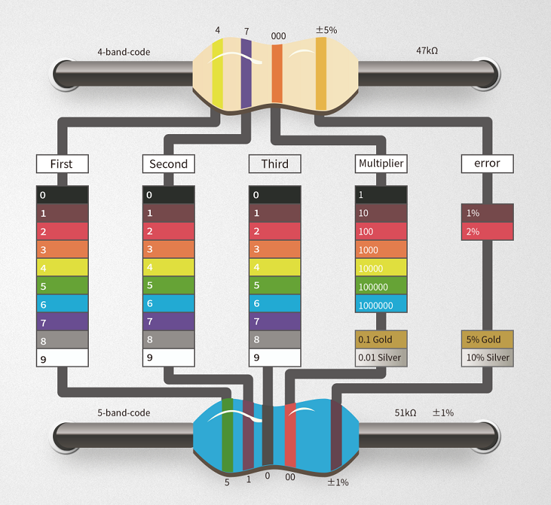

