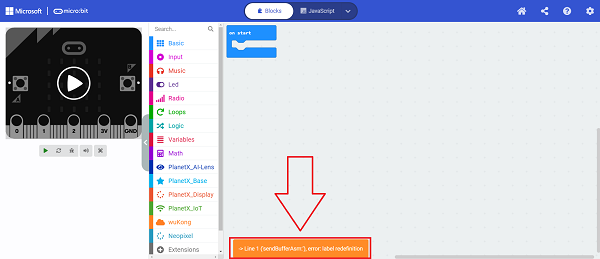
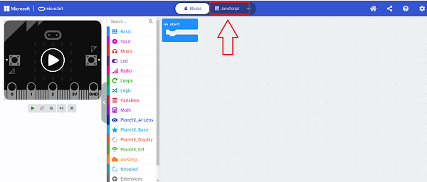
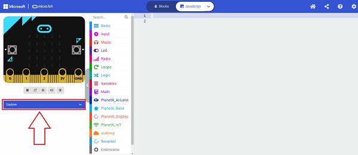
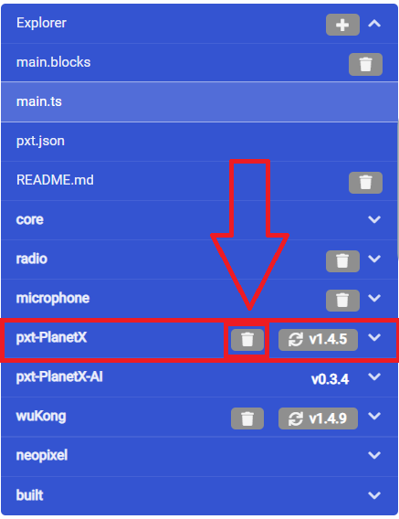

# FAQ 02
## Q: Adding either the Wukong or PlanetX libraries alone will work, but adding both will cause the program to fail to compile or download?
A: When we add multiple repositories at the same time, we need to pay attention to check whether there will be conflicts between multiple repositories.
For example, we have added both the wukong and PlanetX libraries.

Then when you click on download you will be prompted with an error message`-> Line 1 ('sendBufferAsm:'), error: label redefinition`。

In this case, please click "JaveScript" in the red box to switch the programming interface.

 After switching the interface, click on Explorer on the left side of the interface.

Just delete one of the two conflicting repositories, here is an example of deleting the PlanetX repository.

