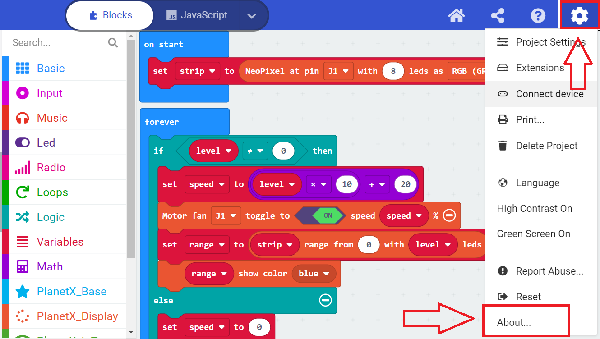
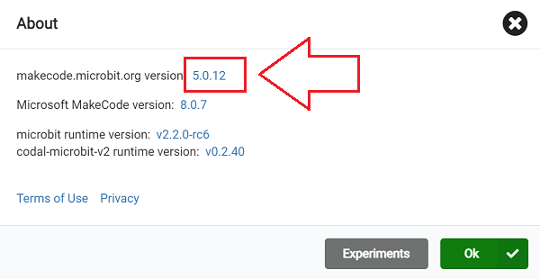
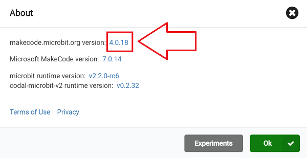

# FAQ 03
## Q:The current program has been running smoothly in previous case, but now it suddenly fails to compile and download.
A: When we open a program that has been running smoothly in the past and try to click download, we find that makecode feeds an error message `program too big by 1352 bytes!`。

This is a bug caused by a makecode update that limited the user's available memory in version V5.0.12, resulting in programs that were once usable may now be unusable.

Click the gear icon in the upper right corner and click About to view the current version information.

Version Information

When an oversized program error message appears, please enter the URL in the address bar of the web page `https://makecode.microbit.org/v4.0.18#editor`to use the V4.0.18 version of the makecode compiler.

Re-view the current version information after the modification is complete

