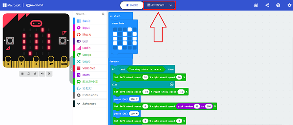
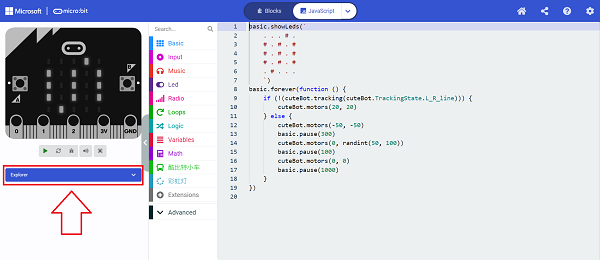
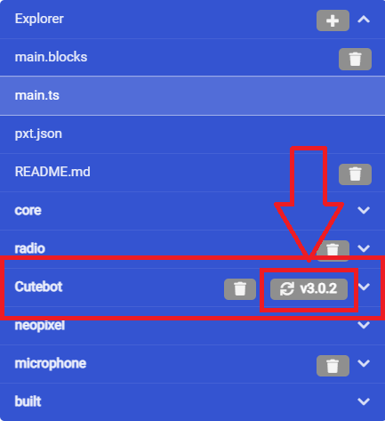
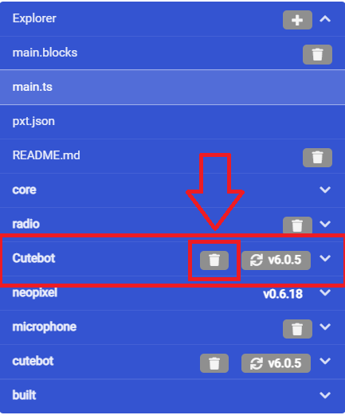
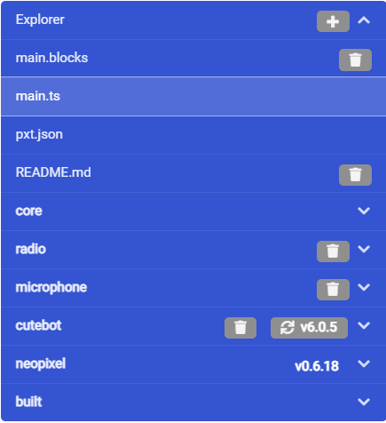

# FAQ 01
## Q: How to update the software library to the latest version?
A: Occasionally, when viewing a case, I find that the program link in the case does not compile or download when the program is opened.
Sometimes it suggests：`The hex file is not available, please connect to internet and try again.`

Take the Cutebot smart Cutebot car as an example.

Open a link to an older version of the program: [https://makecode.microbit.org/_Jgu7a8RrWaDh](https://makecode.microbit.org/_Jgu7a8RrWaDh)

We can see the following interface, click the red box in the figure "JaveScript" to switch the programming interface;

After switching the interface, click on Explorer on the left side of the interface.

Check the cutebot repository in the list below and click the Update button.

After the update is completed, the latest repository version number is displayed. If you find that the old repository is not overwritten by the new one, then please remove the old repository, otherwise it will cause the program to report an error.

After the update is complete and the old version of the repository is deleted

