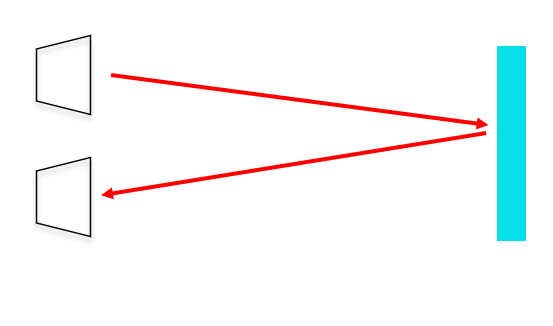
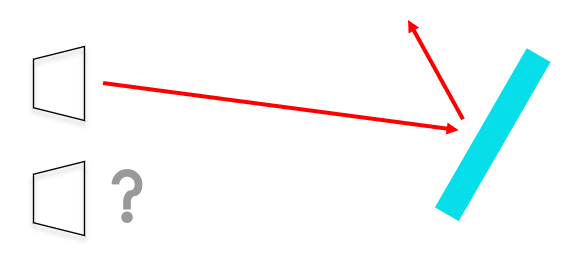

# FAQ 04
## Q: Why does the return value of the ultrasonic sensor appear to be 0?
A: Attention shoud be paid to the detection range of the ultrasonic sensor, when the obstacle is in the detection of the ultrasonic sensor blind area or beyond the detection distance, the return value of the ultrasonic sensor is 0.
Because ultrasonic sensors are used to determine the distance of an obstacle by emitting ultrasonic waves and then detecting the sound waves that hit the obstacle and reflect back.

The surface of the obstacle is uneven or not facing the ultrasonic sensor, it may reflect the ultrasonic waves to other areas, resulting in the ultrasonic sensor not receiving the reflected sound waves, thus returning a value of 0.

## Q:How to exclude the interference of the return value of 0 on the test results?
A: When making conditional judgments, remove the case where the return value is 0.
Specific cases can be referred to: [Case 09: Autonomous Obstacle Avoidance](http://www.elecfreaks.com/learn-en/microbitKit/smart_cutebot/cutebot_case09.html)

