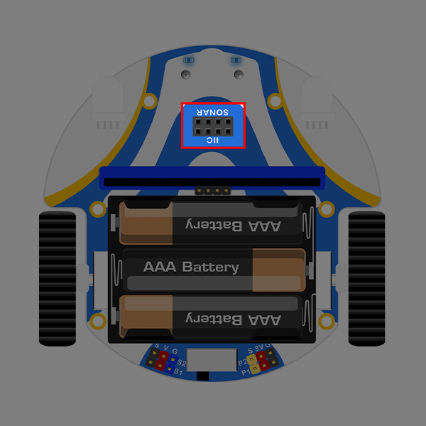

# FAQ 06
## Q:使用Cutebot智能赛车时发现小车正常通电但是无法行使？
A:请按照以下步骤进行检查:
1.在micro:bit上添加一个驱动小车向前行驶的程序:[全速前进](https://makecode.microbit.org/_0p45b90iHie1)
2.正常开机后测试小车是否向前行驶
3.如果小车无法向前行驶请将小车上的超声波传感器取下后重复步骤2
4.如果取下超声波传感器后，小车可以正常行驶，则证明是超声波传感器安装错误而导致小车故障
**安装超声波传感器时请注意分辨插入接口，应该插入SONAR接口中**

