# How to Apply with HiveMQ

HiveMQ is an MQTT broker and client-based messaging platform designed to move data in and out of connected IoT devices quickly, efficiently and reliably.

Website: [https://www.hivemq.com/](https://www.hivemq.com/)

## Register
---
Click the "Cloud" button on the page. 

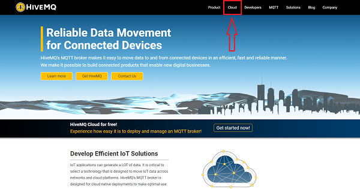

Click "Sign up now". 

 Choose "Sign Up" to register your info(email, passwords). 

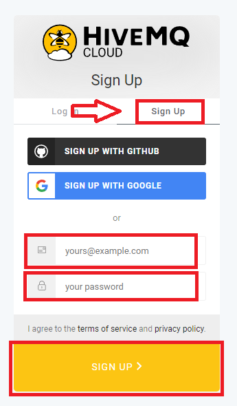

Requirements of the passwords. 

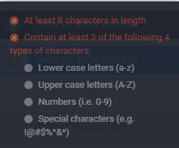

Following the guide to complete the registration. 

## Operation Guide
---
After registration, go to: https://www.hivemq.com/mqtt-cloud-broker/
Choose "Sigh up now".

Log in with your email and password. 

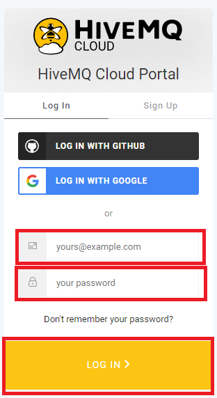

Click "CREATE CLUSTER".

Choose "Azure" and click "CREATE CLUSTER".

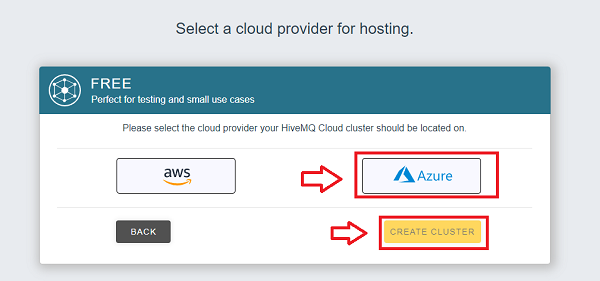

Click "MANAGE CLUSTER".

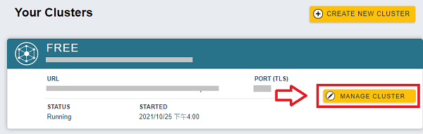

Click "Access Management",  set the "Username" and "Password", then click "ADD". （Add the user's account）

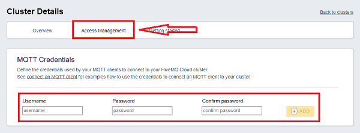

Completed! Please remember the user name and the password, this info would be required on the settings of the MQTT in MakeCode. 

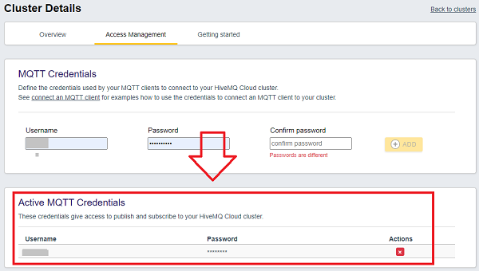

For hardware connections, please refer to our wiki: [https://www.elecfreaks.com/learn-en/microbitKit/iot_kit/iot_bit.html](https://www.elecfreaks.com/learn-en/microbitKit/iot_kit/iot_bit.html)

**Attention:** Please use the USB port on the IoT:bit for power supply, or the Wifi module would not get powered. 

Go to MakeCode: [https://makecode.microbit.org/#editor](https://makecode.microbit.org/#editor)

Click "Advanced" in the MakeCode drawer to see more choices, and then click "Extensions".

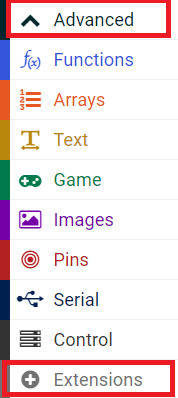

Search with "iot-environment-kit" to add the extension. 

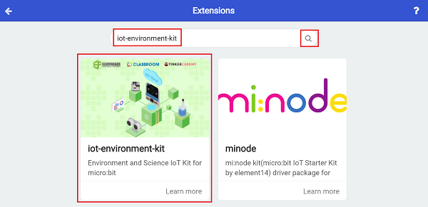

Choose "ESP8266_IoT".

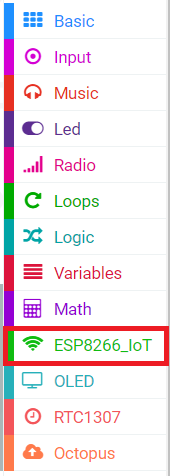

In the on start block, initialize esp8266 and enter with the name and password of the wifi for connecting. 

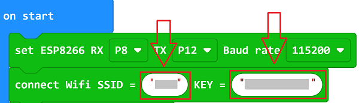

 Set the applications of MQTT, set "scheme" as "TSL", self-define "clientID", add the user name and password with the one on HiveMQ. 

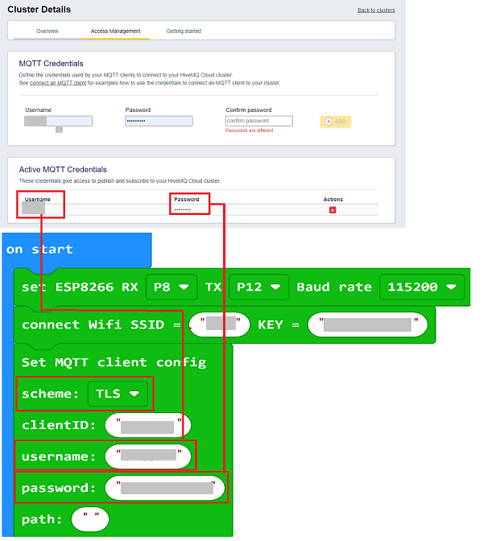

Click "Overview" and copy the "Host" and "port" to MakeCode. 

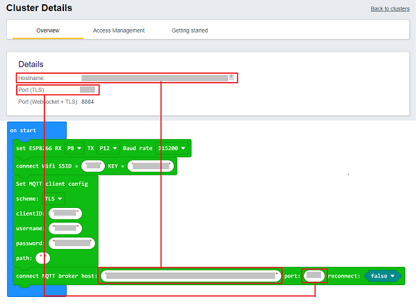

Click "Getting started",  choose "HiveMQ Websocket Client".

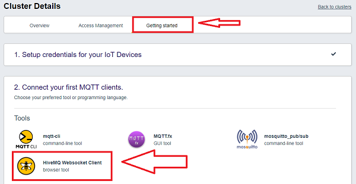

In the jumping page, click "here" on step 1. 

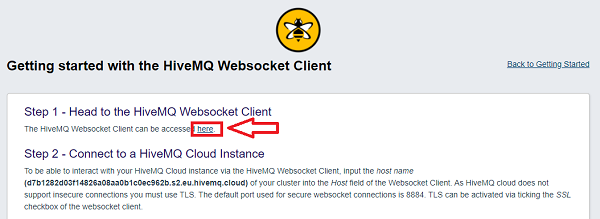

In the jumping page, enter with the User and Password, then click "Connect" to get in touch with MQTT . 

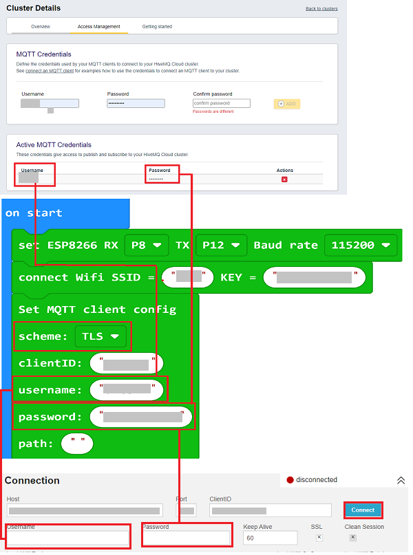

A notice of "connected" labled in green occurs if the connection is made successfully. 

Click "Add New Topic Subscription" . 

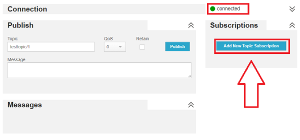

Choose "Subscribe".

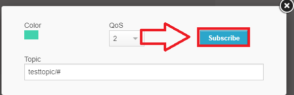

If completed, it is ok to send messages from MakeCode. 

The "hello" in the block is the message we are going to send, you can set it by yourself. And the topic block: "testtopic/1" is the pre-settings on the platform, you can replace "#" with any number. 

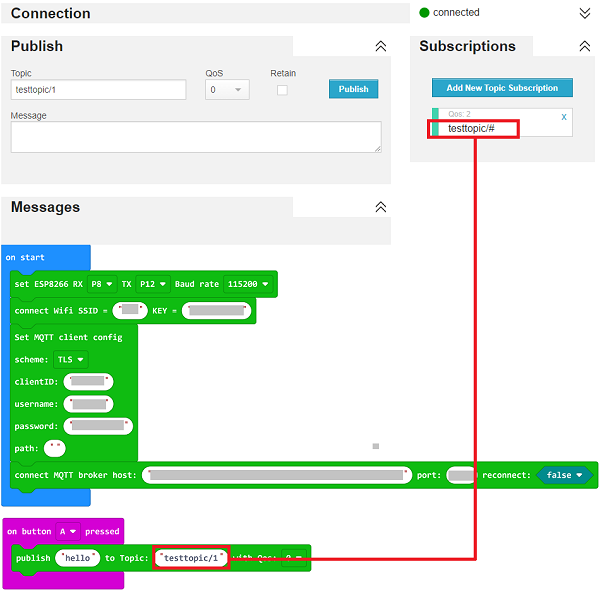

Following the former steps, press the button A on micro:bit to send "hello" to the platform. 

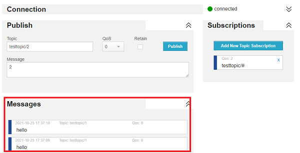

Absolutely, we can send data from the platform to local part, set the topic as "testtopic/2", and enter the messages  on "Message", then click "Publish" to send. 
And make sure to keep the topic in the blocks the same. 

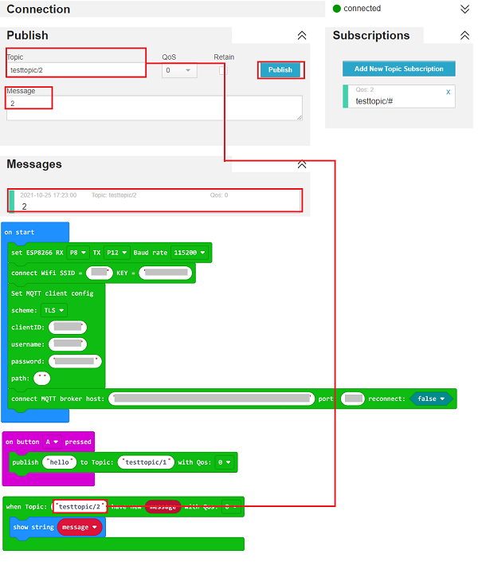

Send the number "2" from the platform and display it on the micro:bit. 

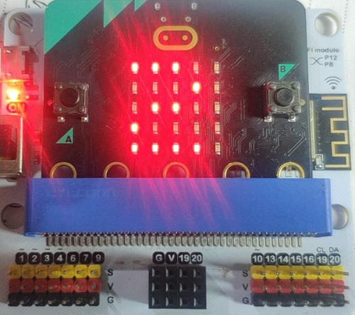

Program:

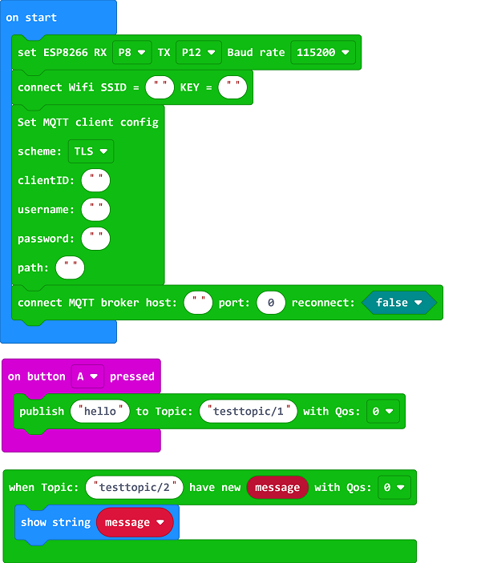

Link: [https://makecode.microbit.org/_2Ys7uE8F7Dr8](https://makecode.microbit.org/_2Ys7uE8F7Dr8)

## FAQ
---
Q: How to judge if the current IoT:bit supports MQTT? 
A: Please refer to the version number printed on the back of the IoT:bit, only V1.6 supports MQTT, V1.4 and the former are not availble for MQTT.

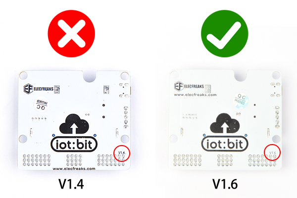
