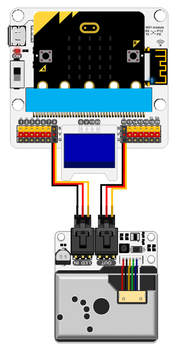
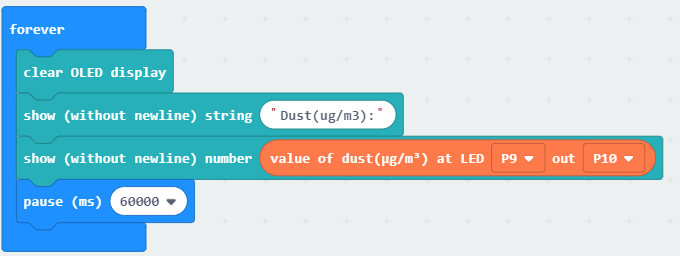

# iot:kit case01

## Our goal
---

- Let's make an air quality monitoring.

## Required materials 
---

- 1 x IOT:kit

## Background
---

### What is the IOT

- [IoT](https://en.wikipedia.org/wiki/Internet_of_things)The Internet of things (IoT) is the network of devices such as vehicles, and home appliances that contain electronics, software, sensors, actuators, and connectivity which allows these things to connect, interact and exchange data.The IoT involves extending Internet connectivity beyond standard devices, such as desktops, laptops, smartphones and tablets, to any range of traditionally dumb or non-internet-enabled physical devices and everyday objects. Embedded with technology, these devices can communicate and interact over the Internet, and they can be remotely monitored and controlled.

## Hardware connection
---

As below picture, connect `LED IN` of the dust sensor to `P9` and `OUT` to `P10`.

Connect the OLED screen to the `IIC` interface. 

## Software
---

[makecode](https://makecode.microbit.org/#)

## Coding
---

### Step 1
- Click on "Advanced" in the MakeCode Drawer to see more code sections.

- We need to add an extension for coding to the IOT. Click on the “Extension” at bottom of coding drawer, then Search for “IOT” and click on the IOT package to add it to your project. (As below picture) 

Note：If you get a warning telling you some packages will be removed because of incompatibility issues, either follow the prompts or create a new project in the Project file menu.

### Step 2

Snap the `initialize OLED` block into the `on start` and write parameters `64*128`.

Initialize the OLED screen to `64`* `128` pixel. 

### Step 2

Snap the `clear OLED display`, `show string` and `show number` blocks into the forever as below picture.

Showing string `Dust(ug/m3):`to display returned value of the dust sensor. 

Pause `60s`, once a minute.

### Program

Program link：[https://makecode.microbit.org/_7EPDui88d7v3](https://makecode.microbit.org/_7EPDui88d7v3)

If you don't want to type these code by yourself, you can directly download the whole program from the link below:

<iframe style="position:absolute;top:0;left:0;width:100%;height:100%;" src="https://makecode.microbit.org/#pub:_7EPDui88d7v3" frameborder="0" sandbox="allow-popups allow-forms allow-scripts allow-same-origin"></iframe>
  

### Result
---

The dust particle number will be displayed every minute. 

## Think 
---

How do you do to make it alarm when the air is in bad quality? 

## Questions
---

## More Information  
---

 
