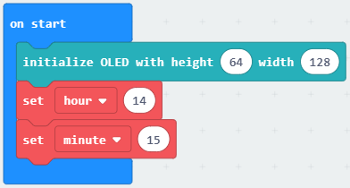
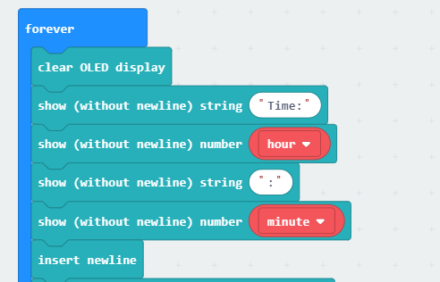

# iot:kit case02

## Our goal
---

-  Let's make an environmental noise detection. 

## Required materials 
---

- 1 x IOT:kit

## Background
---

### What is the environmental noise?

- Environmental noise is the summary of noise pollution from outside, caused by transport, industrial and recreational activities.Noise is frequently described as 'unwanted sound', and, within this context, environmental noise is generally present in some form in all areas of human, animal, or environmental activity. The effects in humans of exposure to environmental noise may vary from emotional to physiological and psychological.

## Hardware connection
---

As below picture, let the noise sensor be connected to `P1`.

Let the OLED screen be connected to `IIC`. 

Let the onboard RTC be connected to `IIC` Bus. 

## Software
---

[makecode](https://makecode.microbit.org/#)

## Coding
---

### Step 1
- Click on "Advanced" in the MakeCode Drawer to see more code sections.

- We need to add an extension for coding to the IOT. Click on the “Extension” at bottom of coding drawer, then Search for “IOT” and click on the IOT package to add it to your project. (As below picture) 

Note：If you get a warning telling you some packages will be removed because of incompatibility issues, either follow the prompts or create a new project in the Project file menu.

### Step 2

Snap the `initialize OLED` in to the `on start`, initialize OLED screen pixels to `64*128`.

Then snap the RTC timing block after the `initialize OLED`, set current time to 14:15.

### Step 2

Snap the `clear OLED display`, `show string` and `show number` blocks into the `forever` in turn.

Display string: `Time:`for current hours and minutes.

Then, snap into the `insert newline`. 

### Step 3

Now snap intp the `show string` and `show number` blocks.

Display string `Noise:`and returned noise value. 

Pause 1 second.

### Program

Program link：[https://makecode.microbit.org/_3y5WWxWUFYtV](https://makecode.microbit.org/_3y5WWxWUFYtV)

If you don't want to type these code by yourself, you can directly download the whole program from the link below:

<iframe style="position:absolute;top:0;left:0;width:100%;height:100%;" src="https://makecode.microbit.org/#pub:_3y5WWxWUFYtV" frameborder="0" sandbox="allow-popups allow-forms allow-scripts allow-same-origin"></iframe>
  

### Result
---
The noise db be displayed every second.

## Think 
---

How can you count the average noise db in a minute ?如何统计一分钟内平均分贝数。

## Questions
---

## More Information  
---

 
