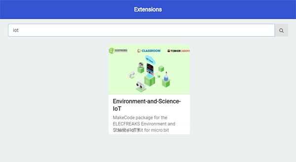
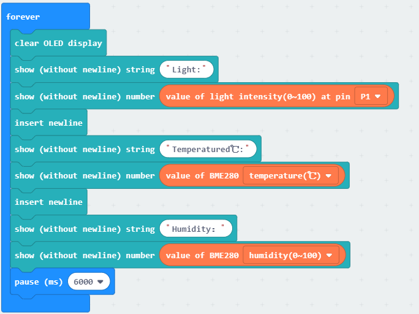

# iot:kit case03

## Our goal
---

- Let's make an environmental quality monitoring station. 

## Required materials 
---

- 1 x IOT:kit

## Background
---

### What is the environmental monitoring

- Environmental monitoringn Environmental monitoring is to design environemntal monitoring and display & save the collected information by using of GIS. 

## Hardware connection
---

As below picture, let the light sensor be connected to `P1`. 

Let the BME280 module be connected to `SCL-P19` `SDA-P20` of the `IIC`.

Let the onboard RTC be connected to `IIC`.

## Software
---

[makecode](https://makecode.microbit.org/#)

## Coding
---

### Step 1
- Click on "Advanced" in the MakeCode Drawer to see more code sections.

- We need to add an extension for coding to the IOT. Click on the “Extension” at bottom of coding drawer, then Search for “IOT” and click on the IOT package to add it to your project. (As below picture) 

Note：If you get a warning telling you some packages will be removed because of incompatibility issues, either follow the prompts or create a new project in the Project file menu.
### Step 2

Snap the `initialize OLED` in to the `on start`, initialize OLED screen pixels to `64*128`.

### Step 2

Snap the `show string` and `show number` blocks into the `forever` in turn.

Display current light intensity, humidity and temperature. 

Then, snap into the `insert newline`. 

### Program

Program link：[https://makecode.microbit.org/_gXa1mXargW1V](https://makecode.microbit.org/_gXa1mXargW1V)

If you don't want to type these code by yourself, you can directly download the whole program from the link below:

<iframe style="position:absolute;top:0;left:0;width:100%;height:100%;" src="https://makecode.microbit.org/#pub:_gXa1mXargW1V" frameborder="0" sandbox="allow-popups allow-forms allow-scripts allow-same-origin"></iframe>
  

### Result
---

The light intensity, temperature and humidity be displayed every minute. 

## Think
---

How do you count the data in a day ?

## Questions
---

## More Information  
---
