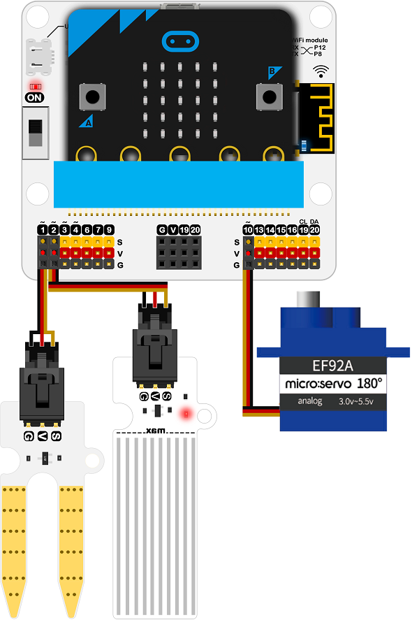
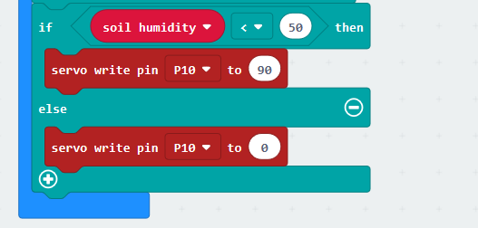

# iot:kit case04

## Our goal
---

- Let's make an automatic irrigation detection.

## Required materials 
---

- 1 x IOT:kit

## Background
---

### What is the automatic irrigation detection 
---

- automatic irrigation detection An automated irrigation system refers to the operation of the system with no or just a minimum of manual intervention beside the surveillance. Almost every system (drip, sprinkler, surface) can be automated with help of timers, sensors or computers or mechanical appliances. It makes the irrigation process more efficient and workers can concentrate on other important farming tasks. On the other hand, such a system can be expensive and very complex in its design and may needs experts to plan and implement it.

## Hardware connection
---

As below picture, let the soil moisture sensor be connected to `P1`.

Let the water level sensor be connected to `P2`.

Let the 180° servo be connected to `P10`.

## Software
---

[makecode](https://makecode.microbit.org/#)

## Coding
---

### Step 1
- Click on "Advanced" in the MakeCode Drawer to see more code sections.

- We need to add an extension for coding to the IOT. Click on the “Extension” at bottom of coding drawer, then Search for “IOT” and click on the IOT package to add it to your project. (As below picture) 

Note：If you get a warning telling you some packages will be removed because of incompatibility issues, either follow the prompts or create a new project in the Project file menu.

### Step 2

Snap the `servo write` block into the `on start`, write in `0` to turn the servo to 0 deg for shuting the valve.

### Step 3

Snap the `set to` block into the `forever`.
Get the value of water level and assignment it to the `water level` variable and the value of soil moisture value to the `soil humidity` variable. 

### Step 4

To judge if the water level is lower than 10, if it is, play a bading for adding water. 

### Step 5

To judge if the soil humidity is lower than 30, that is if it is need to watering. 

If it lowers than 30, valve opened and watering; if it not lowers than 30, valve shuted. 

### Program

Program link：[https://makecode.microbit.org/_dxTF0K1be0w0](https://makecode.microbit.org/_dxTF0K1be0w0)

If you don't want to type these code by yourself, you can directly download the whole program from the link below:

<iframe style="position:absolute;top:0;left:0;width:100%;height:100%;" src="https://makecode.microbit.org/#pub:_dxTF0K1be0w0" frameborder="0" sandbox="allow-popups allow-forms allow-scripts allow-same-origin"></iframe>
  

### Result
---

## Think
---

## Questions
---

## More Information 
---
