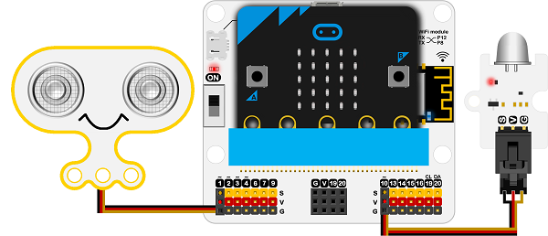
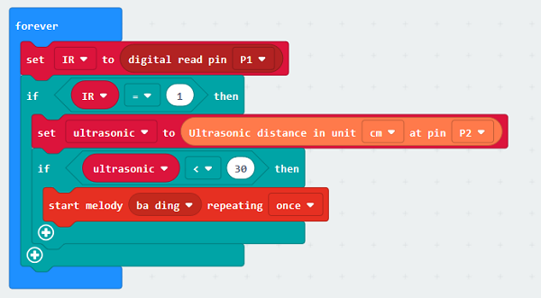

# iot:kit case05: A self defense monitoring station

## Our goal

 Let's make a self defense monitoring station. 

## Required materials 

 1 x [IOT:kit](https://www.elecfreaks.com/micro-bit-smart-science-iot-kit.html)

## Background

### What is self defense? 

 You need to set a self defense device when your environmental monitor station is out of doors to prevent device damage and to warn people keep away from this device.                     

## Hardware connection

As below picture, let the ultrasonic module be connected to `P1`.

Let the human infrared sensor module be connected to `P10`.

Let the onboard buzzer be connected to `P0`. 

## Software

[makecode](https://makecode.microbit.org/#)

## Coding

### Step 1
 Click on "Advanced" in the MakeCode Drawer to see more code sections.

 We need to add an extension for coding to the IOT. Click on the “Extension” at bottom of coding drawer, then Search for “IOT” and click on the IOT package to add it to your project. (As below picture) 

***Note：*** If you get a warning telling you some packages will be removed because of incompatibility issues, either follow the prompts or create a new project in the Project file menu.

### Step 2

Get value from `P1` and assignment it to `IR` block uner `forever`, to judge if `IR` is equal to `1`.

If the `IR` parameter is equal to `1`, get the ultrasonic returned value again and assignment to the `ultrasonic` variable. 

If the `ultrasonic` variable is lower than 30, play a `ba ding` to warning. 

### Program

Program link：[https://makecode.microbit.org/_05sYuyciH93g](https://makecode.microbit.org/_05sYuyciH93g)

If you don't want to type these code by yourself, you can directly download the whole program from the link below:

<iframe style="position:absolute;top:0;left:0;width:100%;height:100%;" src="https://makecode.microbit.org/#pub:_05sYuyciH93g" frameborder="0" sandbox="allowpopups allowforms allowscripts allowsameorigin"></iframe>
  

### Result

It will play a remind sound when detecting creatures approching in a near distance.

## Think

## Questions

## More Information

