#  The fourth part: Guidance of KidsIoT
---
- KidsIoT is a platform for IoT(Internet of Things) produced by Elecfreaks with only three minutues to get connected, it can achieve a remote control to the micro:bit. (Currently in English version only)
 link: [KidsIoT Cloud Platform: https://www.kidsiot.cn/](https://www.kidsiot.cn/)

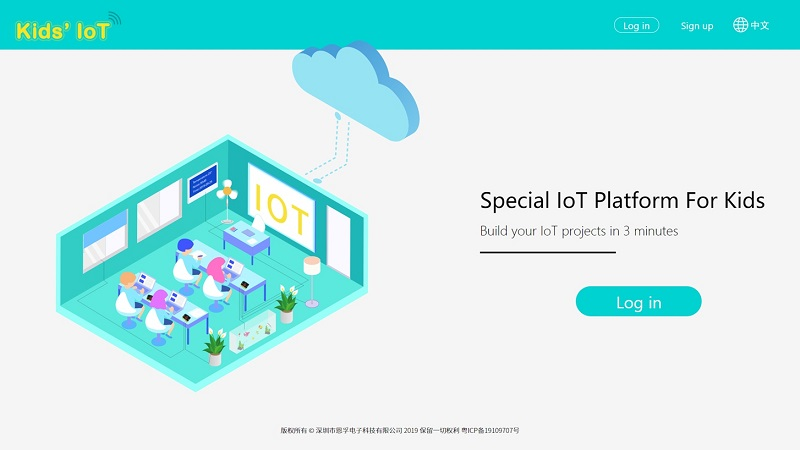

## Registration
---
- Sign up in the website to get a new account. 

- Fill in with your email address and password, and click Sign Up. 

- After signing up, an email should be sent to your mailbox.

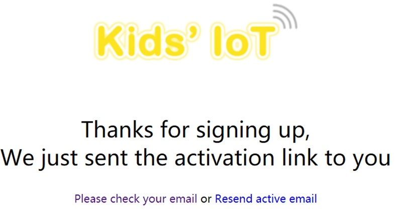

- Activate your account with the links sent to your mailbox, note the letter might be in your junk email for the first time. 

- Sign Up successfully!

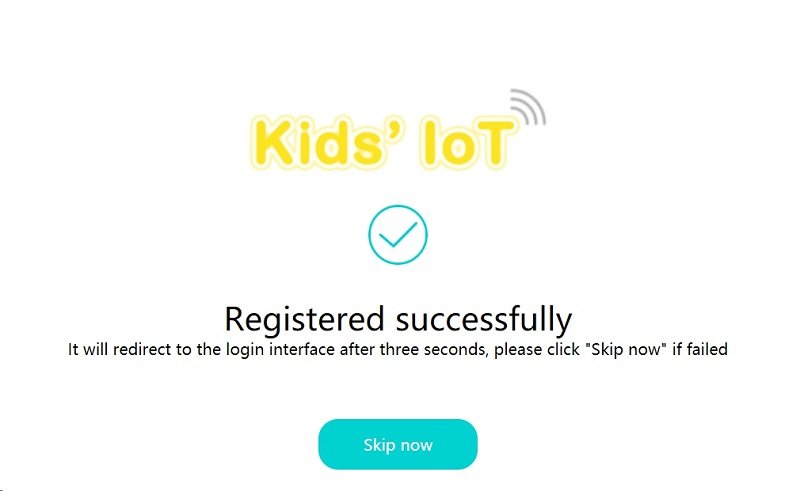

## Guidance of the KidsIoT
---
- Go to the log in interface by clicking Sign in. 

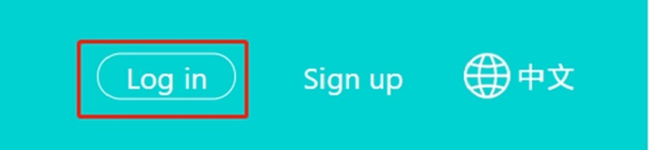

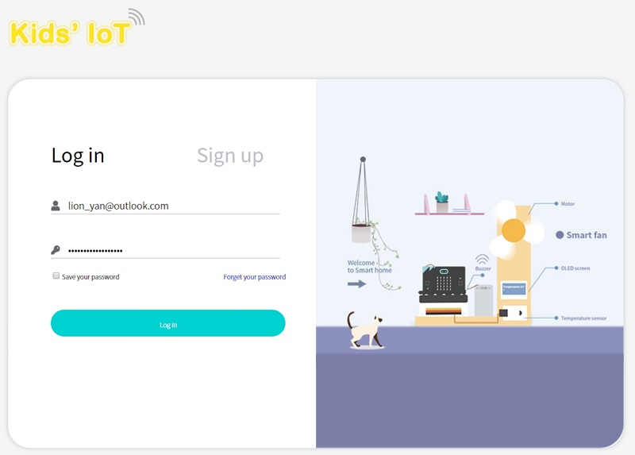

- Click log in to enter the device manage interface, the "User Name" on the top left corner is your email address, the unique "User Token"(Currently miswritting as ID, we will correct to Token later) on the top right corner is the only indentification code for this platform which is corresponding to your account. 

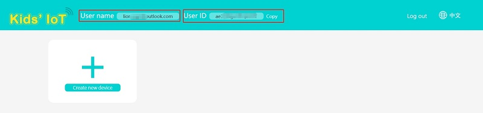

- Create new device, "Topic" is the only identification code(the only device in the account), and you can revise the device name(only 10 devices can be created).
- Click "Details"to see the information, click "Delete" to delete the device. 

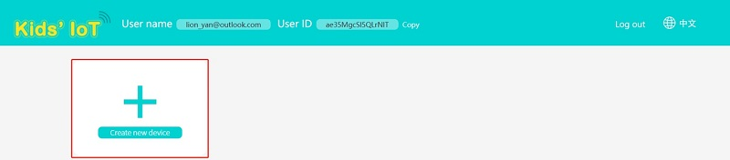

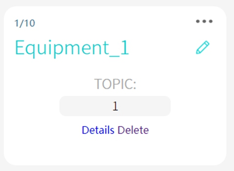

- The upload data will be shown on the left, what on the right is a two-dimension line chart for data and time. You can choose the data that you want to see or export the data. 
- You can use "Remote Control" to give instruct to the micro:bit. 

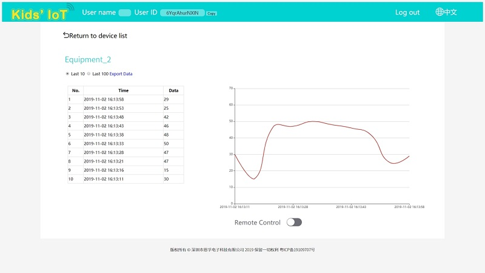

## Write Code
---

[MicroSoftmakecode](https://makecode.microbit.org/#)

## Programme
---
### Modules Connection Diagram
- Connect the Light sensor to P1. 

### Add Package
- Click "Advanced" to see more choices in MakeCode drawer. 

- We need to add a package for programming the IoT kit. Click "Extension" in the drawer and search "IoT" in the dialogue box to download it. 

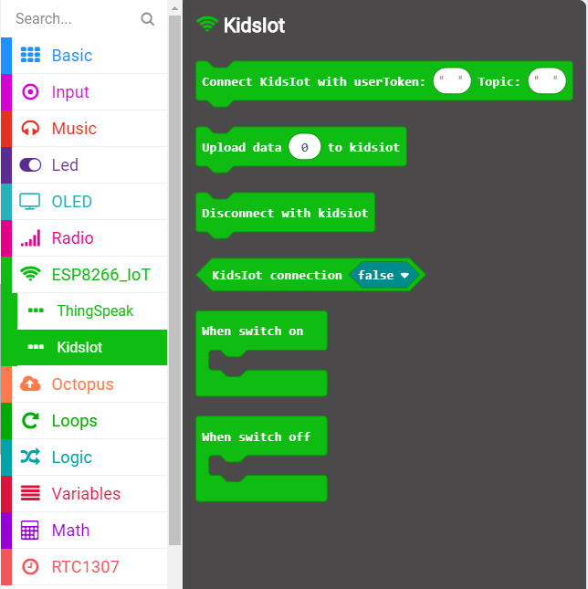

***Note：*** If you get a warning indicating some packages will be removed because of incompatibility issues, you can follow the prompts or create a new project in the menu.

### Code Details

Connect to Kids'IoT platform, User Token(Currently miswritting as ID) is the only indentification code for the account which can not be revised. 

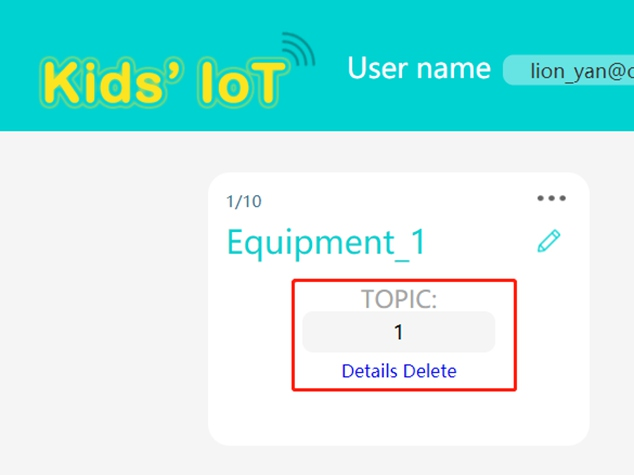

Topic is the only indentification code and you have to appoint the updload device when connecting. The device number(Topic) will be in sequential order.

Upload an integer to KidsIoT and it shows here. 

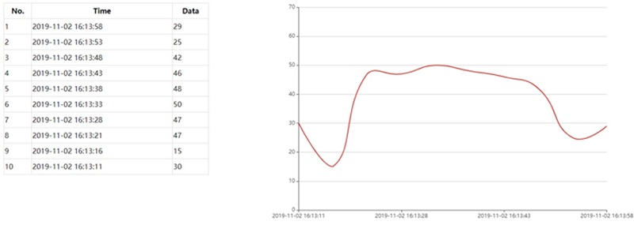

Judge if the conection status is successful, "Ture" for success, "False" for failure. 
You can edit the reconnection system to ensure the stable connection.

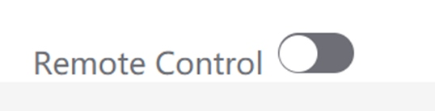

When getting connected well, you can click this switch to operate these two bricks. 

### Reference

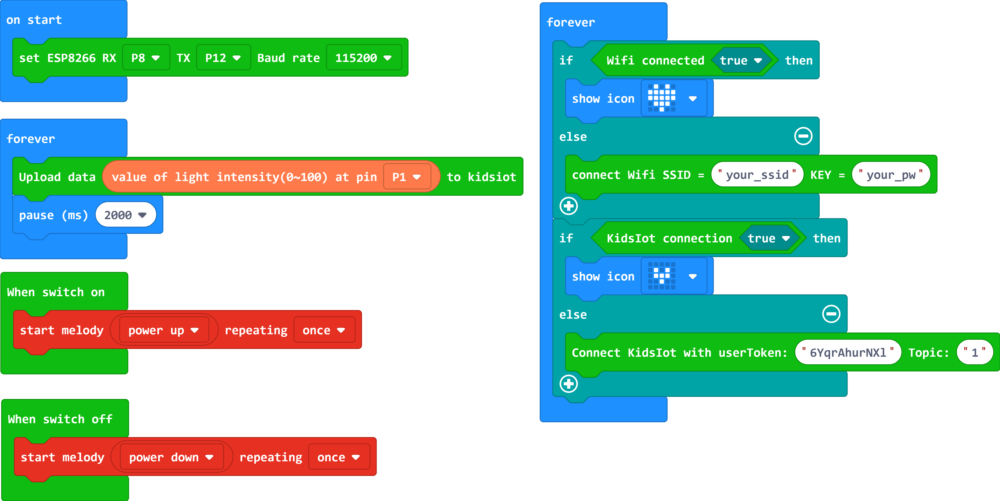

Link：[https://makecode.microbit.org/_4pCRr0DKYh58](https://makecode.microbit.org/_4pCRr0DKYh58)

You can also revise the code with the below page:

<iframe style="position:absolute;top:0;left:0;width:100%;height:100%;" src="https://makecode.microbit.org/#pub:_4pCRr0DKYh58" frameborder="0" sandbox="allow-popups allow-forms allow-scripts allow-same-origin"></iframe>
  

### Result

Connect WIFI when on start. 
Continuously judge if the WIFI is connected successfully, if yes, a big icon will be shown or it continues connecting. 
Continuously judge if the connection to KidsIoT is ready, if yes, a small icon will be shown or it continues connecting.
Continuously judge if the connection to KidsIoT is a success, if yes, the data(given by the light sensor connected to P1) will be uploaded. 
If the switch of the platform is on, it plays a music of “Power Up”
If the switch of the platform is off, it plays a music of “Power Down”
