# The first part: Upload the data collected by IoT kit to the Thingspeak IoT platform.

ThingSpeak can deal with HTTP request, save and process data. This platform has function as open application, real-time data collection, location data, data processing, visualization, device status information and plug-in. It can integrate many hardwares and software platforms like Arduino, Raspberry Pi, ioBridge/RealTime.io、Electic lmp, mobile & internet application, social network and MATLAB data processing. It also porvide hosted service apart from open source edition.

Thingspeak link: [thingspeak](https://thingspeak.com/)

## Thingspeak Registration
---
Head to thingspeak website, click on Get Started For Free and in create MathWorks Account package.

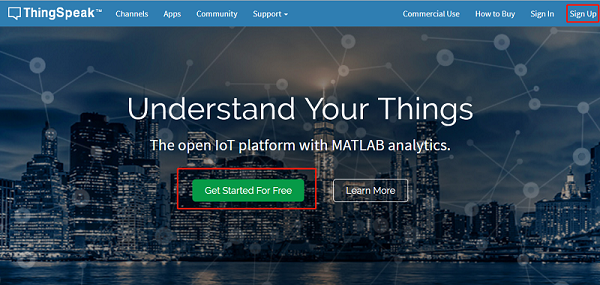

- Fill in the registration information and click continue to go on.（As below）

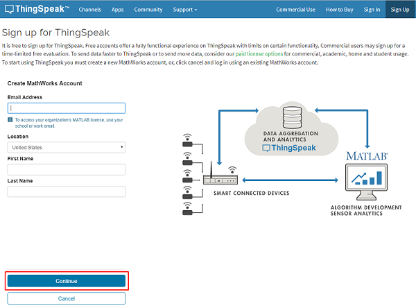

- Confirm the email address, click it as the sign in account to continue.

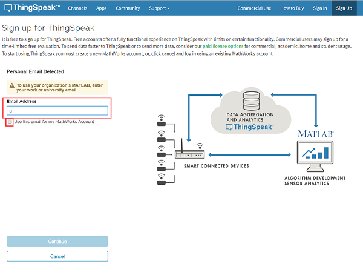

- Verify your MathWorks account and the thingspeak will send an email to your email box. You need to click the lin of the email to verify and continue. 

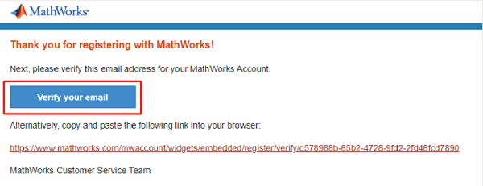
 
- Then set your own user ID and password(Note: both Captital and lower case words are required)，then click on continue to go on.

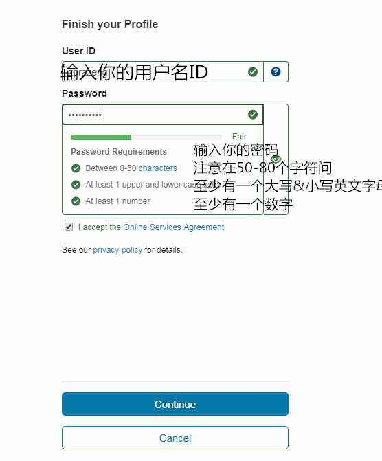

- Then, Sign-up successful!

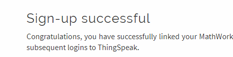

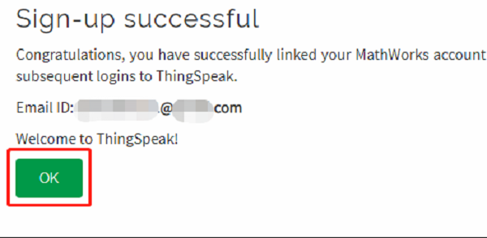

## Thingspeak guide:
---
- Here we will upload luminous intensity for testing. 

- Click on “MY Channels” and click on **New Channel** for your new project.

!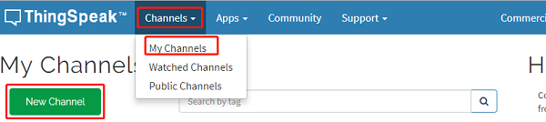

- An project parameter design list be showed. If there are more parameters, you need to choose more fields.

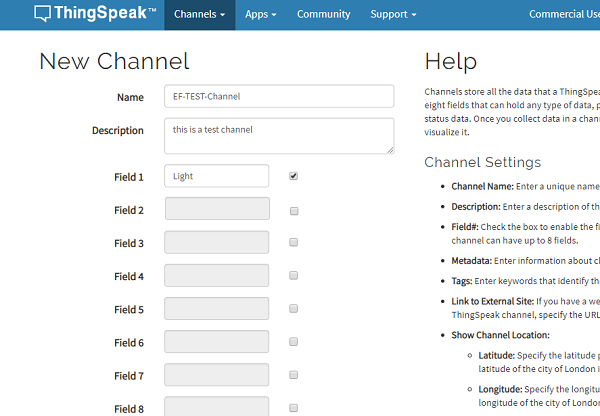

- Then, click on save channel. 

- But here you will find nothing. You can find the data of what we have uploaded here:
- 
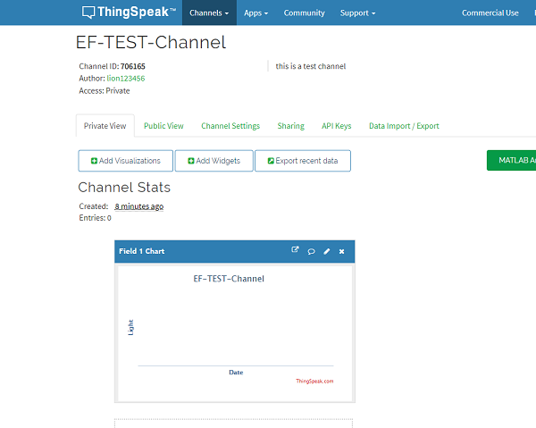

- Click on API KEY, parameters as below be showed.

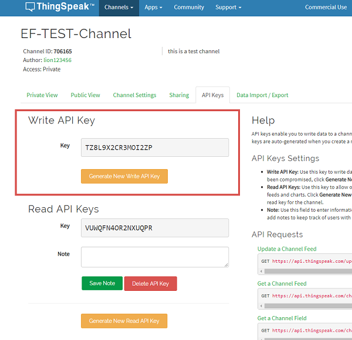

## Coding
---

### Connection diagram:
- Connect the iot:bit to the micro:bit.
- 
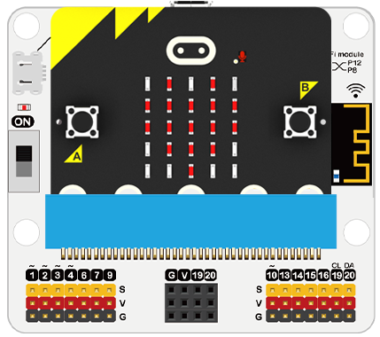

#### Step 1
- Click on "Advanced" in the MakeCode drawer to see more code selections.

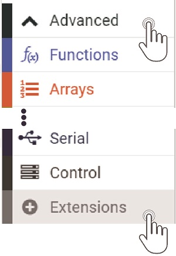

- We need to add an extension for coding to the IOT. Click on the “Extension” at bottom of coding drawer, then search for “IOT” and click on the IOT package to add it to your project. (As below picture) 

***Note：*** If you get a warning telling you some packages will be removed because of incompatibility issues, either follow the prompts or create a new project in the Project file menu.

#### Step 2

Drag the `set 8266` block into the `on start` and choose RX`P8`TX`P12` `baud rate`115200`.

Snap into the `connect wifi` block，write in your wifi name and the key. 

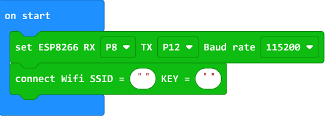

***Note：*** The 8266 module can't support the 5G, please conenct it to 2.4G

#### Step 3

Snap `connect thinkspeak`, `set data` and "upload data to Thingspeak"  into the `forever`. 

Write `write api key` into `set data` and snap the randow number block to the field1.

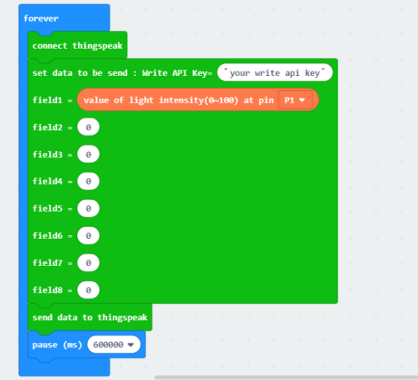

#### Program

program link：[https://makecode.microbit.org/_0MqJdw99D2hV](https://makecode.microbit.org/_0MqJdw99D2hV)

If you don't want to type these code by yourself, you can directly download the whole program from the link below:

<iframe style="position:absolute;top:0;left:0;width:100%;height:100%;" src="https://makecode.microbit.org/#pub:_0MqJdw99D2hV" frameborder="0" sandbox="allow-popups allow-forms allow-scripts allow-same-origin"></iframe>
  

#### Result

Uploading the random data to the thingspeak continuously. 

You can check all datas on the thingspeak.

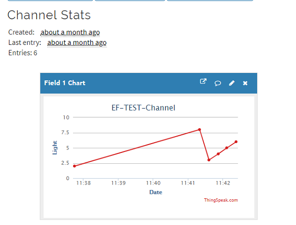

## Thingspeak Add visulization
---
- Click the visulization button to choose the three choices: [stopwatch],[Numeric Display],[Threshold indicator light].

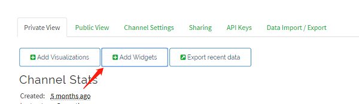

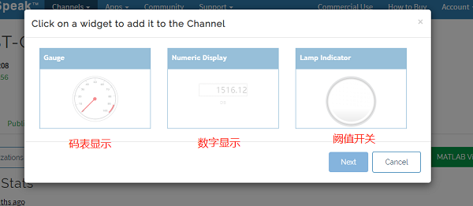

- Choose types of the stopwatch and click NEXT, write the name, filed, the maximum and minimum value of the chart, then click Create to create a new chart.

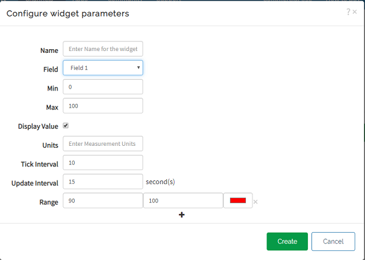

Both the chart and the value of Field 1 changed.

- Add the numeric display and Threshold indicator light in the same way for the chart.

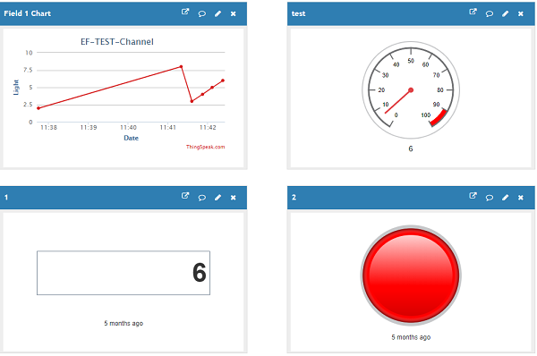
