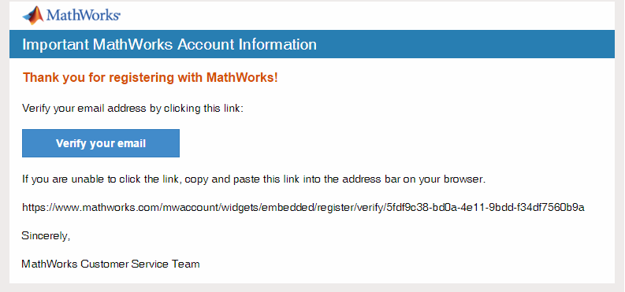
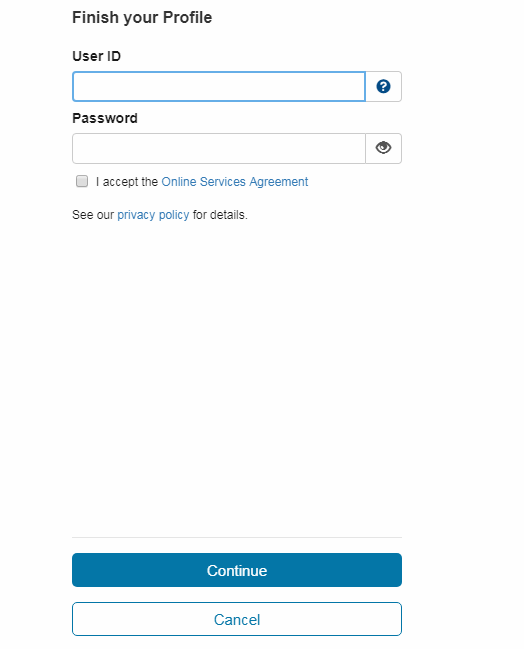
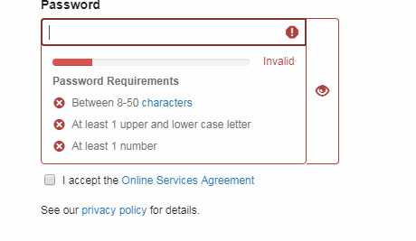
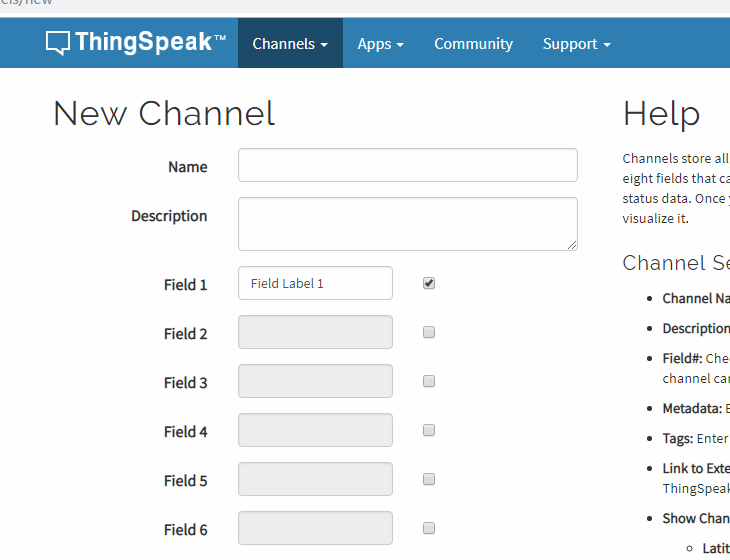
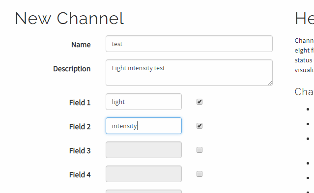
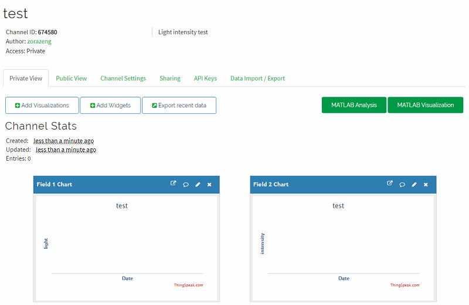
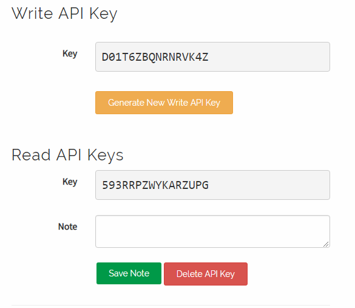
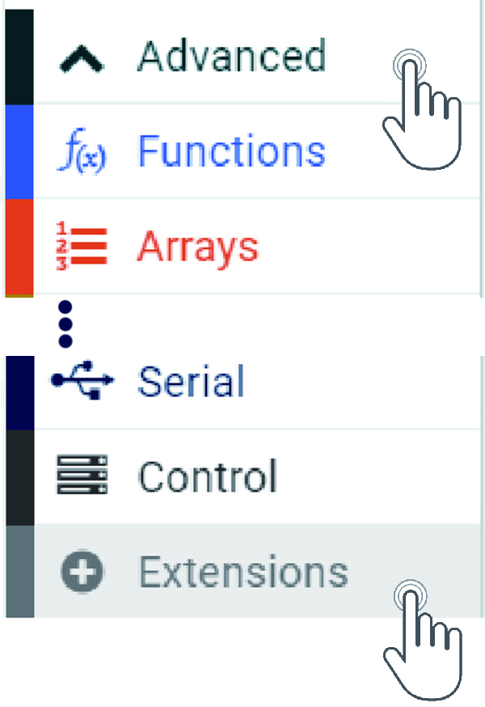
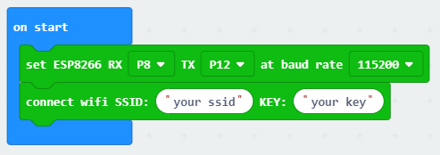
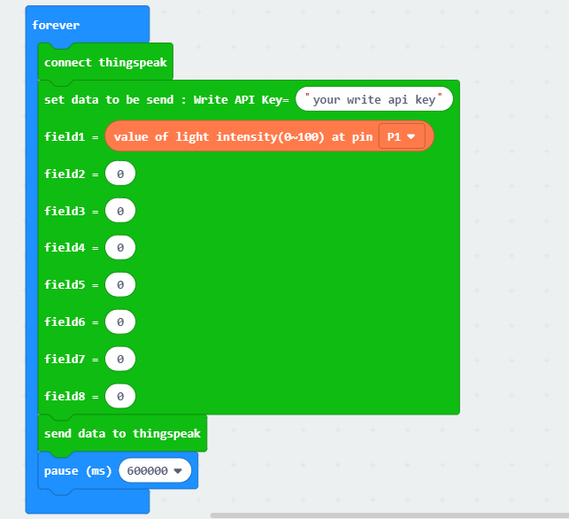

# How to use thinkspeak 

### Thingspeak Platform
---
ThingSpeak can deal with HTTP request, save and process data. This platform has function as open application, real-time data collection, location data, data processing, visualization, device status information and plug-in. It can integrate many hardwares and software platforms like Arduino, Raspberry Pi, ioBridge/RealTime.io、Electic lmp, mobile & internet application, social network and MATLAB data processing. It also porvide hosted service apart from open source edition.

Thingspeak link: [thingspeak](https://thingspeak.com/)

### Thingspeak Registration
 
- Head to thingspeak website, click on Get Started For Free and in create MathWorks Account package.

- Fill in the registration information and click continue to go on, then confirm your email.（As below）

- Verify your MathWorks account and the thingspeak will send an email to your email box. You need to click the lin of the email to verify and continue. 

- Head in your email box and click on the link to verification.

Click on the verify your email (as above picture).

- You have successful verified as above picture.
 
- Then set your own user ID and password，then click on continue to go on.

- Please note that the **Password Requirements**.

- Then, Sign-up successful!

### New Thingspeak Project

- Here we will upload luminous intensity for testing. 

- Click on “MY Channels” and click on **New Channel** for your new project.

k
- An project parameter design list be showed. 

- Fill in as below picture. If there are more parameters, you need to choose more fields.

- Then, click on save channel. 

- But here you will find nothing. Click on API KEY, parameters as below be showed.

## Coding

### software
---

[makecode](https://makecode.microbit.org/#)

### Coding
---

#### Step 1
- Click on "Advanced" in the MakeCode Drawer to see more code sections.

 

- We need to add an extension for coding to the IOT. Click on the “Extension” at bottom of coding drawer, then Search for “IOT” and click on the IOT package to add it to your project. (As below picture) 

 

Note：If you get a warning telling you some packages will be removed because of incompatibility issues, either follow the prompts or create a new project in the Project file menu.

#### Step 2

Snap the `set 8266` block into the `on start` and choose RX`P8`TX`P12` `baud rate`115200`.

Snap into the `connect wifi` block，write in your wifi name and the key. 

***Note：The 8266 module can't support the 5G, please conenct it to 2.4G***

#### Step 2

Snap `connect thinkspeak`, `set data` and `pause` blocks into the `forever`. 

Write `write api key` into `set data` and snap light intensity to the field1.

Pause `60s` and sending every minute. 

#### Program

program link：[https://makecode.microbit.org/_Rfe5wJhT1f2D](https://makecode.microbit.org/_Rfe5wJhT1f2D)

If you don't want to type these code by yourself, you can directly download the whole program from the link below:

<iframe style="position:absolute;top:0;left:0;width:100%;height:100%;" src="https://makecode.microbit.org/#pub:_Rfe5wJhT1f2D" frameborder="0" sandbox="allow-popups allow-forms allow-scripts allow-same-origin"></iframe>
  

#### Result
---

Uploading the light intensity to the thingspeak every minute. 

You can check all datas on the thingspeak.

