# iot:bit

## Introduction
---

- IoT:bit is an expansion board based on IoT for micro:bit, it can support the sensors in 3-pins, the actuator and the buzzer, it can also give a specific time telling even the micro:bit powers off with the RTC onboard. 
- 
- It uses ESP8266 as WIFI expansion board and serial port to communicate with micro:bit. It also has extended all available IO port of the micro:bit which is led by GVS and you can extent various 3V E-blocks as LED, photosensitive and servo by using it. At the same time, the IOT:bit with an on-board buzzer for outside sound and an on-board RTC clock for timing without power supply.The codebase for makecode can connect to Thingspeak conveniently and create your IoT project quickly. 

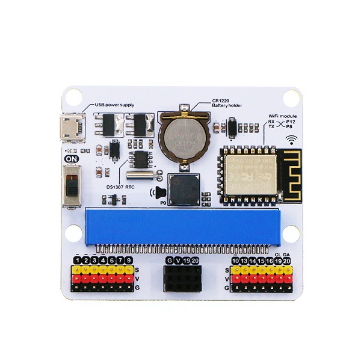

## Features
---
- Intergrated ESP12F WiFi、RTC and passive buzzer module
- Extended most IO ports by GVS
- Silk-screen indication onboard main components
- Separately lead IIC interface, directly plug in OLED, BME280 and IIC,etc
- Intergrated buzzer and earphone jack
- Adaptive for LEGO (4 standard spacing Lego fixed holes)

## Hardware apperance & Parameters 
---

### Size & Installation 

- Product size：71mm x 63mm x 23mm
- PCB thickness：1.5mm
- Hole diameter：2.4mm

 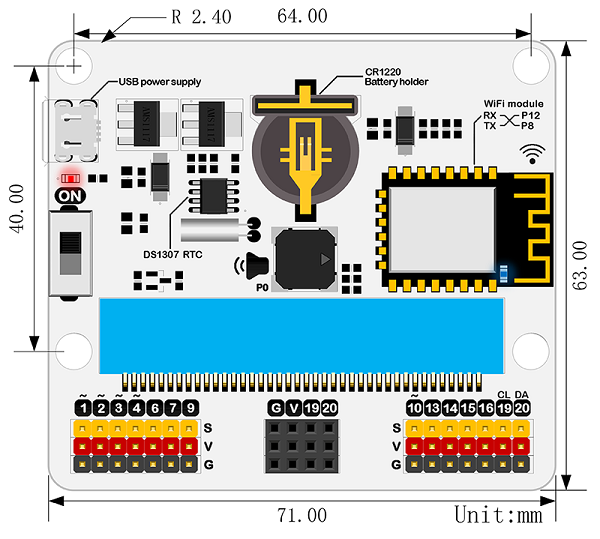

### Parameters

 |Items|Parameters|Remarks|
 |:-:|:-:|:-:|
 |DC supply|USB-5V|-|
 |Maximum power current|800mA|-|
 |Operation temperature|-25~80℃|-|
 |WIFI module|ESP8266|ESP12F|
 |Buzzer|Passive buzzer|-|
 |RTC timing|DS1307 RTC|-|
 |RTC timing battery|CR1220 button cell|Equipped by yourself|
 |Lead out|Not all|-|
 |port lead|Serial port can map the IO port|Coding|
 |I2C port lead|19、20 pin|Only for I2C pin|
 |SPI port lead|14、15 pin|for common IO|
 |Size|71.00mm X 63.00mm|Without packing|
 |Net weight|30.00g|Without packing|

### Pin interface drawing

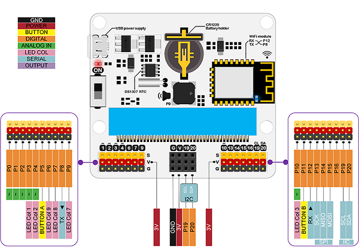

### Introduction of main module

 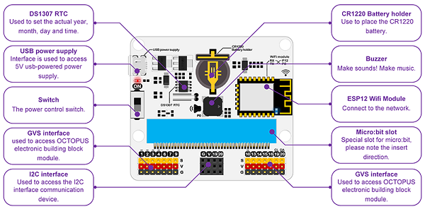

## Software support
---

- Coding：Makecode/Micropython/JavaScript/

### Makecode block

- Coding developed by Microsoft and mainly publiced by micro:bit offical.

-  [https://makecode.microbit.org](https://makecode.microbit.org)

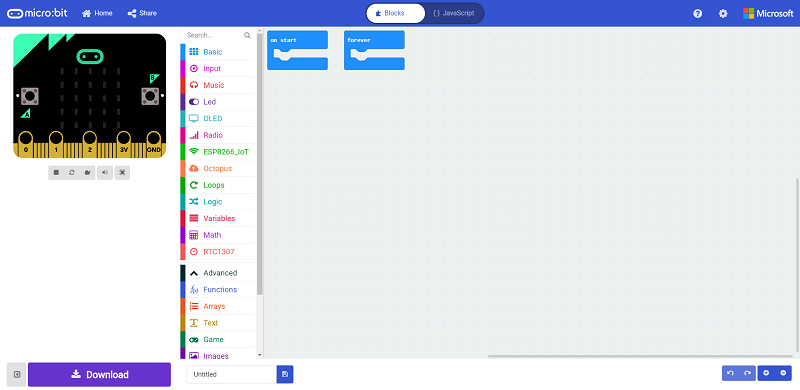 

### JavaScript

- Click on `JavaScript` of the `makecode` for `JavaScript` coding.

- [https://makecode.microbit.org](https://makecode.microbit.org)

### MicroPython 

- Using `MU` for advanced coding method`MicroPython` 

-  [https://codewith.mu/](https://codewith.mu/)

## Easy start 
---
### Hardware connection

- Fisrt, install CR1220 button cell for power supply to the RTC timing. 

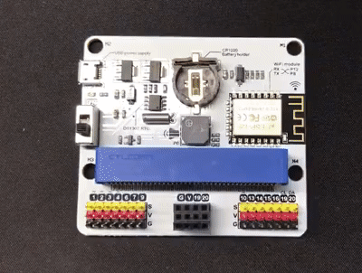

- Plug the micro:bit to the Iot:bit.

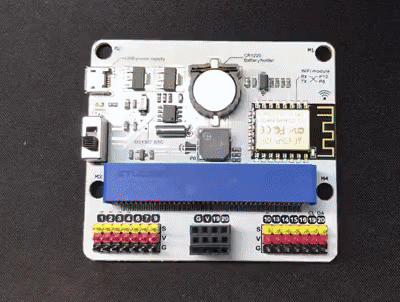

- Using single USB for power supply to expansion board and switch on.  

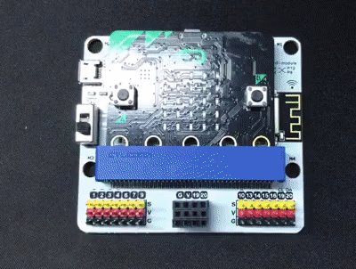

### Coding  

#### Coding Platform ####

[https://makecode.microbit.org](https://makecode.microbit.org)

#### Add codebase ####

- Click on "Advanced" in the MakeCode Drawer to see more code sections.

 

- We need to add an extension for coding to the IOT. Click on the “Extension” at bottom of coding drawer, then Search for “IOT” and click on the IOT package to add it to your project. (As below picture) 

 

***Note：*** If you get a warning telling you some packages will be removed because of incompatibility issues, either follow the prompts or create a new project in the Project file menu.

#### How to drive the buzzer ####

- There is on-board buzzer on the IOT:bit as below picture. Let the buzzer be connected to the PO of the micro:bit to play music by the `music` of the makecode.

 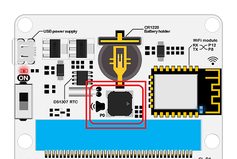

- When button A be pressed in the "input", play a bit of music. 

 

- Program link：[https://makecode.microbit.org/_4j6PCeV087AW](https://makecode.microbit.org/_4j6PCeV087AW)

#### How to use RTC ####

- There is on-board DS1307RTC timing on the IOT:bit as below picture. RTC timing need a CR1220 button cell for lasting power supply. We need the RTC timing keep accuracy in the event of a power outage. 

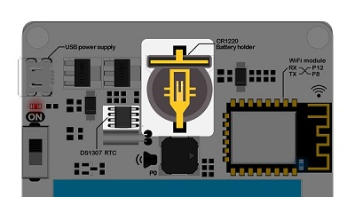

- Press button A to set the time to the set time. On start with RTC function and the minutes be displayed on the 5*5 allay.

-   Turn off the power after turning off the power for one minute, and the dot matrix display will show the number of minutes after another 1 minute.

  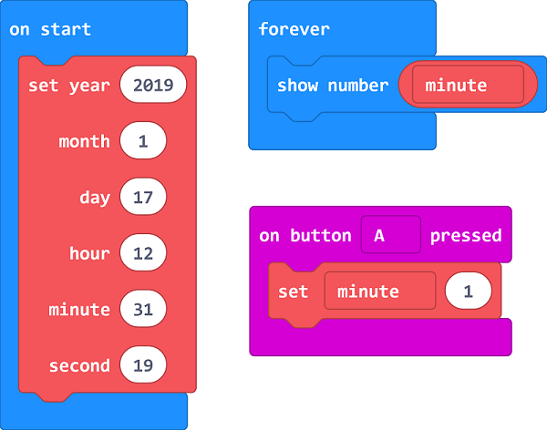

- Program link：[https://makecode.microbit.org/_e9d3vW96bPe2](https://makecode.microbit.org/_e9d3vW96bPe2)

#### How to use the internet function ####

- The most important function of IOT:bit is WIKI. The onboard `ESP-12F`WIFI module can connect WIFI and send information. To use port for communication with the micro:bit and the pin `RX-P8`，`TX-P12` is special for IoT.
- Using thingspeak as cloud to coding and data uploding.[thingspeak guidebook]()

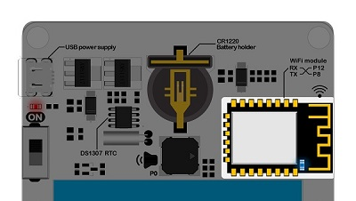

- On start, initialize ESP8266 to default connection with P8 & P12.
- Connect your own WiFi, input the key and the password.
- Under foever loop, connect the thinkspeak and set date to send, then pause. 

 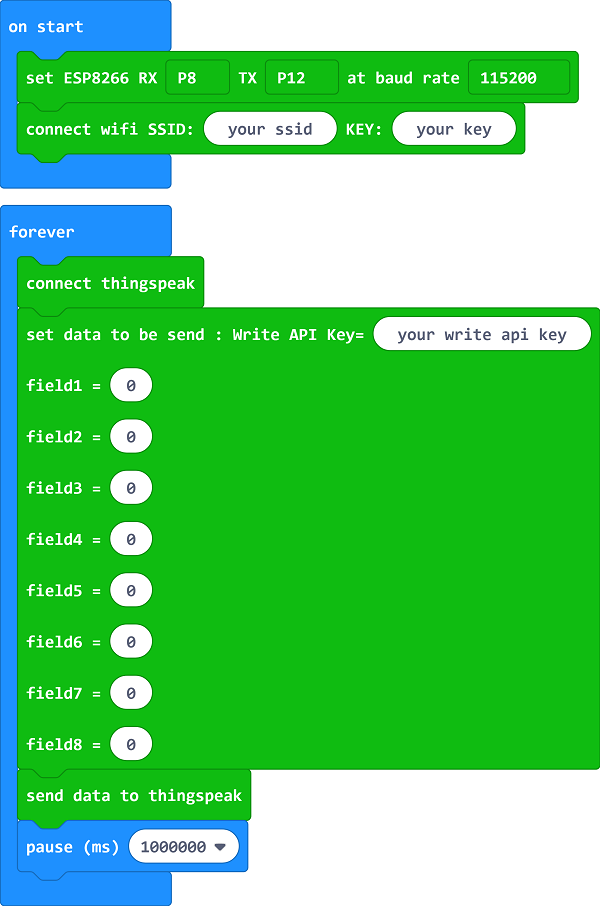

- Program link：[https://makecode.microbit.org/_JAXAmmHq4FhW](https://makecode.microbit.org/_JAXAmmHq4FhW)

#### Codebase for other sensors

-IoT:bit also supports the other ELECFREAKS sensors can the new Octopus blocks are added in the package.
 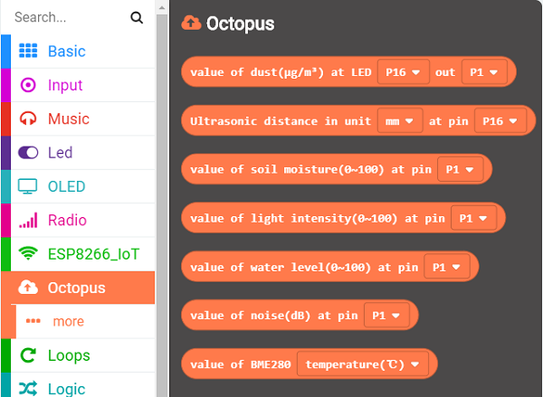

### Down load code ###

- Let your micro:bit be connected to one side of the USB, the other side to your computer.（Inserting on the expansion board may cause the micro:bit connection to be abnormal or damaged.）

  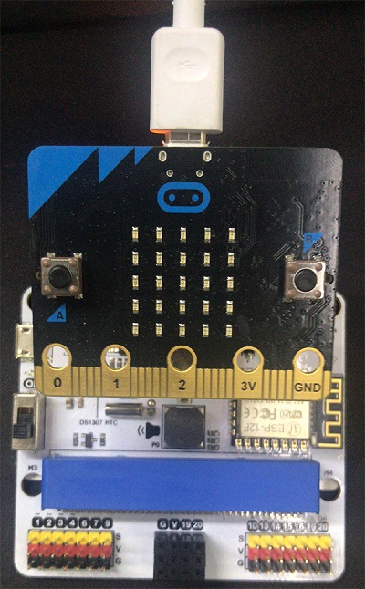

- Then copy your documents to the micro:bit. 

- Now, here is your observing time!
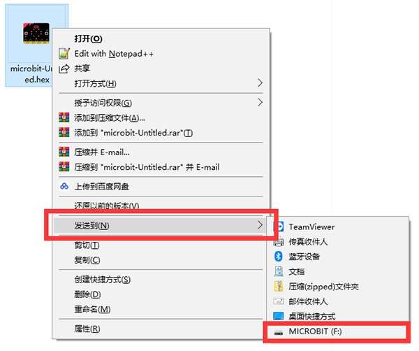

 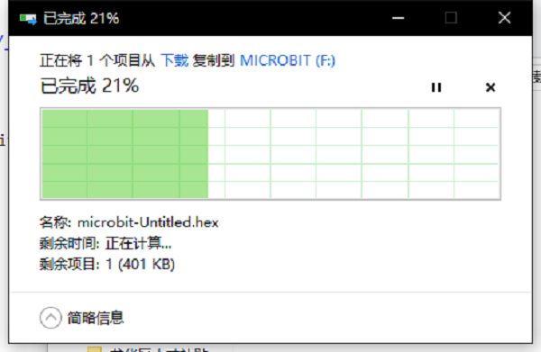

### Documents 

#### FAQ

#### Question: After installing the button cells, why can't I get the correct data for RTC ? 

Solution: The nominal voltage for CR1220 button cells is 3V, while some of the cells in the market may have a higher voltage than 3V. The high voltage will make abnormal operation of the RTC happen, to solve this, you can use the used cells or discharge the brand new cells by yourself.

 
 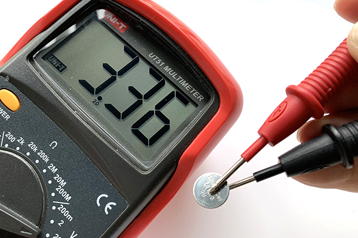

Cells Discharge Steps

1. Connect the pins of the LED as the picture shows(Make sure the positive and negative anodes connect in the right way)

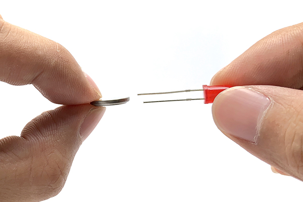

2. The LED lights up after connection, the button cells in 3.4V would come down to 3V after around 10 seconds.
 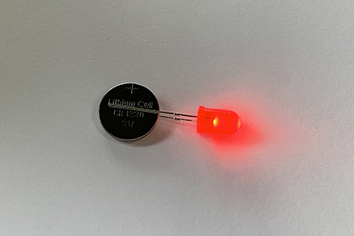

3. Detect the cells voltage with a multimeter and it works well after deducing the voltage to about 3V.

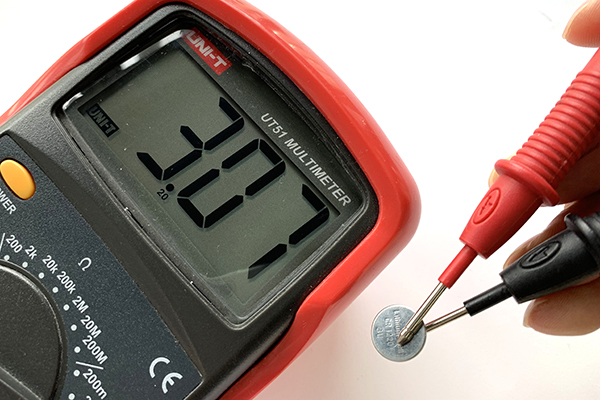

    

