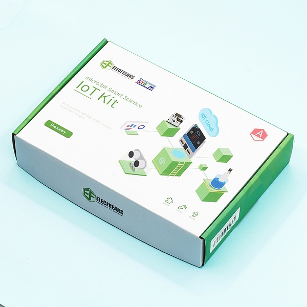
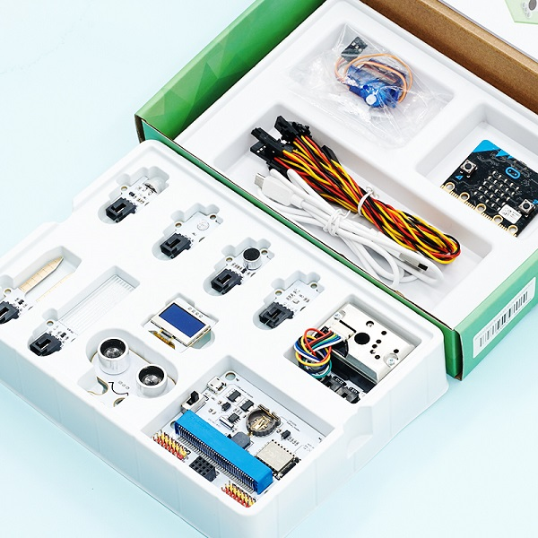

# iot:kit Introduction

## micro:bit Smart Science IoT kit
---

ELECFREAKS Smart Science IoT Kit is developed based on loT:Bit,a new breakout board compatible with science sensors such as theultrasonic sensor, dust sensor, light sensor and water level sensor,.including RTC Timing and WIFI module. 
You can gather data via thesensors and send data to the cloud with more stable and accuratedata analysis.

## pack list ##
---

|Component|number|
|:-:|:-:|
|micro:bit|option|[micro:bit official website:https://microbit.org/](https://microbit.org)|
|IoT:bit|1| [IoT user guide](http://www.elecfreaks.com/learn-en/microbitKit/iot_kit/iot_bit.html)|
|OLED|1|[OLED brochures](http://www.elecfreaks.com/learn-en/microbitOctopus/output/octopus_ef03155.html)|
|BME 280|1|[BME280 brochures](http://www.elecfreaks.com/learn-en/microbitOctopus/sensor/octopus_ef04087.html)
|PIR sensor|1|[PIR Brochures](http://www.elecfreaks.com/learn-en/microbitOctopus/sensor/octopus_ef04055.html)|
|Light sensor|1|[Light Sensors Brochures](http://www.elecfreaks.com/learn-en/microbitOctopus/sensor/octopus_ef04032.html)|
|Noise sensor|1||[Noise Sensor brochures](http://www.elecfreaks.com/learn-en/microbitOctopus/sensor/octopus_ef04081.html)|
|Water level sensor|1|[Water Level Sensor brochures](http://www.elecfreaks.com/learn-en/microbitOctopus/sensor/octopus_ef04094.html)|
|soil moisture sensor|1|[Soil Moisture Sensor Brochures](http://www.elecfreaks.com/learn-en/microbitOctopus/sensor/octopus_ef04027.html)|
|Sonar:bit|1|[Sonar:bit brochures](http://www.elecfreaks.com/learn-en/microbitOctopus/sensor/sonar_bit.html)|
|Dust sensor|1||[Dust Sensor Brochures](http://www.elecfreaks.com/learn-en/microbitOctopus/sensor/octopus_ef11083.html)|
|180° servo|1|[180° servo micro:bit drive code example](https://makecode.microbit.org/_3R4bPr75P4jJ)|

