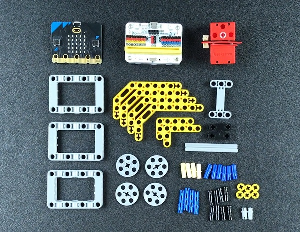

# Case 10: Boating 
## Purpose
To make a boating car. 
 

## Link: 

[micro:bit Wonder Building Kit](https://www.elecfreaks.com/micro-bit-wonder-building-kit-without-micro-bit-board.html)

## Materials Required

Video link:
[https://player.bilibili.com/player.html?bvid=BV1V64y117zM&p=10&page=10](https://player.bilibili.com/player.html?bvid=BV1V64y117zM&p=10&page=10)

## Software Platform

[MakeCode](https://makecode.microbit.org/)

## Coding
### Add extensions
Click "Advanced" in the MakeCode to see more choices.
 

Search with Wukong in the dialogue box to download it. 

### Program
 

Link:[https://makecode.microbit.org/_5t8W90cX625t](https://makecode.microbit.org/_5t8W90cX625t)

