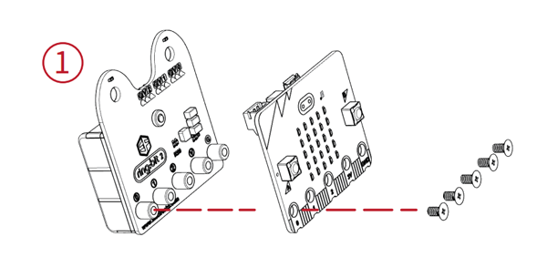
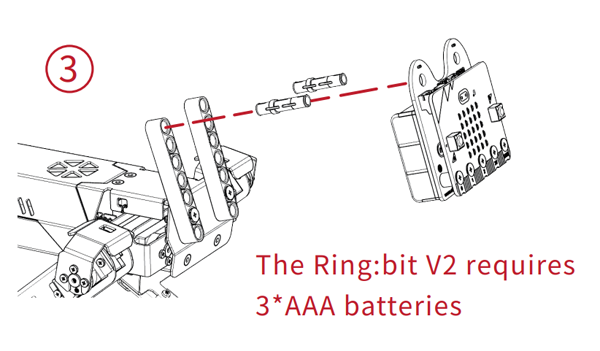
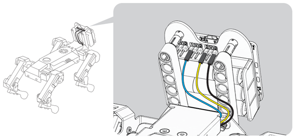
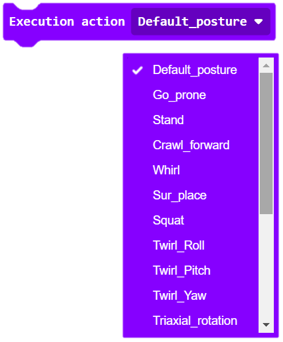
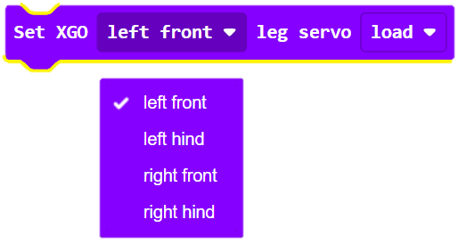
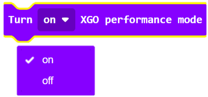
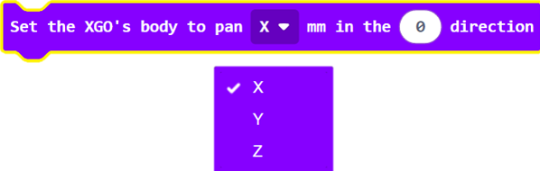
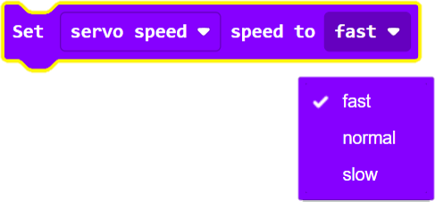
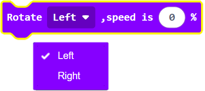
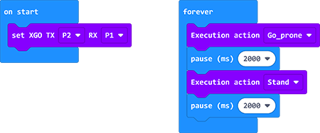

## Hardware Assembly

### Step 1

- Connect the micro:bit with the Ring:bit V2 with the shorter screws. 

### Step 2

- Fix the 7-hole bricks with the XGO with the longer screws. 

### Step 3

- Fix the Ring:bit V2 on the 7-hole bricks with the shaft pins. 

### Step 4

-  Connect the Dupont cables with the Ring:bit V2(Note to connect in the right connections: G for black, blue for port 1 and yellow for port 2)

### Step 5

- Connect the micro:bit with the computer through USB cables. 

## Programming

The program platform here we use for XGO is [Makecode](https://makecode.microbit.org/#) in the graphical programming, you can choose to program in Python or JaveScript too. 

## Add XGO Package

### Steps

- Create a new project, click Advanced in the drawer to see more choices. 

- Click extensions in the drawer: 

- Search with XGO and download it: 

- The program blocks of XGO are listed below: 

- After programming, connect the micro:bit with the computer and download it to the micro:bit board. 

## Program Guidance

Initialize XGO 

 

Set the actions of XGO, there are 12 kinds of actions and you can select any one from them.

Get the angles of each joint on the limbs and get the power status of XGO. 

The debug mode of the servos(the specific servo or all servos) on the limbs. 

Turn on/off the performance mode and the gyroscope for XGO. 

Stop the periodic rotation of XGO around the X/Y/Z axis. 

Set the rotation degrees/time of XGO around the X/Y/Z axis.

Set the time of the translation/going back and forth/moving of the XGO around the X/Y/Z axis. 

Set the time and height of the limbs being lifted. 

Set the direction, speed and time of the rotation of XGO. 

Set the direction of the feet of XGO. 

Set the speed of the servos on the joints and the walking frequency of  XGO. 

Set the speed of moving or rotating for XGO. 

Set the height of XGO

 

### Project Samples

Link: [XGO](https://makecode.microbit.org/_HC4T96AddJfp)

You can also download it directly below:

<iframe style="position:absolute;top:0;left:0;width:100%;height:100%;" src="https://makecode.microbit.org/#pub:_0DpgxvF40XY4" frameborder="0" sandbox="allow-popups allow-forms allow-scripts allow-same-origin"></iframe>
 

<iframe style="position:absolute;top:0;left:0;width:100%;height:100%;" src="https://makecode.microbit.org/#pub:_i4k5K6HYMcjc" frameborder="0" sandbox="allow-popups allow-forms allow-scripts allow-same-origin"></iframe>
 

##  FAQ

 **Note**: Turn on the Ring:bit V2 before running the program and note if the power is sufficient. 

## Relevant File

